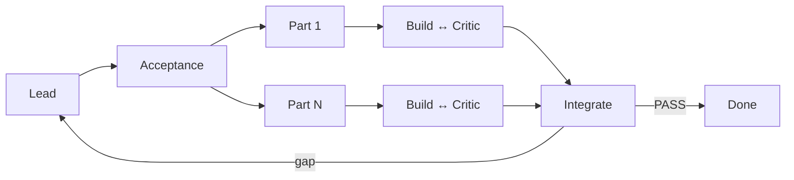

# Gauntlet loop

1. Lead fija alcance, aceptación observable y partes; no cambia criterios durante
   la ronda.
2. Por parte, Builder entrega cambio más evidencia; Critic no edita y responde
   `PASS` o un defecto reproducible.
3. El defecto vuelve al Builder, máximo tres veces. Sólo `PASS` llega a integración.
4. Un Critic final verifica el conjunto. `DONE` exige todos los puntos;
   `BLOCKED` exige falla repetida o autoridad externa.
5. Paralelizar sólo partes independientes y cuando esté autorizado.
