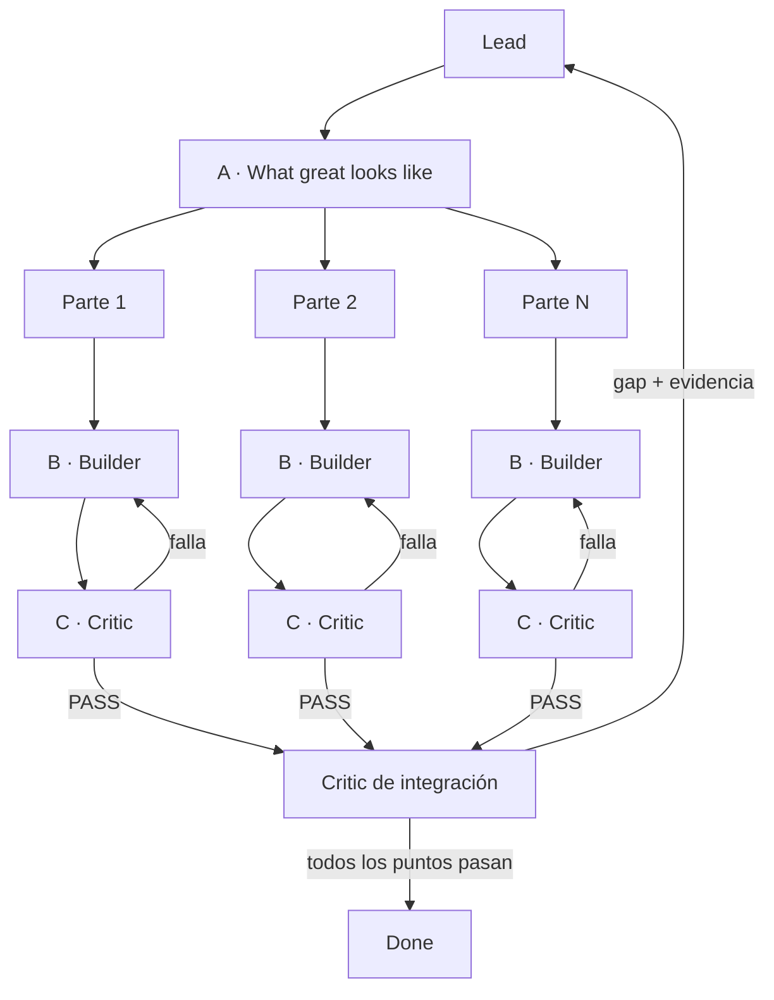

# Gauntlet loop

Objetivo: producir evidencia contra una definición previa de excelencia, sin
ampliar el alcance.

## A · Lead

1. Fijar alcance y escribir `what great looks like` como puntos observables.
2. Dividir el resultado en partes mínimas; cada parte referencia sus puntos.
3. No cambiar la aceptación durante una ronda. Si estaba mal, abrir otra ronda
   y registrar el cambio.

## B/C · Por cada parte

1. **Builder** hace el cambio mínimo y entrega artefacto más evidencia.
2. **Critic** recibe criterios, artefacto y evidencia; intenta refutarlos, no
   edita y responde `PASS` o un defecto reproducible.
3. Un defecto vuelve al Builder de esa parte. Máximo tres pases B→C.

Las partes independientes pueden avanzar en paralelo sólo cuando la ejecución
lo autorice; los roles también pueden ser pases secuenciales con contexto limpio.

## Cierre del Lead

Integrar sólo partes en `PASS`. Un Critic final intenta refutar el resultado
completo contra A; el Lead no exime criterios. Terminar cuando todos los puntos
pasan; declarar `BLOCKED` si se repite dos veces la misma falla o se requiere
autoridad externa. Informar cambio, evidencia y riesgo restante.
