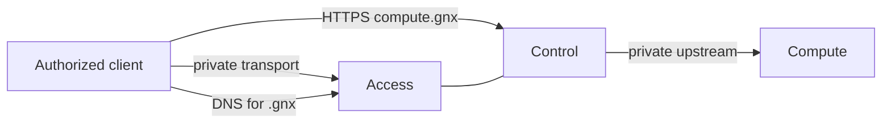

# GNX 0.3.1

**Private infrastructure behind one small, verifiable command contract.**

GNX reconciles a private infrastructure node around three business
capabilities:

- **Access** gives authorized clients a persistent private path and resolves the
  private `.gnx` zone.
- **Control** publishes explicit HTTPS names and routes each one to a declared
  upstream.
- **Compute** runs the persistent service behind Control and keeps its own
  authentication boundary.

The PoC has one orchestration core, written in Rust and executed on Linux.
Windows exposes the same contract through a narrow broker into an isolated WSL
runtime; it is not a second implementation of the product.



## Current status

This branch contains an implemented 0.3.1 product slice. Repository tests cover
contracts, state transitions, setup boundaries and refusal paths; they are not a
substitute for host acceptance. Windows/WSL, Linux runtime, remote-client and
G0-G6 evidence remain pending where this environment lacks MSVC, elevated
Windows, WSL and Podman. No release is READY until those gates produce
sanitized, reproducible evidence. The latest local Windows binaries are built
under `target/release`; a complete `dist` candidate is **not** available yet
because the configured WSL builder has no Linux Rust toolchain. Do not treat
`target/release` as an installable release artifact.

The first useful milestone is not “the project compiles.” It is an executable
vertical slice in which `doctor`, `plan`, `apply` and `status` share one JSON
contract, observe real state and preserve the last valid configuration.

## Public contract

```text
gnx doctor    # validate prerequisites and explain corrective action
gnx plan      # compare intent with observed state; never mutate
gnx apply     # reconcile a validated candidate and verify the result
gnx status    # report observed capability health
```

Stdout is machine-readable JSON. The process exits `0` for `READY`, `1` for
`FAILED`, and `2` for `ACTION_REQUIRED`. Human-readable diagnostics belong on
stderr. The same request must have the same meaning on Linux and Windows.

## Configuration boundary

[`gnx.toml`](gnx.toml) is operator intent, not a deployment manifest. It may
name the node, network intent and optional explicit routes. It must not contain
image repositories, digests, internal runtime paths or secrets.

Immutable implementation choices belong to the release definition. Credentials,
private keys and enrollment material belong only to protected runtime state.
Keeping these three inputs separate is a core safety property:

```text
operator intent + immutable release + observed state
                         |
                         v
                  application use case
                         |
                         v
              candidate -> verify -> last valid
```

## Start the PoC

The documentation set is intentionally limited to seven normative documents.
The older document names still visible in historical GitHub revisions are
superseded; they are not a second active contract. The current branch keeps
historical material out of the normative navigation so operators have one
source of truth:

1. [`docs/01-product.md`](docs/01-product.md) defines the product outcome,
   vocabulary, requirements and non-goals.
2. [`docs/02-architecture.md`](docs/02-architecture.md) defines capability
   ownership, dependency direction, state transitions and retained decisions.
3. [`docs/03-operator-runbook.md`](docs/03-operator-runbook.md) gives the safe
   operating, recovery and evidence rules.
4. [`docs/04-windows-runtime.md`](docs/04-windows-runtime.md) specifies the
   Windows account, service, broker, WSL and setup boundaries.
5. [`docs/05-acceptance.md`](docs/05-acceptance.md) defines G0-G6 acceptance and
   summarizes current evidence without converting blockers into success.
6. [`docs/06-release.md`](docs/06-release.md) defines candidate contents,
   manifest rules, promotion and historical reuse.
7. [`docs/07-implementation.md`](docs/07-implementation.md) gives the milestone
   plan, current status and immediate next work.

Git history remains design evidence, not implementation authority: old behavior
is reintroduced only when it traces to a current requirement and acceptance gate.

## Definition of done

A change is complete only when all of the following are true:

- its behavior traces to a `BR-*` requirement;
- domain and application code do not depend on an operating-system or vendor
  adapter;
- success is based on observed runtime state, not generated files or process
  launch alone;
- failure preserves the last valid configuration and persistent identity;
- tests cover the normal path and the relevant refusal or failure path;
- evidence is sanitized and reproducible from a clean candidate.

The complete PoC is accepted only when G0-G6 pass on the declared Linux and
Windows test paths. Until then, documentation and command output must describe
the unverified state honestly.

## License and attribution

GNX-owned code is distributed under GNU Affero General Public License version 3
only (`AGPL-3.0-only`); the complete text is retained in [`LICENSE`](LICENSE).
Third-party dependencies and components retain their own licenses and
attributions. The historical `legacy` material and its behavior are preserved
as historical records and are not modified by this integration.
