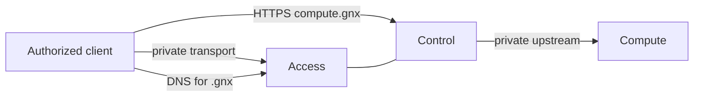

# GNX 0.3.2-rc.2

**Private infrastructure behind one small, verifiable command contract.**

GNX reconciles a private infrastructure node around three business
capabilities:

- **Access** gives authorized clients a persistent private path and resolves the
  private `.gnx` zone.
- **Control** publishes explicit HTTPS names and routes each one to a declared
  upstream.
- **Compute** runs the persistent service behind Control and keeps its own
  authentication boundary.

The PoC has one orchestration core, written in Rust and executed on Linux.
Windows exposes the same contract through a narrow broker into an isolated WSL
runtime; it is not a second implementation of the product.



## Current status

This candidate includes the Rust runtime, Proxmox, Tailscale, CoreDNS, Caddy,
Quadlet, Windows broker/service, and an installer executable. See
[`docs/release-validation.md`](docs/release-validation.md) for current evidence
and acceptance gaps. This is a release candidate, not a claim that G0-G6 passed.

Windows artifacts: `gnx-install.exe`, `gnx.exe`, `gnx-service.exe`, the matching
Linux bundle, and a clean WSL rootfs pinned by `manifest.json`.
Run the installer elevated, using the manifest digest published with the release:

```powershell
./gnx-install.exe --manifest-sha256 <published-hash> --rootfs ./gnx-wsl-rootfs.tar.gz
```

The installer creates the dedicated account and rights, verifies artifacts before
execution, and checks the broker after bootstrap. Existing services/accounts are
refused to preserve them; automatic in-place migration is not yet accepted.
Linux installation uses `sudo sh gnx-linux.run`, followed by `gnx doctor` and
`gnx apply`. Proxmox is exposed as both `compute.gnx` and `proxmox.gnx`.

`https://app.gnx` serves the bundled HTML/CSS/JavaScript welcome page, with a
real HTTPS reachability check and links to Proxmox. It does not expose an
unauthenticated service-control API. Reserve `app.gnx` for this built-in page;
use a different hostname for optional application routes.

The first useful milestone is not “the project compiles.” It is an executable
vertical slice in which `doctor`, `plan`, `apply` and `status` share one JSON
contract, observe real state and preserve the last valid configuration.

## Public contract

```text
gnx doctor    # validate prerequisites and explain corrective action
gnx plan      # compare intent with observed state; never mutate
gnx apply     # reconcile a validated candidate and verify the result
gnx status    # report observed capability health
```

Stdout is machine-readable JSON. The process exits `0` for `READY`, `1` for
`FAILED`, and `2` for `ACTION_REQUIRED`. Human-readable diagnostics belong on
stderr. The same request must have the same meaning on Linux and Windows.

## Configuration boundary

[`gnx.toml`](gnx.toml) is operator intent, not a deployment manifest. It may
name the node, network intent and optional explicit routes. It must not contain
image repositories, digests, internal runtime paths or secrets.

Immutable implementation choices belong to the release definition. Credentials,
private keys and enrollment material belong only to protected runtime state.
Keeping these three inputs separate is a core safety property:

```text
operator intent + immutable release + observed state
                         |
                         v
                  application use case
                         |
                         v
              candidate -> verify -> last valid
```

## Start the PoC

Read the documents in this order:

1. [`docs/business-requirements.md`](docs/business-requirements.md) defines the
   outcome and the requirements every implementation choice must satisfy.
2. [`docs/architecture.md`](docs/architecture.md) defines capability ownership,
   dependency direction, state transitions and the target repository tree.
3. [`docs/implementation-plan.md`](docs/implementation-plan.md) turns that design
   into vertical milestones with an exit condition for each one.
4. [`docs/poc.md`](docs/poc.md) defines the executable G0-G6 acceptance protocol
   and required evidence.
5. [`docs/windows-runtime.md`](docs/windows-runtime.md) specifies the Windows
   identity, broker, WSL and secret boundaries.
6. [`docs/release.md`](docs/release.md) defines what may be promoted as a 0.3.1
   candidate.

The historical review and the exact material retained from earlier versions are
recorded in [`docs/documentation-audit.md`](docs/documentation-audit.md). Git
history is design evidence, not implementation authority: old behavior is
reintroduced only when it traces to a current requirement and acceptance gate.

## Definition of done

A change is complete only when all of the following are true:

- its behavior traces to a `BR-*` requirement;
- domain and application code do not depend on an operating-system or vendor
  adapter;
- success is based on observed runtime state, not generated files or process
  launch alone;
- failure preserves the last valid configuration and persistent identity;
- tests cover the normal path and the relevant refusal or failure path;
- evidence is sanitized and reproducible from a clean candidate.

The complete PoC is accepted only when G0-G6 pass on the declared Linux and
Windows test paths. Until then, documentation and command output must describe
the unverified state honestly.

