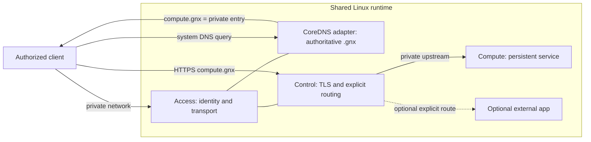
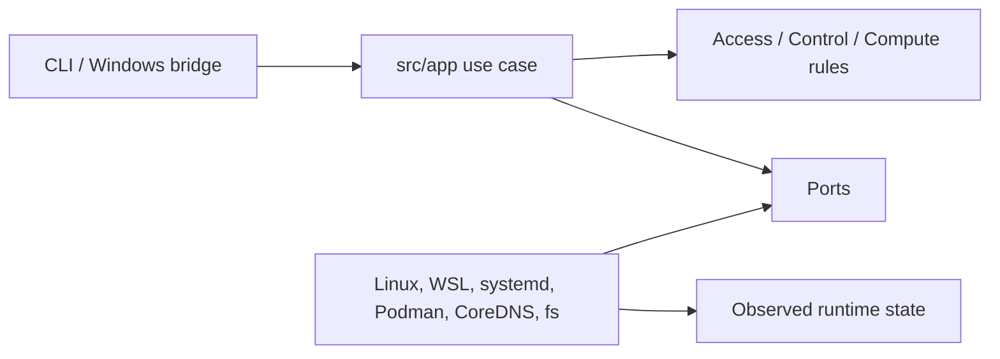

# GNX 0.3.1 architecture

Status: normative  
Audience: engineering, audit  
Last reviewed: 2026-09-19  
Replaces: `architecture.md`, `documentation-audit.md`, `decisions/*`

GNX is organized around business capabilities, application use cases, ports and adapters. Dependency direction points inward toward the domain. Product outcomes are defined in `01-product.md`; acceptance is defined in `05-acceptance.md`.

## Principles

1. Capabilities describe outcomes, not products.
2. One Linux application core owns the four public use cases.
3. Observed state decides success.
4. Intent, release and secrets are different inputs.
5. Changes are transactional at the product boundary.
6. Failure is contained to the affected capability or optional route.
7. Platform bridges render and transport requests; they do not orchestrate.

## Capability topology



CoreDNS is an adapter, not a fourth capability. The shared Linux runtime is a hosting boundary, not a business capability.

## Ownership matrix

| Capability | Owns | Exposes | Must not own |
| --- | --- | --- | --- |
| Access | private identity, authorized transport, `.gnx` authority | private entry address, DNS answers, identity health | HTTPS routing, Compute lifecycle, Compute auth |
| Control | TLS identity, public-root export, explicit host routes | HTTPS entrypoints, route diagnostics | enrollment, Compute credentials, upstream lifecycle |
| Compute | service lifecycle, persistent data, service credentials | private upstream contract and public CA/name data needed by Control | client DNS, public routes, Windows mediation |

## Use-case flow



- `doctor` evaluates host and release prerequisites.
- `plan` validates intent and returns a change set without mutation.
- `apply` stages a candidate, reconciles resources, verifies required health and only then promotes last valid.
- `status` reports actual capability health.

The CLI parses and renders. Domain and application modules do not import filesystem, process, WSL, container, DNS or vendor APIs. Adapters implement ports and are selected in the composition root.

## State model

```text
operator intent + immutable release + observed state
                         |
                         v
                  application use case
                         |
                         v
          candidate -> reconcile -> verify -> last valid
```

Rules:

- Operator intent is portable and non-secret.
- Release data is immutable for a candidate.
- Secrets are runtime state and enter only through protected channels.
- Persistent identity and Compute data are not rollback material.
- Last valid changes only after live verification passes.
- Failure keeps or restores the previous last valid candidate.

## Publication order

1. acquire per-node lock;
2. read intent, release and current observed state;
3. validate schema, release identity and host prerequisites;
4. stage candidate artifacts/configuration in protected state;
5. reconcile private services and internal routes;
6. run capability-specific live checks;
7. publish external names/trust material only after required checks pass;
8. promote last valid;
9. render one JSON result.

No step may hide a failed gate behind a later success.

## Decisions retained from history

- Recover useful behavior, not old code.
- Keep exactly one orchestration core in `src/app`.
- Use capability names as product language; vendor names stay in adapters, SBOM and technical evidence.
- Retain the Windows boundary: `gnx-runtime`, `GNXRuntime`, bounded pipe and isolated WSL.
- Success means observed behavior, not generated config or launched processes.

## Adapter decisions for 0.3.1

These choices are release facts, not public product vocabulary:

- CoreDNS is the authoritative `.gnx` DNS adapter.
- Earlier mesh decisions retained the principle of a stable private endpoint, one node identity per host, no secret in argv, and no cloning of identity state.
- The historical Tailscale/NetBird split remains evidence of valid patterns but not an operator-selected framework.
- Caddy/reverse-proxy, Podman/systemd and Dockur-based Windows test environments are technical choices that require manifest/digest/license evidence before release use.

Open release decisions must be recorded before their adapter is accepted: exact private transport, enrollment flow, Compute service, authenticated health contract, Control artifact/root lifecycle, JSON schema and diagnostic code set, release signing mechanism and supported platform matrix.

## Repository shape

```text
src/
  app/          # public use cases and transactions
  domain/       # capability rules and result vocabulary
  ports/        # traits/interfaces owned by the core
  adapter/      # Linux/Windows/vendor implementations
runtime/        # release-selected service assets
packaging/      # setup/build/release material
ops/            # operator/dev helpers, never a second runtime core
tests/          # contract, architecture and acceptance support
docs/           # seven normative documents only
```

`legacy` is historical and is not modified.
