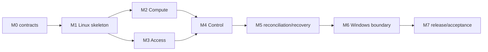

# GNX 0.3.1 implementation plan and status

Status: normative delivery plan  
Audience: engineering, coordinator, audit  
Last reviewed: 2026-09-19  
Replaces: `implementation-plan.md`, `implementation-checkpoint.md`, final status fragments

This document turns the product contract into thin, testable vertical slices. A milestone is complete only when its exit condition is executable.

## Delivery rules

1. Trace behavior to `BR-*` requirements and G0-G6 gates.
2. Build one application core in `src/app`.
3. Observe before changing.
4. Keep last valid state until verification passes.
5. Test refusal paths early.
6. Keep evidence reproducible and secret-free.
7. Do not implement agent orchestration inside product runtime or installers.
8. Prefer small vertical slices over broad generated scaffolding.

## Dependency path

## M0 — executable contracts

Deliver schema models for `gnx.toml`, release definition, JSON result envelope, states, diagnostic codes, exit mapping, port traits and fixtures for valid/invalid/forward-incompatible inputs.

Exit: Linux and Windows contract fixtures pass; no command reports `READY` without observation port evidence.

## M1 — Linux application skeleton

Deliver the four use cases through one composition root with real host observation and deliberately incomplete capability adapters.

Exit: G0 can run on supported Linux test host; repeated `plan` has no observable mutation; incomplete runtime never returns `READY`.

## M2 — Compute vertical slice

Deliver pinned Compute artifact, runtime assets, install/start/observe/health adapter, persistent state and negative tests for credentials/storage/artifact mismatch.

Exit: G1 passes locally; unchanged `apply` preserves identity, credentials and storage witness.

## M3 — Access vertical slice

Deliver private transport adapter, enrollment flow, persistent identity, CoreDNS `.gnx` generation and UDP/TCP checks including refusal outside `.gnx`.

Exit: G2 passes from authorized remote client; identity remains after reapply and reboot.

## M4 — Control vertical slice

Deliver reverse-proxy/TLS adapter, persistent GNX root/server identity, deliberate CA export, verified TLS, explicit routes and no direct Compute exposure.

Exit: G3 passes end-to-end through `compute.gnx`; optional route failure is isolated.

## M5 — reconciliation and recovery

Deliver candidate staging, last-valid promotion, rollback/recovery, locking, service restart/reboot probes and failure containment.

Exit: G4 and Linux side of G5 pass, including invalid/unhealthy candidate refusal.

## M6 — Windows boundary

Deliver `gnx.exe`, `gnx-service.exe`, `gnx-setup.exe`, dedicated account/service, protected pipe, fixed WSL import, secret channel and parity fixtures.

Exit: Windows clean-host setup/provision/bootstrap gates pass; G6 parity passes; no Windows path becomes a second orchestrator.

## M7 — release and acceptance

Deliver authenticated manifest, platform matrix, artifact digests, license/SBOM, evidence index and full G0-G6 run.

Exit: `06-release.md` promotion checklist passes or candidate is explicitly rejected.

## Current consolidated status

- Public product contract, architecture, Windows boundary, acceptance protocol, release rules and implementation plan are now consolidated into seven normative docs.
- Existing repo contains Rust source, runtime, packaging and tests from the functional slice.
- Local `cargo fmt --all`, `cargo test --locked` and release compilation pass on the active MSVC toolchain. `cargo clippy` remains unavailable because the component is not installed.
- The latest Windows executables are present under `target/release`; no complete `dist` candidate is declared because the configured WSL builder (`gnx-node`) has no Linux Rust toolchain.
- Host cleanup on this workstation removed old active GNX Program Files/ProgramData roots by moving them to backup; no GNX process/service remained.
- Dockur lab evidence proves useful Windows guest boot/share/setup observations but does not establish final GNX `READY`.

## Immediate next work

1. Install/pin a Linux Rust toolchain in the selected WSL builder, without silently changing the builder distro.
2. Install the `clippy` component and run script/static gates from a clean checkout.
3. Rebuild the complete candidate, seal the manifest with the production key and record SHA256/SBOM evidence.
4. Run `gnx-setup.exe --check` on the cleaned host or disposable VM only with trusted bundle/rootfs hashes.
5. If using Dockur, run a share/OEM JSON-return test first; then only proceed to apply/bootstrap gates with retained-state decision recorded.
6. Update this file with pass/fail evidence; do not edit gates after the run to fit results.

## Agent/harness policy for development

Development may use a local coordinator harness and up to five or six supervised workers when useful for research, test execution or review. Constraints:

- workers operate on source/docs/tests only, never inside product runtime;
- no worker receives secrets, private URLs or update credentials;
- failed gates reported by workers remain failed until independently fixed;
- worker outputs are evidence suggestions, not acceptance authority;
- product code must not depend on the harness, prompts or agent protocols.
