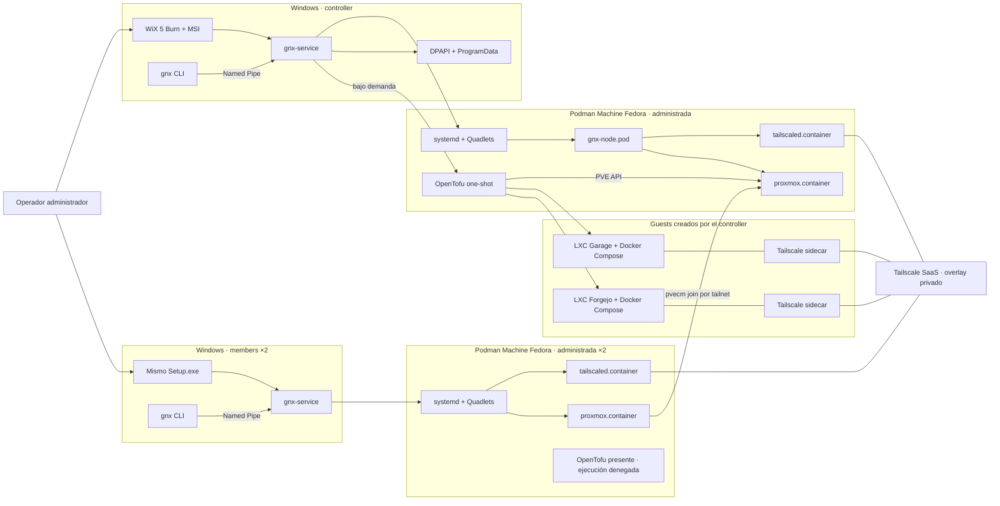
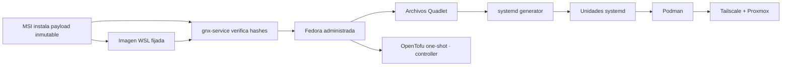
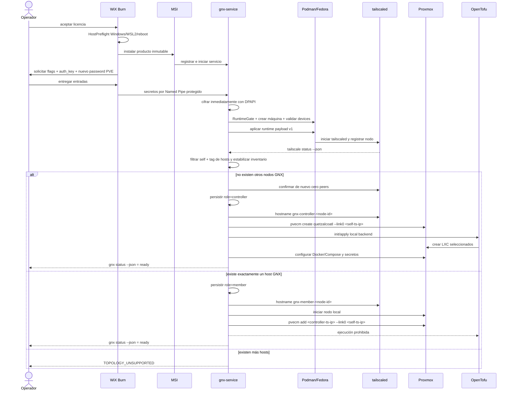
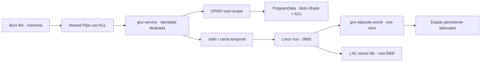
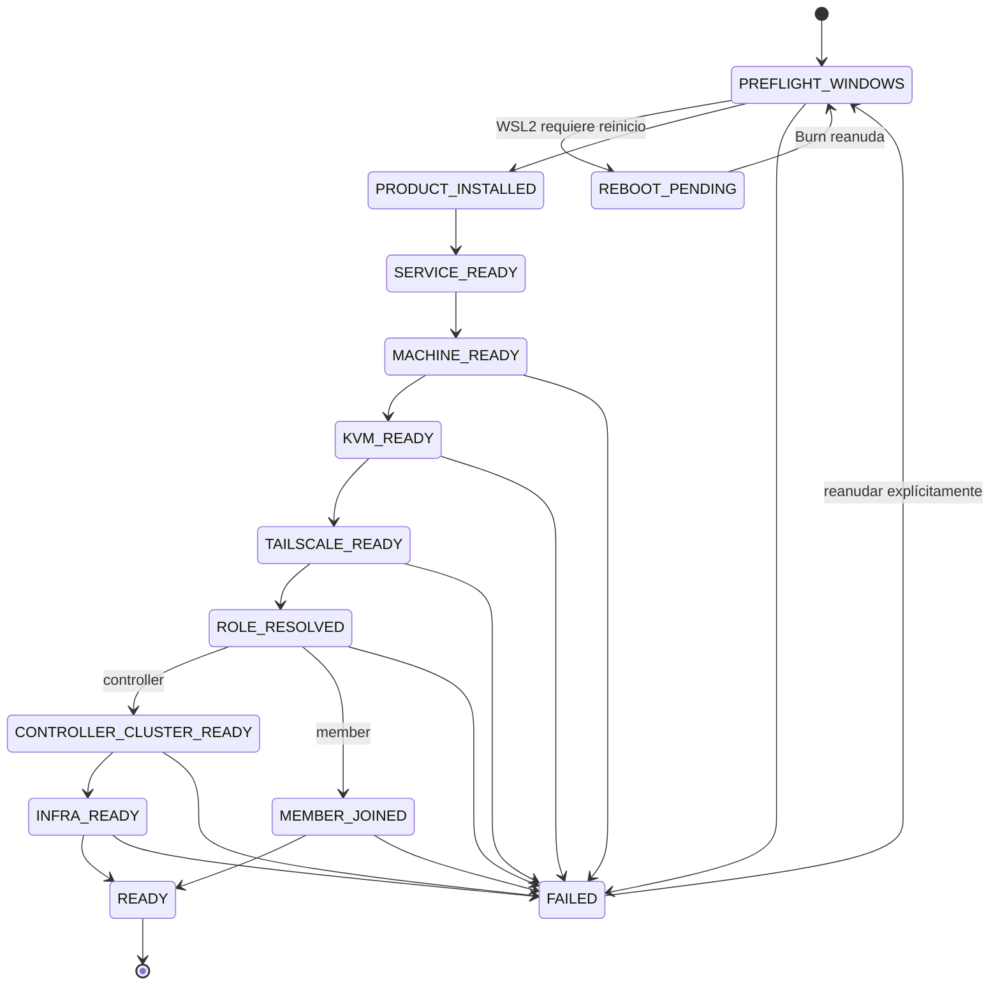

# Arquitectura del PoC Quetzalcoatl

Estado: contrato normativo para implementación  
Alcance: Incremento 1 (controller) e Incremento 2 (member)  
Prioridad: obtener `QuetzalcoatlSetup.exe` funcionando en un host real cuanto antes

## 1. Objetivo

El PoC debe producir un único instalador Windows que deje operativo el sistema completo en dos incrementos acumulativos:

1. La primera instalación autorizada no encuentra otros nodos Quetzalcoatl en Tailscale, se designa automáticamente `controller` y converge el runtime local y la infraestructura seleccionada.
2. Las dos instalaciones siguientes, ejecutadas secuencialmente, encuentran al mismo controller en Tailscale, se designan automáticamente `member`, levantan el mismo runtime local y unen su Proxmox al clúster existente.

El PoC termina cuando el recorrido controller y el mismo recorrido member repetido en dos hosts Windows objetivo funcionan y `gnx status --json` lo demuestra. No termina cuando el código solamente compila.

## 2. Regla de alcance

Sólo se implementa lo que aparece en este documento. Una condición no contemplada termina con un error explícito y reanudable; no habilita fallbacks, proveedores alternativos, elecciones distribuidas ni lógica de recuperación general.

### Incluido

- WiX Toolset 5 Burn para `QuetzalcoatlSetup.exe`.
- WiX Toolset 5 MSI para archivos inmutables y registro del servicio.
- Habilitación de WSL2 con reanudación después de reinicio.
- Podman fijado a una versión y una máquina administrada con nombre fijo.
- Preflight obligatorio de virtualización y KVM dentro de WSL2/Podman Machine.
- `gnx-service.exe` en Rust como única autoridad privilegiada del producto.
- `gnx.exe` en Rust como CLI sin privilegios.
- Named Pipe local con ACL para la comunicación CLI/instalador/servicio.
- Tailscale, Proxmox y OpenTofu como componentes obligatorios.
- Rol automático mediante descubrimiento de nodos etiquetados en `tailscale status --json`.
- Garage S3 y Forgejo como opciones independientes, desplegadas únicamente por el controller.
- Docker Compose dentro de LXC para Garage y Forgejo.
- DPAPI para secretos persistidos en Windows.
- Un solo escritor OpenTofu: el controller.

### Fuera de los dos incrementos

- Invitaciones, enrolamiento firmado o selección manual de rol.
- OAuth, `client_id` o `client_secret` de Tailscale.
- Headscale y Forgejo Runner.
- Tauri Tray.
- Upgrades, migraciones generales, uninstall destructivo y purge.
- Compatibilidad con varios proveedores de VM, red, runtime o infraestructura.
- Elección automática de controller, failover o promoción de member.
- Instalaciones iniciales concurrentes.
- Benchmarks y frameworks de pruebas.
- Garage como backend de OpenTofu.

La aceptación será manual y reproducible con comandos y artefactos reales. Esto no autoriza construir un framework de testing.

## 3. Topología soportada



La única topología de aceptación contiene exactamente un controller y dos members. Ambos members ejecutan el mismo Incremento 2; no existe un tercer incremento. Un cuarto host GNX produce `TOPOLOGY_UNSUPPORTED`; no se implementan HA, promoción ni elecciones.

## 4. Decisiones e invariantes

| Área | Decisión normativa | Límite del PoC |
|---|---|---|
| Instalador | WiX Toolset 5.0.2 Burn encadena prerrequisitos y MSI | No se implementa abstracción de instaladores |
| Windows | Un baseline Windows 11 x64 físico con virtualización habilitada | No hay matriz multi-versión |
| Runtime Linux | Una Podman Machine Fedora nombrada `quetzalcoatl` | No se adoptan máquinas del usuario |
| Identidad | La máquina pertenece a la cuenta virtual `NT SERVICE\Quetzalcoatl` | Es administrada por Windows, no tiene contraseña y la CLI no ejecuta privilegios directamente |
| SID de servicio | WinSW y su hijo `gnx-service` se ejecutan con el token de esa cuenta; SCM carga su perfil | El nombre de servicio fija el SID que debe poseer Podman y DPAPI user-scope después de reiniciar |
| Autoridad | `gnx-service` contiene toda la lógica privilegiada | WinSW sólo supervisa el proceso; no contiene lógica de dominio |
| Runtime local | systemd y Quadlets mantienen Podman | Quadlet no administra Windows, WSL ni infraestructura PVE |
| Red | Tailscale SaaS conecta los nodos host | Headscale queda fuera |
| Rol | Cero hosts GNX implica controller; uno o dos hosts GNX implican member | El PoC exige exactamente un controller identificable, admite hasta dos peers y persiste el rol una sola vez |
| Infraestructura | OpenTofu está presente en todos los nodos | Sólo el controller puede ejecutar `init/plan/apply` |
| Estado OpenTofu | Backend local persistente y `0600` en el controller | Garage no es backend en estos incrementos |
| Apps remotas | Garage y Forgejo viven en LXC con Docker Compose | Ninguna app remota es Quadlet local |
| Secretos | Tailscale usa únicamente `auth_key` | No OAuth; ningún secreto entra en MSI properties, argv o logs |
| Puertos Windows | Ningún puerto PVE se publica en Windows | Todo acceso ocurre por tailnet |
| Errores | Fallo explícito con etapa y código, seguido de reanudación manual | Sin rollback general ni caminos alternativos |

El MSI registra WinSW como el servicio `Quetzalcoatl` bajo la cuenta virtual `NT SERVICE\Quetzalcoatl`; no crea un usuario local ni persiste una contraseña. El nombre del servicio es inmutable dentro de la línea 0.1.x porque determina su SID. La aceptación exige comprobar que el wrapper, `gnx-service`, Podman Machine y DPAPI usan ese mismo SID antes y después de reiniciar.

La cadena queda fijada a WiX Toolset 5.0.2, WinSW 2.12.0 x64 —SHA-256 `05B82D46AD331CC16BDC00DE5C6332C1EF818DF8CEEFCD49C726553209B3A0DA`— y WSL 2.7.10.0 x64 MSI —SHA-256 `1A62F90A43C03CC5BDA47DFD0B6FAF496AC70FD4389190518120A4F84FC895CF`—. Podman CLI para Windows queda fijado a 6.0.1 x64 MSI; ProductCode `{661EDED1-C5BC-430C-8802-015B34A382FA}`; UpgradeCode `{A6A9DD9C-0732-44BA-9279-FFE22EA50671}`; SHA-256 `3B65848F2D9AE652A15C35F2496A9ECE2E07F28746FA651415D519AE7C5902AD`. Burn valida tamaño y SHA-256 de cada artefacto descargado antes de compilar la cadena; HostPreflight valida el producto instalado por ProductCode, nombre y versión.

La máquina usa exclusivamente el artefacto WSL x86_64 de Podman Machine OS 6.0.1: commit `137982aea62947e436bfb58408676e246414ea47`, índice OCI `sha256:6dec5eadc84f41e55c3b6fc67264ed6c985e5f61a1d4ba243056dc0efc234bec`, manifest de plataforma `sha256:c1b05f0f5f5cdbbfb2be4e23fccfbd0436f3aa6bfa6d4705daed00a251b03943` y layer/archivo `sha256:0d828beef16a031a50a7cee594fd79ade36c3d3972b590cb01c32a987bd88bc3` de 249,510,008 bytes. El build verifica el release oficial `podman-machine.x86_64.wsl.tar.zst`, el MSI lo instala en `machine-images` y RuntimeGate vuelve a verificarlo antes de `podman machine init`. La creación no depende de red ni del resolvedor OCI de Podman 6.0.1 y no admite tag, imagen o proveedor alternativo.

Cada versión publicada obtiene un ProductCode MSI nuevo y conserva el UpgradeCode `{47D5BD44-D061-407B-913B-47D17EC3BEA9}`. `MajorUpgrade` ejecuta `RemoveExistingProducts` después de `InstallInitialize`, de modo que una falla restaura la versión anterior. Quetzalcoatl 0.1.1 usa ProductCode `{3704395F-B42C-409D-A342-EE03E81A6B4C}` y reemplazó transaccionalmente 0.1.0. Burn conserva ProviderKey y UpgradeCode `{10B764B2-36AE-4911-A8C8-2F1A2A963769}`; cada evidencia identifica el EXE concreto por SHA-256.

## 5. `runtime payload v1` y Quadlets

El antiguo término “versioned runtime profile” se reemplaza por **`runtime payload v1`**. No es un proceso, un servicio ni un framework de migraciones. Es el conjunto inmutable de archivos que corresponde exactamente a la versión del MSI:

`runtime/payload-v1/manifest.json` es la fuente normativa del payload: fija plataforma `linux/amd64`, commits de origen, digests OCI de plataforma y SHA-256 de cada archivo. No admite tags mutables ni secretos embebidos.

- manifiesto con versión, hashes y digests;
- imagen WSL x86_64 fijada para la única Podman Machine;
- `gnx-node.pod`;
- `tailscaled.container`;
- `proxmox.container`;
- `opentofu.image`;
- ejecutable/script fijado `gnx-tailscale-enroll` y su unidad one-shot;
- unidad de soporte `gnx-opentofu.service` para ejecución one-shot;
- configuración base de Tailscale Serve;
- scripts cerrados `pve-init`, `pve-join` y `pve-status`;
- módulos OpenTofu utilizados por el controller;
- Compose y configuración fijados para Garage y Forgejo.

El flujo de ownership es único:



Responsabilidades:

- MSI posee los archivos inmutables en `%ProgramFiles%\Quetzalcoatl`.
- MSI instala la imagen WSL fijada; `gnx-service` verifica su tamaño y SHA-256 antes de crear la máquina.
- `%ProgramData%\Quetzalcoatl` posee estado mutable, checkpoints y blobs DPAPI.
- `gnx-service` verifica y aplica el payload dentro de la máquina administrada.
- systemd genera y supervisa unidades a partir de Quadlets.
- Podman ejecuta el pod y sus contenedores.
- OpenTofu se invoca sólo cuando el controller debe converger recursos PVE; no queda como daemon.

En los incrementos 1 y 2 el payload tiene versión `1`. El campo existe para comprobar compatibilidad y reanudar; no se crea código de migraciones.

## 6. Preflight Windows, WSL2 y KVM

Hay dos gates con ownership distinto. Burn no administra la Podman Machine y `gnx-service` no habilita features Windows.

### HostPreflight — Burn, antes del MSI

| Orden | Verificación o acción | Resultado permitido | Fallo |
|---|---|---|---|
| 1 | Windows 11 x64 y privilegios de administrador | Baseline soportado | `UNSUPPORTED_WINDOWS` |
| 2 | Virtualización habilitada en firmware e hipervisor activo | Disponible | `VIRTUALIZATION_DISABLED` |
| 3 | WSL2 y Virtual Machine Platform | Reusar o habilitar | `WSL_ENABLE_FAILED` |
| 4 | Reinicio requerido | Persistir sólo checkpoint no secreto y reanudar Burn | `REBOOT_RESUME_FAILED` |
| 5 | WSL Store/version fijada y proveedor WSL2 | Compatible | `WSL_VERSION_UNSUPPORTED` |
| 6 | Podman MSI fijado | Instalar o reutilizar sólo versión compatible | `PODMAN_INSTALL_FAILED` |

### RuntimeGate — `gnx-service`, después del MSI

| Orden | Verificación o acción | Resultado permitido | Fallo |
|---|---|---|---|
| 1 | SID y perfil de la identidad runtime | Cuenta estable, perfil cargado | `RUNTIME_IDENTITY_INVALID` |
| 2 | `.wslconfig` de esa identidad con nested virtualization | Configuración efectiva después de `wsl --shutdown` | `WSL_NESTED_VIRT_FAILED` |
| 3 | Imagen WSL fijada y máquina `quetzalcoatl` propiedad de esa identidad | Verificar el archivo local; crear o reutilizar únicamente la máquina propia | `RUNTIME_PAYLOAD_INVALID` / `MACHINE_CREATE_FAILED` |
| 4 | systemd y cgroup v2 dentro de Fedora | Saludables | `FEDORA_RUNTIME_UNSUPPORTED` |
| 5 | `/dev/kvm`, `/dev/net/tun` y `/dev/fuse` | `KVM_GET_API_VERSION=12`; TUN y FUSE utilizables | `REQUIRED_DEVICE_MISSING` |
| 6 | Contenedor PVE privilegiado con esos devices | Arranca y abre KVM correctamente | `NESTED_RUNTIME_FAILED` |

La conexión Podman del producto será rootful y estará aislada bajo la identidad dedicada. La mera existencia de `/dev/kvm` no basta: RuntimeGate invoca el ioctl `KVM_GET_API_VERSION` y exige el valor `12` dentro de la máquina y del contenedor PVE. Si falla, la instalación se detiene; no existe fallback a emulación por software ni a otro proveedor.

El Quadlet PVE usa `--privileged`, pasa KVM, TUN y FUSE y conserva únicamente los dos bind mounts de datos PVE. No monta `/sys/fs/cgroup` desde el host: al detectar `/sbin/init`, el modo systemd de Podman 6.0.1 monta cgroup v2 escribible dentro del contenedor. RuntimeGate crea previamente los directorios persistentes, arranca la unidad generada y exige systemd, cgroup v2 y servicios PVE saludables.

Docker dentro de LXC es una restricción aceptada. Antes de integrar Garage o Forgejo se debe demostrar dentro del LXC: Docker Engine, Compose, cgroup v2, `fuse-overlayfs`, `/dev/net/tun` y reinicio persistente. No se implementará fallback a QEMU VM.

## 7. Secuencia de instalación y rol automático



### Contrato de descubrimiento

Precondiciones Tailscale:

- El operador entrega una `auth_key` reutilizable, preautorizada y no efímera, con únicamente `tag:quetzalcoatl-node`. `tagOwners` asigna ese tag a administradores y hace que `tag:quetzalcoatl-node` sea propietario directo de `tag:quetzalcoatl-service`.
- El bootstrap host solicita explícitamente sólo `--advertise-tags=tag:quetzalcoatl-node` y verifica que `Self.Tags` contiene exactamente ese tag.
- El bootstrap de Garage/Forgejo reutiliza la misma key, solicita sólo `--advertise-tags=tag:quetzalcoatl-service` y verifica el tag exacto antes de arrancar la aplicación. La delegación directa reemplaza el tag original; no añade ambos tags al sidecar.
- No existe `tag:quetzalcoatl-controller`: controller/member es estado automático y ambos hosts usan exclusivamente `tag:quetzalcoatl-node`.
- La ACL permite visibilidad y tráfico únicamente entre identidades GNX autorizadas.
- El descubrimiento de rol filtra exclusivamente `tag:quetzalcoatl-node`, excluye `Self` y peers expirados; los sidecars nunca cuentan como hosts.
- La tailnet tiene HTTPS/Serve habilitado y `CertDomains` contiene el dominio esperado; no se permite un consentimiento web durante Setup.
- `tailscaled` debe estar autenticado y el mismo inventario debe observarse en dos lecturas consecutivas antes de decidir.
- Un peer host conocido cuenta aunque esté temporalmente offline; así nunca se crea un segundo controller por una caída de red.

Con sólo `auth_key`, “cero peers” significa “cero peers visibles”. El instalador no puede distinguir una tailnet vacía de una ACL que oculta máquinas existentes. La visibilidad correcta del tag es una precondición externa bajo control del operador; una ACL incorrecta no habilita otro mecanismo de descubrimiento.

Matriz:

| Estado persistido | Peers host distintos de self | Controller identificable | Acción |
|---|---:|---:|---|
| Existe | Cualquiera | Cualquiera | Reusar el rol persistido; no redetectar ni cambiar |
| No existe | 0 | 0 | Persistir `controller`, fijar hostname y crear clúster |
| No existe | 1 | Existe exactamente un `gnx-controller-*` | Persistir `member`; unirse si está online o quedar `CONTROLLER_UNAVAILABLE` reanudable |
| No existe | 2 | Existe exactamente un `gnx-controller-*`; el otro es `gnx-member-*` | Persistir el segundo `member`; unirse al mismo controller |
| No existe | 1 o 2 | Cero o más de un controller identificable | `TOPOLOGY_UNSUPPORTED`; no persistir rol ni mutar PVE |
| No existe | Más de 2 | Cualquiera | `TOPOLOGY_UNSUPPORTED`; no persistir rol ni mutar PVE |

La regla de negocio es automática: si existe cualquier otra máquina host autorizada, el nuevo nodo es member. Entre uno o dos peers debe existir exactamente un hostname `gnx-controller-*`; sólo se usa para localizar la autoridad de `pvecm`, no para elegirla. El límite de tres hosts evita HA, elección o selección manual. Antes de `pvecm create`, el futuro controller vuelve a confirmar que el inventario continúa vacío.

En una reanudación, “no redetectar el rol” significa no volver a decidir controller/member. Un member sí vuelve a consultar el peer guardado para comprobar su identidad, disponibilidad e IP actual antes del join. El `Self.ID` de Tailscale y el ID del controller se persisten. Tailscale [genera un nuevo par de claves de nodo al reautenticar](https://tailscale.com/docs/concepts/tailscale-identity), por lo que una rotación de `Self.ID` es válida únicamente durante la reconciliación protegida cuando permanecen idénticos la IPv4 Tailscale, el hostname lógico, la tailnet, el tag, TUN y el contrato HTTPS. En ese caso se actualizan sólo `self_id` y `controller.id`; rol, etapa, IP y hostnames no cambian. Cualquier otra deriva es fail-stop.

Los hostnames de Garage y Forgejo se derivan del hostname lógico persistido del controller, no del `Self.ID` vivo. Así una reautenticación no renombra servicios ni crea una segunda identidad lógica.

Las tres instalaciones se ejecutan secuencialmente. No se escribe código de elección para instalaciones iniciales simultáneas.

## 8. Red y exposición

La exposición completa se define mediante tres controles complementarios:

1. El `serve.conf` mencionado en el PoC se materializa como el `serve.json` consumido por `TS_SERVE_CONFIG` y publica endpoints TCP/HTTPS aprobados.
2. La política Tailscale por tags autoriza tráfico directo entre nodos.
3. El firewall dentro del runtime limita puertos y peers.

`serve.json` no sustituye la conectividad directa que necesitan el join de PVE y Corosync.

Política Tailscale mínima del producto:

| Origen | Destino | Permiso |
|---|---|---|
| `tag:quetzalcoatl-node` | `tag:quetzalcoatl-node` | TCP 22 y 8006; UDP 5405-5412 |
| `autogroup:admin` | `tag:quetzalcoatl-node` | TCP 22 y 443 |
| `autogroup:admin` | `tag:quetzalcoatl-service` | TCP 443 y 2222 |
| SSH `tag:quetzalcoatl-node` | `tag:quetzalcoatl-node` | `accept` como `root` |
| SSH `autogroup:admin` | `tag:quetzalcoatl-node` | `check` como `root` |

No hay wildcard de red ni `nodeAttrs` de Funnel. La regla preexistente `group:dev → tag:github-rdp` permanece limitada a TCP/UDP 3389 y no concede acceso a tags Quetzalcoatl.

| Tráfico | Transporte | Ruta | Control | Publicación Windows |
|---|---|---|---|---|
| PVE UI operacional | TCP 443 hacia backend HTTPS 8006 | Tailscale Serve en el sidecar del nodo | `serve.json` + ACL | Ninguna |
| PVE API de cluster/join | TCP 8006 | IP tailnet directa, mismo namespace del pod | ACL `node → node` + firewall | Ninguna |
| SSH PVE | TCP 22 | IP tailnet directa, mismo namespace del pod | ACL `node → node` + firewall | Ninguna |
| Corosync | UDP 5405-5412 | IP tailnet directa, mismo namespace del pod | ACL `node → node` + firewall | Ninguna |
| OpenTofu → PVE | HTTPS `127.0.0.1:8006` | Loopback dentro de `gnx-node.pod` | Provider PVE fijado con `insecure=true` únicamente para ese backend local | Ninguna |
| Garage S3 | TCP 443 hacia 3900 | Tailscale Serve del sidecar Garage | `serve.json` + tag service | Ninguna |
| Forgejo web | TCP 443 hacia 3000 | Tailscale Serve del sidecar Forgejo | `serve.json` + tag service | Ninguna |
| Forgejo SSH | TCP 2222 hacia 22 | TCP forward del sidecar Forgejo | `serve.json` + tag service | Ninguna |

El proxy de la UI PVE usa como backend local `https+insecure://127.0.0.1:8006` porque PVE inicia con certificado propio; esto sólo desactiva la validación entre el sidecar y su backend local. El acceso del usuario sigue siendo HTTPS de Tailscale. El directorio `/config`, no el archivo suelto, se monta en el sidecar y `TS_SERVE_CONFIG=/config/serve.json`; la configuración se valida con `tailscale serve status --json`.

MagicDNS y **HTTPS Certificates** deben estar habilitados una sola vez en la tailnet antes de instalar. El instalador no abre el consentimiento web ni ejecuta `tailscale cert`: exige que Serve pueda aprovisionar su certificado automáticamente y falla cerrado si el handshake HTTPS no queda operativo.

Garage y Forgejo comparten el namespace de red de su sidecar. Compose recrea ambos contenedores como una unidad, el bootstrap exige que sus namespaces coincidan y ejecuta los probes locales mediante `nsenter`; no se publican puertos del servicio en el host LXC.

Corosync queda fijado a la tailnet: el controller ejecuta `pvecm create quetzalcoatl --link0 <controller-ts-ip>` y el member `pvecm add <controller-ts-ip> --link0 <member-ts-ip>`. Los nombres PVE resuelven a esas IP y la postcondición verifica que `ring0_addr` en `corosync.conf` coincide; no se acepta la interfaz que Proxmox elija por defecto.

Antes de `pvecm join`, el servicio debe comprobar en ambos sentidos:

- identidad y reachability del controller;
- PVE API privada;
- SSH TCP/22;
- Corosync UDP por la interfaz tailnet;
- resolución de nombres estable;
- fecha y hora sincronizadas;
- camino Tailscale directo, pérdida cero y RTT menor a 5 ms; no se acepta DERP para el cluster.

Si cualquiera falla, el member queda `failed-resumable` y no intenta otra red ni otro puerto.

## 9. Secretos y DPAPI

### Entradas del instalador

- aceptación de licencia;
- nombre esperado de la tailnet;
- `auth_key` Tailscale, en control enmascarado;
- nuevo password `root` de Proxmox, en control enmascarado, para reemplazar la credencial bootstrap de la imagen;
- `install_garage`;
- `install_forgejo`.

No existe campo de rol, invitación, OAuth ni `client_id`.

Burn solicita `auth_key` y password PVE únicamente después de completar HostPreflight, cualquier reboot, el MSI y el arranque de `gnx-service`. Antes del reboot sólo persiste el checkpoint de etapa; nunca necesita almacenar plaintext para reanudar.

### Flujo de secretos



Reglas:

- Burn no pasa secretos como propiedades MSI, argumentos o variables registradas en logs.
- El instalador registra una sola cuenta virtual runtime, `NT SERVICE\Quetzalcoatl`; WinSW, DPAPI y Podman Machine deben usar su mismo SID estable. No existe contraseña de cuenta; SCM crea el token y carga el perfil antes de que `gnx-service` descifre o invoque Podman.
- El servicio recibe y cifra el secreto con DPAPI user-scope bajo esa identidad.
- Los blobs viven en `%ProgramData%\Quetzalcoatl\secrets` con ACL para SYSTEM y la identidad del servicio.
- El plaintext sólo cruza a Fedora/LXC por stdin o un canal temporal y vive en `/run` con modo `0600`.
- Los snippets que contienen `TS_AUTHKEY` son referencias, no archivos de producto. El Quadlet y los Compose canónicos nunca contienen el valor.
- Antes de habilitar `tailscaled.container`, `gnx-service` inicia exclusivamente `gnx-tailscale-enroll.service`. El one-shot usa la misma imagen Tailscale fijada, consume `/run/gnx/ts-authkey`, solicita el tag host y escribe el state en `/var/lib/quetzalcoatl/tailscale/host` (`0700`, root).
- En cada LXC, el mismo script fijado ejecuta un `docker run --rm` de enrolamiento, solicita el tag service y escribe en `/var/lib/quetzalcoatl/tailscale/<servicio>` antes de `docker compose up`.
- Tras verificar IP, identidad y tag exacto, el one-shot elimina contenedor y archivo temporal. El contenedor permanente monta el mismo state como `TS_STATE_DIR`, usa `TS_AUTH_ONCE=true` y nunca recibe `TS_AUTHKEY`.
- La credencial fija de build de la imagen PVE sólo permite el bootstrap local. Antes de habilitar Serve, API o join, `gnx-service` establece el password solicitado, verifica que la credencial de build dejó de funcionar y conserva únicamente el nuevo valor cifrado con DPAPI.
- `gnx-service` genera una sola vez con CSPRNG el RPC secret/admin tokens de Garage y las claves internas requeridas por Forgejo; los blobs DPAPI son la fuente de recuperación. Después del arranque, la CLI oficial de Garage genera la credencial S3 y el servicio captura su salida una vez para cifrarla con DPAPI.
- Los secretos Linux se materializan fuera del Compose y del repositorio, administrados por root y legibles sólo por root y el UID de aplicación estrictamente necesario.
- OpenTofu crea infraestructura, pero no recibe secretos de aplicación ni los guarda en `tfvars` o state.

## 10. OpenTofu y servicios remotos

OpenTofu es obligatorio como motor de infraestructura, pero su autoridad depende del rol:

| Componente | Controller | Member |
|---|---|---|
| Imagen OpenTofu fijada | Presente | Presente |
| Workspace y state | Presente, local y `0600` | Ausente |
| Credenciales PVE | DPAPI, entrega temporal | Ausentes |
| `init/plan/apply` | Permitido por `gnx-service` | Denegado antes de ejecutar |
| Garage/Forgejo LXC | Crea sólo los seleccionados | Nunca crea ni reconverge |

Garage no puede ser backend del state durante estos incrementos porque es opcional y todavía no existe durante el primer `apply`. El state local del controller es la única implementación del PoC. No se escribe migración a S3.

La vía de ejecución es única: `gnx-service → systemctl start gnx-opentofu.service → contenedor OpenTofu fijado`. El workspace vive en `/var/lib/quetzalcoatl/opentofu/controller` (`0700`), se monta como `/workspace`, y `terraform.tfstate` y su backup son `0600`. El member no crea esa ruta. OpenTofu apunta sólo a `https://127.0.0.1:8006/api2/json` dentro del pod; debido al certificado bootstrap de PVE usa `insecure=true` sólo en loopback y nunca usa Serve ni la IP tailnet.

Secuencia por servicio seleccionado:

1. OpenTofu crea el LXC, red, almacenamiento y metadatos estrictamente necesarios.
2. OpenTofu devuelve el VMID; antes de existir el sidecar, `gnx-service` usa exclusivamente el PVE local para ejecutar `pct push/exec` dentro del guest.
3. Por ese canal host-mediated instala/verifica Docker Engine y Compose mediante el script fijado del payload.
4. El servicio genera secretos, copia Compose sin valores sensibles y materializa archivos con owner/mode mínimos para el UID de la aplicación.
5. Ejecuta el enrolamiento Tailscale one-shot y después `docker compose up` con el contenedor permanente sin auth key.
6. Comprueba endpoint privado y persiste sólo estado no secreto. SSH por tailnet queda disponible después; no participa en el bootstrap.

La ejecución canónica del controller selecciona Garage y Forgejo. Desmarcar una opción sólo omite su recurso; no introduce perfiles, dependencias ni caminos de recuperación adicionales.

## 11. Estado, reanudación y CLI

Estado mutable Windows:

- `%ProgramData%\Quetzalcoatl\state.json`: etapa, rol, identidad controller, opciones y último error; nunca secretos.
- `%ProgramData%\Quetzalcoatl\secrets\*.bin`: blobs DPAPI.
- `%ProgramData%\Quetzalcoatl\logs`: logs acotados y redactados.

Máquina de estados:



Cada transición escribe checkpoint sólo después de verificar su postcondición. Reanudar repite la operación actual de forma idempotente; no ejecuta rollback del trabajo ya convergido.

CLI mínima:

- `gnx status`
- `gnx status --json`
- `gnx runtime status`
- `gnx cluster status`

Todos los comandos consultan `gnx-service` por Named Pipe. Ninguno modifica WSL, Podman, PVE o OpenTofu directamente.

Esquema mínimo de `gnx status --json`:

```json
{
  "schema_version": 1,
  "overall": "ready",
  "stage": "READY",
  "role": "controller",
  "controller": "gnx-controller-<node-id>",
  "components": {
    "service": "ready",
    "wsl": "ready",
    "podman_machine": "ready",
    "kvm": "ready",
    "tailscale": "ready",
    "tailscale_serve": "ready",
    "proxmox": "ready",
    "opentofu": "ready"
  },
  "cluster": {
    "joined": true,
    "quorate": true
  },
  "services": {
    "garage": "ready",
    "forgejo": "ready"
  },
  "last_error": null
}
```

Los únicos valores necesarios para estados de componentes son `pending`, `ready`, `failed`, `not_selected` y `not_applicable`.

## 12. Los dos incrementos

### Incremento 1 — Controller funcional

Camino canónico:

1. Ejecutar Setup en un Windows limpio.
2. Habilitar/reusar WSL2, reiniciar y reanudar si hace falta.
3. Instalar MSI, servicio y CLI.
4. Crear la máquina Podman administrada y pasar el gate KVM.
5. Aplicar payload v1 y registrar Tailscale con `auth_key`.
6. No encontrar otros hosts GNX y persistir `controller`.
7. Levantar PVE, crear el clúster y habilitar OpenTofu.
8. Desplegar Garage y Forgejo cuando están seleccionados.
9. Terminar con `gnx status --json` en `READY` y sin puertos Windows publicados.

Criterio de cierre: el EXE realiza el recorrido completo en un host objetivo y existe evidencia de PVE, Tailscale, OpenTofu y los servicios seleccionados funcionando.

### Incremento 2 — Member funcional

Camino canónico:

1. Ejecutar el mismo Setup, primero en un segundo Windows y después sin cambios en un tercero.
2. Repetir la preparación local y registrar Tailscale.
3. Encontrar uno o dos hosts GNX, clasificar y persistir `member`.
4. Confirmar que existe exactamente un controller y que ambos members conservan su ID/IP.
5. Levantar PVE local, comprobar SSH/Corosync/API y ejecutar `pvecm join`.
6. Denegar OpenTofu y no crear servicios remotos.
7. Terminar con `gnx status --json` en `READY` en ambos members y clúster de tres nodos visible desde todos.

Criterio de cierre: el mismo EXE agrega dos members mediante el mismo camino, el clúster queda quorate con tres nodos y existe una sola autoridad OpenTofu y una sola instancia de cada servicio remoto seleccionado.

## 13. Condiciones fail-stop

No se agrega lógica alterna. La instalación se detiene cuando:

- falta KVM o cualquiera de los devices requeridos;
- la versión o hash del runtime payload no coincide;
- la `auth_key` es inválida o no produce los tags requeridos;
- HTTPS/Serve no está habilitado o `CertDomains` no contiene el dominio esperado;
- la credencial bootstrap PVE continúa activa después de la convergencia local;
- el descubrimiento encuentra más de dos peers host, o entre uno y dos peers no existe exactamente un controller;
- cambia la IP, hostname, tailnet, tag, TUN o contrato HTTPS de la identidad Tailscale propia, o desaparece la identidad controller persistida; una rotación aislada de `Self.ID` sigue la reconciliación acotada de la sección 7;
- PVE API, SSH o Corosync no son viables antes del join;
- un member intenta ejecutar OpenTofu;
- Docker dentro del LXC no pasa su gate;
- Garage o Forgejo seleccionados no alcanzan estado saludable;
- aparece un secreto en logs, argumentos, Compose, OpenTofu state o archivos sin protección.

El código informa etapa, código y evidencia acotada. No inventa un segundo camino.

## 14. Referencias normativas

- [PoC original](../PoC.md)
- [WiX Toolset y Burn](https://docs.firegiant.com/wix/tools/burn/)
- [WiX Toolset v5.0.2](https://github.com/wixtoolset/wix/releases/tag/v5.0.2)
- [WinSW v2.12.0](https://github.com/winsw/winsw/releases/tag/v2.12.0)
- [WSL v2.7.10](https://github.com/microsoft/WSL/releases/tag/2.7.10)
- [Cuentas de servicio y perfil cargado por SCM](https://learn.microsoft.com/en-us/windows/win32/services/service-user-accounts)
- [Cuentas virtuales `NT SERVICE`](https://learn.microsoft.com/en-us/windows-server/identity/ad-ds/manage/understand-service-accounts)
- [Podman Machine](https://docs.podman.io/en/latest/markdown/podman-machine.1.html)
- [Podman v6.0.1](https://github.com/podman-container-tools/podman/releases/tag/v6.0.1)
- [Podman Machine rootful](https://docs.podman.io/en/stable/markdown/podman-machine-set.1.html)
- [Configuración avanzada de WSL](https://learn.microsoft.com/es-es/windows/wsl/wsl-config)
- [API KVM](https://docs.kernel.org/virt/kvm/api.html)
- [Tailscale auth keys](https://tailscale.com/docs/features/access-control/auth-keys)
- [Tailscale tags](https://tailscale.com/docs/features/tags)
- [Tailscale Docker parameters](https://tailscale.com/docs/features/containers/docker/docker-params)
- [Tailscale Serve](https://tailscale.com/docs/reference/tailscale-cli/serve)
- [Tipos de conexión Tailscale](https://tailscale.com/docs/reference/connection-types)
- [Tailscale en Proxmox](https://tailscale.com/docs/integrations/proxmox)
- [OpenTofu local backend](https://opentofu.org/docs/language/settings/backends/local/)
- [Windows DPAPI](https://learn.microsoft.com/en-us/windows/win32/api/dpapi/nf-dpapi-cryptprotectdata)
- [Proxmox VE Administration Guide](https://pve.proxmox.com/pve-docs/pve-admin-guide.pdf)
- [Garage Quick Start](https://garagehq.deuxfleurs.fr/documentation/)
- [Forgejo con Docker](https://forgejo.org/docs/latest/admin/installation/docker/)
- [Imagen tailnet-proxmox v0.0.1](https://github.com/mayas-alas/tailnet-proxmox/tree/e71615e8e63cbc4a49a32fcd86d0424ac885f850)
- [Tailscale v1.98.8](https://github.com/tailscale/tailscale/releases/tag/v1.98.8)
- [OpenTofu v1.12.4](https://github.com/opentofu/opentofu/releases/tag/v1.12.4)
- [Provider Proxmox v0.111.1](https://github.com/bpg/terraform-provider-proxmox/releases/tag/v0.111.1)
- [Garage v2.3.0](https://git.deuxfleurs.fr/Deuxfleurs/garage/releases/tag/v2.3.0)
- [Forgejo v16.0.0](https://codeberg.org/forgejo/forgejo/releases/tag/v16.0.0)
- [Snippet base de Tailscale/Garage](https://github.com/tailscale-dev/video-code-snippets/tree/ba499312d243e882f7577017065f5d7f2e7982ca/2026/2026-03-s3-garage/docker)

Las referencias demuestran piezas. Los gates de este documento demuestran la integración específica del producto.
