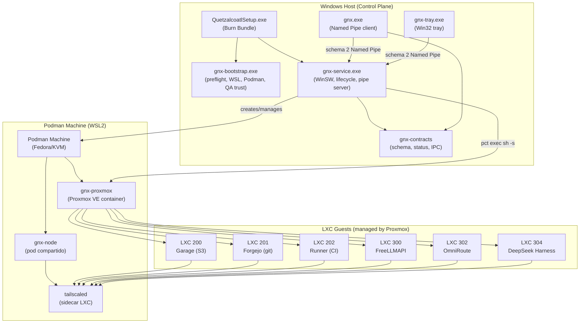
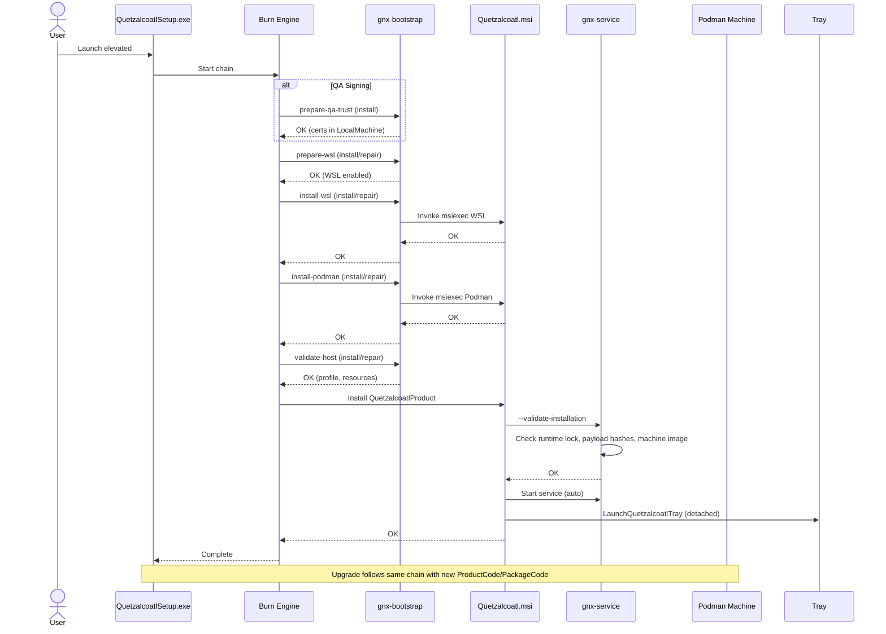
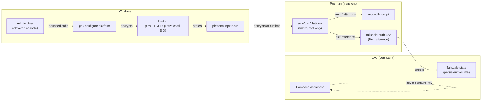
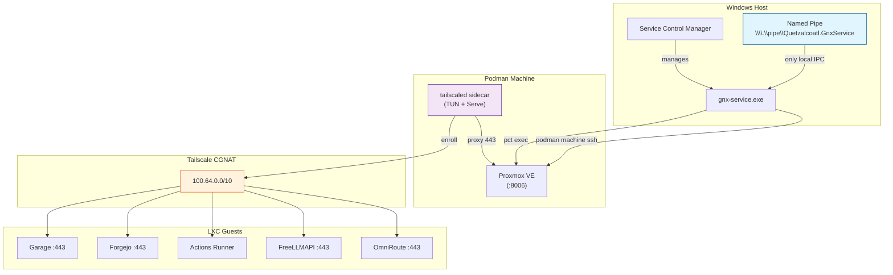

# Architecture

Quetzalcoatl is a Windows control plane around one managed Podman Machine. The
workspace contains exactly four Cargo packages. Setup owns installation, upgrade
and repair; the service owns reconciliation; CLI and tray are bounded Named Pipe
clients.

```text
QuetzalcoatlSetup.exe
  +-- gnx-bootstrap       closed host preflight, pinned dependencies, recovery
  `-- Quetzalcoatl.msi    gnx, tray, service, runtime and machine image
          `-- validate locked installation before StartServices

gnx / tray -- Named Pipe schema 2 --> gnx-service
                                         +-- Windows profile/core state
                                         +-- separate node/platform DPAPI secrets
                                         `-- Podman Machine bounded stdin
                                               +-- Tailscale
                                               `-- Proxmox
```

## Workspace packages

The workspace has exactly four packages:

| Path | Responsibility |
|---|---|
| `apps/gnx` | CLI, pipe client and native Win32 tray |
| `apps/gnx-service` | application lifecycle, domain rules and infrastructure |
| `apps/gnx-bootstrap` | host preflight, dependencies and reboot recovery |
| `crates/gnx-contracts` | shared IPC, status, host profile and schema constants |

`crates/` is the standard Rust workspace location for shared libraries; it is not
vendor storage. Application sequencing belongs in `application/`, rules and closed
types in `domain/`, and operating-system/process adapters in `infrastructure/`.

## Service lifecycle

The service lifecycle is: host profile and WSL, pinned Podman Machine, Fedora/KVM,
locked payload, protected configuration, Tailscale identity and role, local PVE
readiness, fixed HTTPS Serve route, controller creation or bounded member join, then
atomic `READY`. Zero online controllers selects controller; one or more selects
member. Existing members do not affect the choice. Persisted valid identity wins on
restart.

The native tray intentionally adds no localhost UI, listener, port or Tauri runtime.

## Platform foundation

The platform foundation extends only a READY controller. OpenTofu owns PVE
resources; the locked GNX reconciler streams one fixed host operation through
`pct exec <known-vmid> -- /bin/sh -s` and then applies fixed Compose definitions.
Every LXC host is prepared independently before Garage, Forgejo and the runner are
ordered by their real dependencies.

`gnx configure platform` stores a dedicated service-enrollment credential without
rewriting node, tailnet or PVE configuration. Each service uses a Tailscale
sidecar and a persistent node-state volume; the enrollment credential exists only
in a root-only transient file referenced by a transient declarative `tailscaled`
configuration. Service repositories declare only desired private exposure and
never receive network credentials.

Forgejo bootstrap administration is the sole resource-specific CLI surface. The
fixed `gnx-admin` identity is shared as a closed IPC constant; its credential is
owned by the controller, verified against Forgejo before disclosure and rotated
through the loopback API. The service enforces elevated local-administrator access,
and the remote path remains a fixed runtime-agent operation with bounded stdin.

## Runtime layout

```text
runtime/
  |-- commands/        installed executable payload only
  |-- configuration/   installed configuration
  |-- containers/      installed Quadlet definitions
  |-- services/        installed units
  |-- operations/      repository-owned stdin programs and probes
  |-- manifest.toml
  `-- payload.lock.json
```

`runtime/manifest.toml` fixes generation `proxmox-platform` and payload contract 6.
`runtime/payload.lock.json` is authoritative for components, installed paths, modes
and SHA-256 values. Only locked files are installed. Operations are compiled into
fixed orchestration paths and are not copied as runtime payload.

## Remote execution contract

Remote execution has three distinct channels:

```text
argv  = closed repository-selected operation
stdin = bounded variable data or repository-owned program
file  = validated durable state required by a consumer
```

Argument vectors contain no shell syntax, redirection, pipelines, substitution,
caller commands or arbitrary remote argv. Multiline programs use a fixed
interpreter in stdin mode (`sh -s` or `python3 -`). The platform applies that same
contract through `pct exec <known-vmid> -- /bin/sh -s`; OpenTofu contains no
provisioners. Input, output and time are bounded; timeout kills and reaps the child.
Durable writes use GNX-owned paths, restrictive permissions and atomic activation.
Secret-bearing stdin is never logged.

Platform reconciliation, deployment and Forgejo administration share one
controller-owned exclusive lock. A password reset cannot overlap an operation that
may consume the previous credential.

`sh -c`, `bash -c`, new listeners and mutable image tags are prohibited. The
exception set is empty.

## Component topology



## Install and upgrade flow



## Runtime reconciliation flow

```mermaid
graph LR
    subgraph "Windows Service"
        Pipe["Pipe Server<br/>(schema 2)"]
        Reconciler["Platform Reconciler"]
        SecretStore["DPAPI Secret Store<br/>(platform-inputs.bin)"]
    end

    subgraph "Podman Machine (gnx-proxmox)"
        ReconcileOp["reconcile script"]
        DeployOp["deploy script"]
        TofuContainer["OpenTofu Container"]
        LXC200["LXC 200 Garage"]
        LXC201["LXC 201 Forgejo"]
        LXC202["LXC 202 Runner"]
        LXC300["LXC 300 FreeLLMAPI"]
        LXC302["LXC 302 OmniRoute"]
        LXC304["LXC 304 DeepSeek Harness"]
    end

    Pipe -->|closed stdin| Reconciler
    Reconciler -->|bounded stdin<br/>(schema, node, tailnet, pve-pass, auth-key)| ReconcileOp
    ReconcileOp -->|flock| OperationLock["operation.lock"]
    ReconcileOp -->|pct exec sh -s| LXC200
    ReconcileOp -->|pct exec sh -s| LXC201
    ReconcileOp -->|pct exec sh -s| LXC202
    ReconcileOp -->|podman run| TofuContainer
    TofuContainer -->|S3 backend| GarageBucket["Garage S3<br/>(state + lock)"]

    Reconciler -->|if READY controller| DeployOp
    DeployOp -->|fixed locked inventory| NativePolicy["native service policies"]
    DeployOp -->|pct exec sh -s| LXC300
    DeployOp -->|pct exec sh -s| LXC302
    DeployOp -->|pct exec sh -s| LXC304
    DeployOp -->|podman run| TofuContainer

    SecretStore -.->|never in argv/env/logs| ReconcileOp
```

## Secret materialization contract



## Network and exposure model



## Data contracts

### IPC schema 2

```json
{
  "command": "Status",
  "configuration": null,
  "platform_configuration": null
}
```

### Status response schema 2

```json
{
  "schema_version": 2,
  "overall": "ready",
  "stage": "READY",
  "role": "controller",
  "controller": "gnx-controller-...",
  "components": { ... },
  "cluster": { ... },
  "platform": { "forgejo_url": "https://gnx-forgejo....ts.net" },
  "pve_url": "https://gnx-controller-....ts.net:8006"
}
```

### Runtime operation stdin (closed)

```
schema=1
node_name=gnx-controller-2024-...
tailnet=example.ts.net
password=<pve-root-password>
auth_key=<tailscale-auth-key>
```

Completion markers:

| Marker | Meaning |
|---|---|
| `PVE_CLUSTER=ready` | Controller cluster created |
| `PVE_JOIN=ready` | Member joined |
| `PLATFORM_RECONCILE=ready` | OpenTofu applied |
| `PLATFORM_DEPLOY=ready` | Services deployed |
| `FORGEJO_ADMIN_USERNAME=gnx-admin` | Admin credential recovered |
| `GNX_RUNTIME_AGENT=1` | Agent healthcheck |

### Platform bundle contract 1

The platform bundle is one semantic implementation. `platform/manifest.toml` fixes
bundle contract 1. `platform/platform.lock.json` is authoritative for the 23 locked
files. Staging is atomic: the reconciler copies to `platform.gnx-new`, validates,
then activates.

### Host profile schema 1

```json
{
  "schema_version": 1,
  "product_version": "0.3.1",
  "detected": { "logical_cpus": 6, "total_memory_mib": 8192, "system_disk_*": 100 },
  "selected": { "capability": "runtime", "machine_cpus": 4, "machine_memory_mib": 4096, "machine_disk_gib": 60 },
  "supported": true,
  "cluster_member_supported": false,
  "warnings": []
}
```

## Deliverable mapping

| ID | Outcome | Owned paths |
|---|---|---|
| PCT | Bounded platform contract | `crates/gnx-contracts/`, `apps/gnx/src/commands/`, `docs/CONTRACTS.md` |
| BND | Locked platform bundle | `platform/platform.lock.json`, `runtime/payload.lock.json`, `installer/modules/platform.ps1` |
| RUN | Closed platform runner | `apps/gnx-service/src/application/reconciler.rs`, `platform/operations/reconcile`, `platform/operations/deploy` |
| FND | Reproducible foundation | `platform/operations/lxc-host`, `platform/tofu/foundation/` |
| STO | Isolated object storage | `platform/operations/reconcile` (Garage S3 backend, secrets) |
| FRG | Sovereign repository entry | `platform/services/forgejo/`, `platform/operations/forgejo-admin` |
| OCI | Immutable service images | `platform/services/{freellmapi,omniroute,deepseek-dsh}/compose.yml`, `platform/platform.lock.json` |
| SVC | Fixed native workload path | `platform/tofu/service/`, `platform/operations/list-native-services.py`, `platform/operations/{deploy,lxc-service}` |
| NET | Private service exposure | `platform/operations/reconcile` (Tailscale enrollment), `platform/services/*/serve.json` |
| ADM | Closed Forgejo administration | `apps/gnx/src/commands/forgejo.rs`, `platform/operations/forgejo-admin` |
| REC | Safe recovery | `apps/gnx-service/src/application/installation.rs`, `apps/gnx-bootstrap/src/recovery/`, `installer/modules/*.ps1` |
| ARP | Sole maintenance entry | `installer/source/bundle.wxs`, `installer/source/product.wxs`, `installer/build.ps1` |
| SUP | Verifiable supply chain | `runtime/payload.lock.json`, `platform/platform.lock.json`, `installer/modules/signing.ps1`, `tools/check.ps1` |
| REL | Integrated release | `release/manifest.toml`, `installer/build.ps1`, `.AGENTS/EVIDENCE.md`, `CHANGELOG.md` |

## Preserved invariants

- The existing schema-2 core state and schema-1 host profile remain readable and
  authoritative for host identity, topology and cluster recovery.
- Platform state is separate and cannot change the controller/member decision.
- Closed remote argv; variable data uses bounded stdin.
- Controller/member role derives only from validated online topology.
- PVE readiness precedes platform reconciliation.
- No localhost UI, Windows listener, new Windows product port or Tauri runtime.
- No PVE credentials enter Forgejo, its registry, Actions or a runner.
- No service repository supplies HCL, providers, provisioners or remote commands.
- The node enrollment key and `installer-inputs.bin` are not reused as the platform
  secret. Platform enrollment uses schema-1 `platform-inputs.bin`, separate DPAPI
  entropy and `tag:quetzalcoatl-service`.
- Tailscale enrollment credentials are prohibited in repositories, Forgejo Actions
  secrets, Compose, `.env`, OCI images, logs, argv and OpenTofu state.
- Images use immutable digests; mutable tags are prohibited.
- `installer/build.ps1` remains the release entry point.
