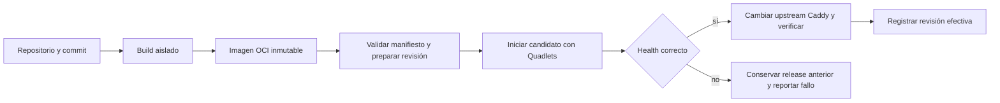

# GNX — Instalación, adaptación de WatchTower y cierre del POC

Estado: propuesta para revisión, 7 de septiembre de 2026. Complementa [arquitectura.md](arquitectura.md). Este documento define qué construir y cómo aceptarlo; no afirma que las pruebas de integración ya se hayan ejecutado.

## 1. Experiencia que debe quedar funcionando

El operador instala GNX con un archivo de su plataforma y obtiene CoreDNS, Caddy y el runtime de aplicaciones sin instalar una malla. En LAN puede abrir `https://mesh.gnx`, ver el estado y acceder a aplicaciones. Después puede instalar una app de integración NetBird, Tailscale u otra, que consume el contrato de red publicado por GNX y vuelve alcanzables DNS e ingress sin añadir lógica del fabricante al núcleo. Una aplicación declarada desde un repositorio llega a `https://demo.gnx`; una release defectuosa conserva o recupera la versión anterior.

El POC incluye un nodo x86-64, una organización, una aplicación web de ejemplo, PostgreSQL, backup/restauración y un flujo de despliegue. CoreDNS autoritativo, el runtime compartido y la demostración independiente de dos apps de integración —una NetBird y una Tailscale— son obligatorios. HA, Kubernetes, catálogo de bases múltiples, ejecución arbitraria remota, LLM autónomo y virtualización anidada no forman parte del cierre.

## 2. Dos artefactos finales

| Artefacto | Contenido y función | Condiciones de soporte inicial |
|---|---|---|
| `GNX-Setup-x64.exe` | Instalador firmado, CLI host, broker, tray y payload Linux verificado | Windows 11 x64 con WSL2 soportado y virtualización; elevación en instalación |
| `gnx-linux-x86_64.run` | Instalador autoextraíble, CLI/servicio Linux, configuración, unidades y payload compartido | Linux x86-64 con systemd, cgroup v2, soporte Podman/Quadlet y TUN |

El payload Linux común es un componente interno de build, no una tercera descarga que el usuario deba ensamblar. Firmas, checksums, inventario de dependencias y avisos acompañan la publicación. La primera matriz a calificar será Ubuntu 24.04 y Debian 13; otras distribuciones reciben diagnóstico de compatibilidad, no una promesa de soporte universal. Versiones finales de Podman/systemd se fijan según las funciones efectivamente usadas.

Elijo `.run` porque el trabajo principal es instalar servicios, paquetes del sistema y permisos. AppImage resuelve el empaquetado portable de una aplicación, pero no elimina esas necesidades del host; añadir FUSE, extracción y montaje al camino crítico no simplifica este producto. El instalador reutiliza los gestores de paquetes admitidos y valida capacidades antes de modificar el host. Headless es un modo de primera clase. [Conceptos de AppImage](https://docs.appimage.org/introduction/concepts.html).

### Windows

1. Verificar firma/payload, espacio, virtualización y WSL; habilitar características faltantes mediante elevación. Si hace falta reinicio, guardar la fase y continuar después.
2. Instalar binarios públicos en Program Files y preparar estado privado en ProgramData. Crear `gnx-runtime` como cuenta estándar de servicio, con contraseña aleatoria protegida por el sistema operativo.
3. Iniciar el broker en esa identidad, cargar su perfil e importar la distro GNX. Instalar el payload Linux por un canal privado; configurar systemd, identidades Linux y permisos.
4. Publicar el contrato local de red. Si el operador elige una integración, instalar su bundle revisado y entregarle solo sus credenciales por entrada protegida; la app aplica su enrolamiento específico.
5. Habilitar `gnx.exe` en PATH y el tray en la sesión del usuario. Mostrar éxito solo después de comprobar el acceso al portal desde Windows.

Una app de integración dentro del runtime no conecta automáticamente el navegador del host. Para acceso por malla, el host operador debe disponer del cliente NetBird, Tailscale o equivalente que corresponda; se reutiliza uno existente o se instala el cliente oficial verificado. No se exige instalar ambos en el escritorio. Ese cliente concede acceso al portal, no lectura del VHD ni de los secretos de GNX.

La cuenta de servicio y las cuentas Linux son identidades diferentes. Un operador normal conserva acceso a las acciones GNX autorizadas; no obtiene `wsl --exec` ni una terminal bajo la identidad sensible. Arrancar WSL como servicio tras reinicio, sin login humano y tras `wsl --shutdown`, es una prueba de aceptación. No se resuelve un fallo de esa prueba elevando permanentemente `gnx-runtime` a administrador.

### Linux

1. Comprobar distro/capacidades y validar el payload antes de ejecutar su instalación. Admitir `--check`, instalación interactiva y `--headless` como interfaz propuesta.
2. Instalar dependencias desde repositorios confiables y crear cuentas de aplicación/build, subUID/subGID, directorios y permisos. Preparar las credenciales sin incluirlas en argumentos.
3. Instalar CLI, socket del broker Linux, unidades de sistema, Quadlets rootless de usuario y linger. La configuración creada pertenece al administrador; el servicio web no puede escribir arbitrariamente unidades de sistema.
4. Publicar el contrato de red y verificar el portal en LAN. Instalar solo las apps de integración seleccionadas y validar cada una por separado. En desktop, instalar launcher/tray y completar confianza TLS; en headless, entregar estado y pasos de acceso remoto.

Actualizar sustituye payload y unidades con versión fija, comprueba health y conserva una revisión anterior. Desinstalar distingue binarios de datos y pide una decisión explícita antes de borrar volúmenes, credenciales o backups. Ningún instalador modifica distros, contenedores o mallas que GNX no administra.

### Tray

Se respeta el gesto solicitado: **clic derecho abre `https://mesh.gnx`; clic izquierdo abre un menú breve** con Estado, Abrir GNX, Diagnóstico y Salir del tray. Salir del tray no detiene servicios. El tray consulta el contrato local y abre enlaces; no guarda claves ni ejecuta comandos privilegiados.

En Windows se implementa con la API nativa. En Linux, la entrega del gesto depende del escritorio y su soporte de StatusNotifier/AppIndicator: algunos hosts imponen su propio menú contextual. El instalador comprueba compatibilidad; en escritorios incompatibles queda un launcher a `mesh.gnx` y se informa que el gesto exacto no está disponible. El modo servidor no instala UI. No se añade Electron únicamente para un icono.

## 3. WatchTower: adaptación elegida

Referencia inspeccionada: [sinhaankur/WatchTower, commit a782ffc](https://github.com/sinhaankur/WatchTower/tree/a782ffc18577ea03a6370d6621c7a6f34bb7d33b). Es una plataforma de despliegues con interfaz web y gestión de aplicaciones; no es `containrrr/watchtower`, el actualizador de imágenes. La capacidad de negocio se interpreta como repositorio → aplicación privada, con base de datos, historial, backup y recuperación. [Presentación upstream](https://github.com/sinhaankur/WatchTower/blob/a782ffc18577ea03a6370d6621c7a6f34bb7d33b/README.md).

No es una integración lista para activar con un flag: el código inspeccionado incluye ejecución directa de contenedores, pods y administración de Podman Machine. La propuesta es reutilizar selectivamente interfaz/modelos de su núcleo compatible y añadir un **backend GNX Quadlet explícito**, con un único camino de ejecución. Ese backend es trabajo nuevo y debe tener una prueba de viabilidad antes de importar una gran parte del proyecto.

| Capacidad | Reutilizar o adaptar | Dueño final de ejecución |
|---|---|---|
| Proyectos, historial y estado web | Evaluar componentes Apache reutilizables; nombres públicos GNX | GNX Apps consulta estado efectivo |
| GitHub → build | Mantener integración de repositorio; fijar commit y aislar build | Servicio temporal de build sin claves de runtime |
| Desplegar/revertir | Sustituir ejecución directa por solicitud con app, revisión y digest | Aplicador GNX + systemd |
| PostgreSQL | Sustituir pod por contenedor, red y volumen independientes | Quadlets rootless por proyecto |
| Backup | Dump consistente + archivo cifrado y copia externa | Unidades de tarea y timers |
| Recuperación | Reinicio limitado y rollback tras health fallido | systemd y transacción de release GNX |
| Red, DNS y TLS upstream | Retirar propiedad paralela de red, DNS y certificados | CoreDNS/Caddy; transporte en apps de integración externas |
| Agente LLM, shell remota y runtime genérico | No se integran en el POC | Coordinación de agentes fuera del producto |

Puntos concretos de intervención: [local_runner.py](https://github.com/sinhaankur/WatchTower/blob/a782ffc18577ea03a6370d6621c7a6f34bb7d33b/watchtower/local_runner.py) ejecuta aplicaciones directamente; [managed_db_runtime.py](https://github.com/sinhaankur/WatchTower/blob/a782ffc18577ea03a6370d6621c7a6f34bb7d33b/watchtower/managed_db_runtime.py) organiza bases en pods; [podman_runtime.py](https://github.com/sinhaankur/WatchTower/blob/a782ffc18577ea03a6370d6621c7a6f34bb7d33b/watchtower/podman_runtime.py) permite operaciones generales de contenedores/máquinas. No se finge compatibilidad con un ejecutable llamado `podman` que traduzca comandos: se sustituye la frontera de ejecución y se eliminan esos caminos del perfil GNX.

La integración prioriza conservar componentes útiles, no hacer un fork completo. Si separar el backend exige mantener dos supervisores o modificar extensamente el núcleo, se considera fallida esa vía; el fallback propuesto es conservar el contrato declarativo y entregar el flujo mínimo mediante CLI/portal GNX, dejando pendiente la paridad de interfaz WatchTower. Esta contingencia debe reportarse como alcance pendiente, no como integración terminada.

### Licencias y atribuciones

El [LICENSE raíz](https://github.com/sinhaankur/WatchTower/blob/a782ffc18577ea03a6370d6621c7a6f34bb7d33b/LICENSE) es Apache-2.0; [LICENSING.md](https://github.com/sinhaankur/WatchTower/blob/a782ffc18577ea03a6370d6621c7a6f34bb7d33b/LICENSING.md) distingue `pro/` bajo Elastic License 2.0 y también declara supuestos comerciales para embedding. No tratar el repositorio completo como FOSS ni asumir resuelta esa discrepancia de alcance. El build inicial excluye `pro/` y audita archivos/dependencias seleccionados antes de redistribuirlos. Si un componente esencial necesita términos adicionales, business decide esa incorporación; el runtime base no dependerá de él. Se conservan avisos, copyright y atribuciones; las superficies de producto se llaman GNX.

### Límite de confianza de GNX Apps

El panel tiene su propia autenticación y almacenamiento de sesiones/historial. Solo entrega solicitudes tipadas al servicio GNX; no monta el socket Podman de infraestructura ni recibe credenciales de integraciones, claves de CA, root del host o argv arbitrario. La identidad autorizada puede operar sus workloads; instalar una integración, modificar políticas de red o cambiar confianza TLS sigue siendo una acción administrativa distinta.

Los repositorios son entrada no confiable. El build fija el commit, limita CPU/memoria/tiempo y produce una imagen OCI inmutable. Se ejecuta bajo una identidad separada, sin montar secretos o sockets del runtime. La caché de build no forma parte del backup de datos. El envío de credenciales al registro/repositorio usa canales de archivo/socket admitidos, nunca URL con token ni argumento secreto.

## 4. Declarar, desplegar y recuperar

Ejemplo de intención de aplicación; el schema aún se debe implementar:

```toml
schema = 1
id = "demo"
kind = "workload"
hostname = "demo.gnx"

[source]
repository = "https://github.com/example/demo"
ref = "main"
# El build resuelve ref a un commit; la release conserva ese commit.

[build]
containerfile = "Containerfile"

[service]
port = 8080
health_path = "/healthz"

[database]
engine = "postgres"
credentials = "credential:demo-postgres"

[backup]
schedule = "daily"
retention_days = 7
destination = "storage:offhost-backups"
```

La UI y la CLI escriben este mismo contrato mediante el servicio autorizado. Los archivos son la intención; la base de datos del panel guarda historial, sesiones y trabajos, no una segunda configuración de despliegue. No se aceptan atributos libres de Quadlet, host paths ni flags de Podman dentro de manifiestos de aplicaciones.

`kind = "integration"` queda reservado a bundles revisados e instalados por un administrador; no puede obtenerse cambiando el manifiesto de un repositorio. Esas apps pueden recibir TUN, publicación de rutas o una credencial propia mediante concesiones explícitas. NetBird y Tailscale mantienen implementaciones separadas: comparten el contrato de datos de GNX, no una interfaz de proveedor ni un método genérico de conexión.



Para aplicaciones sin estado, se prueba el candidato en otro puerto interno y se cambia el upstream tras health correcto; si la verificación posterior falla, se restaura el upstream anterior. Se mantiene el volumen de datos separado de la release. Para aplicaciones con escritura compartida, el manifiesto debe declarar estrategia compatible; no se promete cero downtime por defecto.

Migraciones de base de datos se ejecutan como tarea explícita. Un rollback de imagen no deshace automáticamente una migración incompatible: se requiere esquema compatible hacia atrás o restauración planificada. El primer demo usará una migración aditiva, un dump verificable y una restauración en volumen aparte.

El primer disparador será `gnx apps deploy demo`; opcionalmente un timer comprueba cambios del repositorio y fija su commit antes de desplegar. Los webhooks GitHub llegan después: un endpoint privado `.gnx` no es alcanzable directamente por GitHub. Su incorporación necesita un receptor accesible, validación de firma y deduplicación. No se habilita exposición pública automáticamente para obtener push-to-deploy.

La primera recuperación automática comprende reiniciar un proceso fallido con límites, repetir una descarga transitoriamente fallida y rechazar una release no saludable. No reescribe código, permisos, puertos o credenciales ni borra datos para “arreglar” un despliegue. El fallo conserva causa, fase y acción requerida; las trazas no deben incluir secretos.

## 5. Implementación por cortes y pruebas de cierre

Las pruebas siguientes están **pendientes**. Validar los documentos o renderizar Mermaid no demuestra conectividad de las mallas ni instalación correcta.

| Corte | Entrega mínima | Evidencia necesaria para aprobar |
|---|---|---|
| 1. DNS autoritativo | CoreDNS, zona atómica y contrato de red | Desde LAN se obtienen SOA/A por UDP y TCP; wildcard si se habilita; NXDOMAIN/NODATA correctos; fuera de `gnx` se rechaza y no se reenvía |
| 2. Integraciones y HTTPS | Apps NetBird y Tailscale aisladas + Caddy + portal | Cada cliente, probado por separado, obtiene el mismo A y alcanza `mesh.gnx` con certificado confiable; cliente sin permisos no entra; no hay tránsito entre mallas ni colisión de rutas |
| 3. Instalación común | Dos instaladores y CLI | VM Windows limpia y dos distros Linux calificadas; reboot, arranque sin login, reejecución idempotente, recuperación de instalación interrumpida y tray |
| 4. GNX Apps | Backend Quadlet y demo | UI/CLI despliegan la misma revisión; solo systemd supervisa; Podman no contiene pods; sin socket privilegiado en panel |
| 5. Recuperación y datos | Release mala + backup | Health fallido conserva/restaura release previa; reinicio con límite; dump restaurado en volumen separado con contenido verificado |

Casos críticos adicionales:

- CoreDNS reinicia o recibe una zona inválida: la publicación atómica conserva la revisión anterior, no hay consultas `.gnx` a upstream público y no se afirma READY hasta recuperar estado. Se mide propagación de cambios y vencimiento de TTL.
- Se cae el control de una integración: CoreDNS, Caddy, LAN y la otra integración siguen funcionando. Se registra qué estado ya distribuido conserva esa app y qué operaciones remotas dejan de funcionar; no se promete continuidad que su control plane no ofrezca.
- GNX arranca y completa sus gates sin NetBird ni Tailscale instalados. Un análisis de dependencias confirma que `core`, `dns` e `ingress` no importan SDK, modelos ni API de fabricante; desinstalar una integración elimina solo sus unidades, estado y credenciales.
- Cambia IP de contenedor, digest o configuración: el plan detecta referencias y solo publica una revisión coherente. Una segunda ejecución sin cambios no reinicia todo.
- Endpoint Windows con cliente de malla existente: conserva su configuración ajena a GNX. Los permisos del usuario de servicio y del operador se verifican con intentos negativos de acceso al VHD/pipe.
- Secretos de prueba detectables no aparecen en Git, argv, `inspect`, logs ni evidencia. Se prueba su rotación sin crear una nueva identidad de nodo accidentalmente.
- La integración WatchTower no ejecuta sus rutas anteriores de pods, Machine o shell; un endpoint deshabilitado se rechaza en backend, no solo se oculta en la UI.

Cada corte termina en `READY`, `FAILED` o `ACTION_REQUIRED`, acompañado de fase y código estable. `systemctl is-active` por sí solo no equivale a servicio usable. No se publica como final un instalador que no complete los cortes de su plataforma.

## 6. Tamaño del código y siguientes extensiones

Implementar primero configuración tipada, validación, plantillas deterministas y un aplicador idempotente. Reutilizar bibliotecas mantenidas para TOML, serialización, TLS, procesos y APIs del sistema. Evitar framework de plugins, bus de eventos, cola distribuida, PKI propia y abstracciones con un único consumidor. El ahorro se mide por responsabilidades eliminadas y pruebas claras, no por comprimir funciones en menos líneas.

Fronteras propuestas para crecer: `core` para schema/plan, `host` para transporte local e instalación, `fabric` para direcciones/firewall, `dns` para CoreDNS, `ingress` para Caddy, `runtime` para archivos/unidades y `apps` para workloads e integraciones. Deben empezar como módulos; no como servicios separados. El código específico de NetBird, Tailscale o una red futura vive únicamente en su bundle instalado. No se crea una interfaz de proveedor sin una operación realmente común que la justifique.

La primera decisión técnica que desbloquea todo es aprobar CoreDNS y el contrato de red sin ninguna malla. La segunda es demostrar, con bundles independientes, que NetBird y Tailscale pueden consumir ese contrato sin modificar el núcleo. La tercera es probar que un despliegue de WatchTower pasa exclusivamente por el backend GNX. Con esas pruebas se construyen instaladores sobre una arquitectura comprobada, evitando empaquetar supuestos.

El resultado de esta fase son exclusivamente estos dos documentos en `docs/`. No se despliega infraestructura ni se importa código del POC anterior durante la propuesta.
