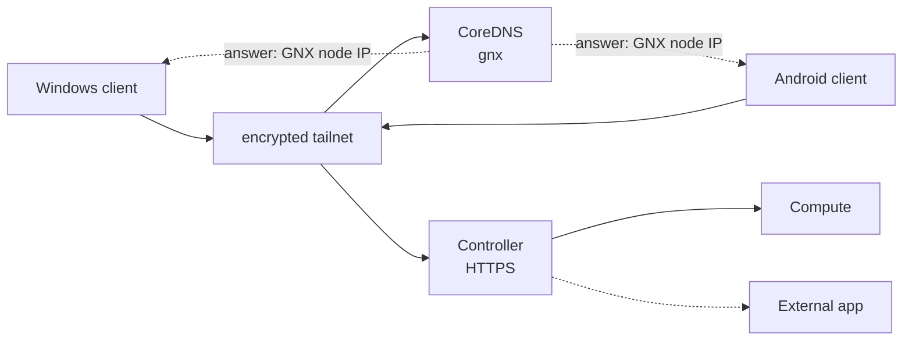
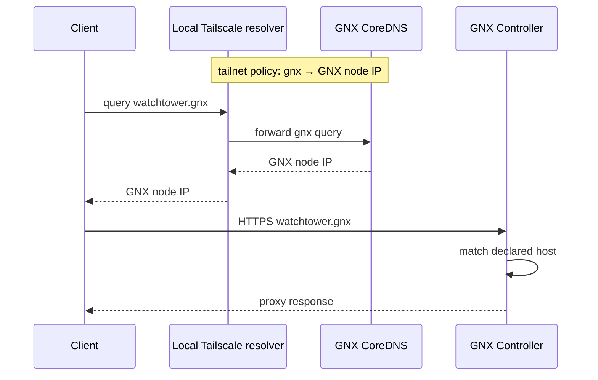

# Quetzalcoatl — PoC

Este PoC valida una idea concreta: **un nodo GNX puede levantar un plano privado de acceso, cómputo y control sobre Linux/WSL; clientes ya unidos al tailnet pueden resolver y alcanzar servicios `.gnx` sin que Quetzalcoatl modifique su DNS local; y una aplicación externa puede publicarse sin integrarla al core.**

No es una especificación del producto final. Su objetivo es eliminar incertidumbre técnica con el menor número de piezas.

## 1. Hipótesis

El PoC se considera útil si demuestra estas cuatro hipótesis:

1. `gnx` puede instalar y recuperar `access`, `compute` y `controller` con systemd + Quadlet.
2. Access puede mantener una identidad privada cifrada y ofrecer CoreDNS sobre su IP del tailnet.
3. Una política split DNS `gnx → <GNX_TAILNET_IP>` permite que Windows, Android y otros clientes resuelvan `*.gnx` sin cambios DNS realizados por GNX en esos endpoints.
4. Controller puede publicar tanto Compute como una aplicación totalmente externa sin convertirla en código, módulo o dependencia del proyecto.

## 2. Alcance

### Dentro

- un nodo GNX x86-64 en Linux o WSL2;
- `gnx access` con identidad Tailscale persistente;
- CoreDNS como autoridad de `gnx`;
- `gnx compute` con el servicio de cómputo histórico del proyecto;
- `gnx controller` con Caddy;
- un cliente Windows y un cliente Android unidos al mismo tailnet;
- una política split DNS configurada en el tailnet;
- una aplicación externa de prueba accesible como `<app>.gnx`;
- reboot y recuperación básica de servicios.

### Fuera

- plataforma genérica de apps;
- forks o adaptación de aplicaciones de terceros;
- múltiples mallas o abstracciones de proveedores;
- HA, scheduler o cluster multi-node;
- Kubernetes;
- CI/CD de aplicaciones, rollback de releases, bases administradas o backups;
- tray final, MSI final, `.run` final, auto-update o matriz comercial de distribuciones;
- automatización del panel DNS del tailnet;
- instalación silenciosa de CA en todos los clientes.

Estas capacidades pueden volver después del PoC; no deben condicionar su arquitectura inicial.

## 3. Resultado esperado



El cliente conoce únicamente el tailnet y los nombres `.gnx`. No necesita conocer bridges Podman, WSL, puertos de Compute o el mecanismo usado para ejecutar la aplicación externa.

## 4. Camino de construcción

### Corte A — runtime

Partir del modelo histórico de tres comandos:

```text
gnx access
gnx compute
gnx controller
```

Linux ejecuta el runtime real. Windows usa `gnx.exe` únicamente como puente hacia WSL2. Para este PoC basta bootstrap reproducible; no hace falta cerrar todavía el instalador comercial.

**Gate:** desde Linux/WSL, cada capacidad puede aplicar, consultar estado y fallar con un resultado estructurado.

### Corte B — Access y DNS

1. Levantar la identidad Tailscale de GNX con estado persistente.
2. Obtener su IP del tailnet.
3. Levantar CoreDNS autoritativo para `gnx` sobre esa identidad.
4. Crear registros mínimos, por ejemplo:

```text
compute.gnx    -> GNX_TAILNET_IP
watchtower.gnx -> GNX_TAILNET_IP
```

5. Configurar manualmente en el tailnet un nameserver restringido:

```text
zone:       gnx
nameserver: GNX_TAILNET_IP
```

**Gate local:** consultas UDP y TCP a CoreDNS resuelven nombres `gnx` y rechazan zonas ajenas.

**Gate remoto:** Windows y Android resuelven el mismo A/AAAA esperado usando la política del tailnet. GNX no modifica `hosts`, NRPT, adaptadores, resolvers ni configuración DNS local de esos clientes.

### Corte C — Controller

Caddy escucha sobre la frontera privada del nodo y acepta solo hosts declarados.

Primera ruta:

```text
compute.gnx -> compute upstream
```

La resolución DNS debe funcionar antes de evaluar TLS. Para HTTPS `.gnx`, la confianza de la CA se configura como una acción explícita y separada en el cliente de prueba.

**Gate:** `https://compute.gnx` llega al upstream correcto desde al menos un cliente remoto con confianza TLS configurada.

### Corte D — aplicación externa

Arrancar WatchTower fuera del repositorio Quetzalcoatl usando su distribución/containerización upstream. GNX no lo construye ni lo adapta.

Controller recibe únicamente una ruta similar a:

```text
watchtower.gnx -> http://<external-upstream>:8000
```

**Gate:** `watchtower.gnx` es alcanzable desde el cliente y la aplicación conserva su propio lifecycle.

Después:

1. detener la aplicación externa;
2. comprobar que Access, Compute y Controller siguen `READY`;
3. volver a levantarla sin reinstalar GNX;
4. comprobar que la ruta vuelve a funcionar.

La prueba valida el límite entre plataforma y aplicación, no la funcionalidad interna de WatchTower.

## 5. Flujo DNS que debe probarse



La propiedad importante no es el nombre del proveedor sino el contrato observado por el cliente: una política de DNS privada transporta la consulta al DNS autoritativo de GNX y el tráfico vuelve por el canal cifrado.

## 6. Casos de aceptación

| ID | Prueba | PASS |
|---|---|---|
| P1 | `access apply` + reboot | misma identidad del nodo; servicio recuperado |
| P2 | CoreDNS autoritativo | `.gnx` resuelve por UDP/TCP; zona ajena no se resuelve |
| P3 | Windows remoto | `compute.gnx` devuelve el IP GNX sin cambios DNS realizados por GNX |
| P4 | Android remoto | mismo resultado DNS desde el mismo tailnet |
| P5 | Controller | hostname declarado llega al upstream correcto; no declarado se rechaza |
| P6 | Compute | lifecycle + health sobreviven reboot |
| P7 | External app | se publica sin copiar/modificar código dentro de Quetzalcoatl |
| P8 | Aislamiento | detener/eliminar external app no rompe core |
| P9 | Trust | confiar la CA es explícito; DNS funciona independientemente de esa confianza |
| P10 | Windows bridge | `gnx.exe` delega; no existe una segunda implementación del runtime |

## 7. Evidencia mínima

Guardar para cada gate:

- revisión Git exacta;
- versión de `gnx`, systemd, Podman y servicios usados;
- `gnx ... status`;
- `systemctl` de las unidades GNX;
- IP/identidad privada del nodo sin credenciales;
- consultas DNS desde Linux, Windows y Android;
- petición HTTPS y hostname probado;
- reboot y segunda ejecución;
- diff/configuración del host Windows suficiente para demostrar que GNX no modificó su DNS.

No guardar auth keys, cookies, claves privadas ni URLs con secretos.

## 8. Condición de cierre

El PoC termina cuando los diez casos anteriores pasan en la misma revisión o cuando un bloqueo externo queda demostrado y acotado.

No hace falta haber construido el instalador final, un catálogo de aplicaciones ni automatización multi-red. El resultado que buscamos es más pequeño: **probar que Quetzalcoatl conserva su núcleo de tres capacidades, ofrece nombres `.gnx` sobre una frontera privada cifrada y puede publicar software externo sin absorberlo.**

Si eso funciona, la siguiente fase puede diseñar packaging, experiencia de instalación y extensiones a partir de evidencia real en vez de anticiparlas dentro del PoC.
