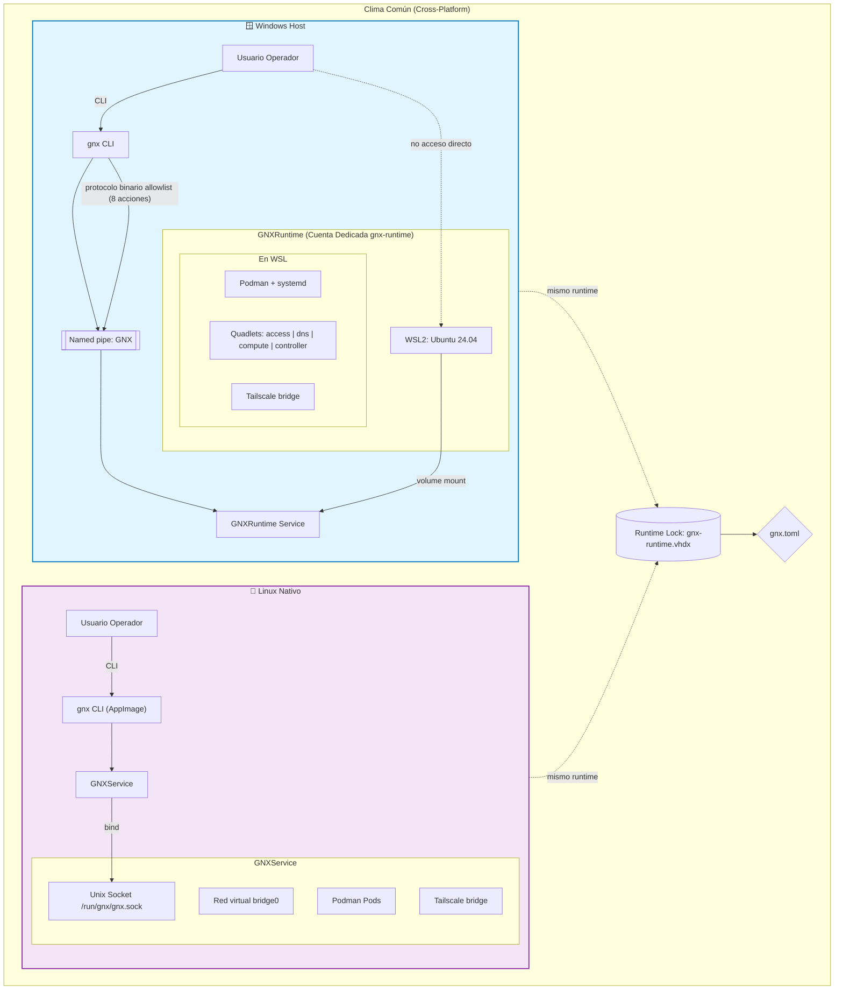
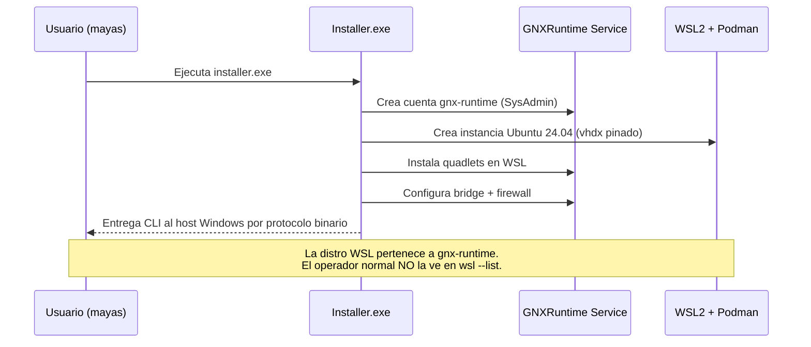
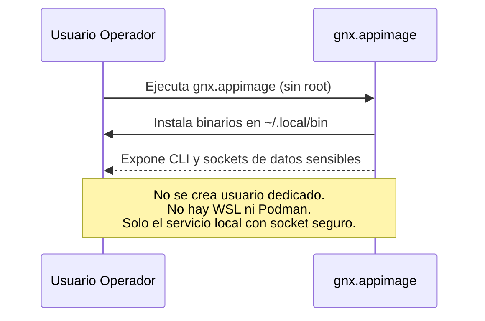
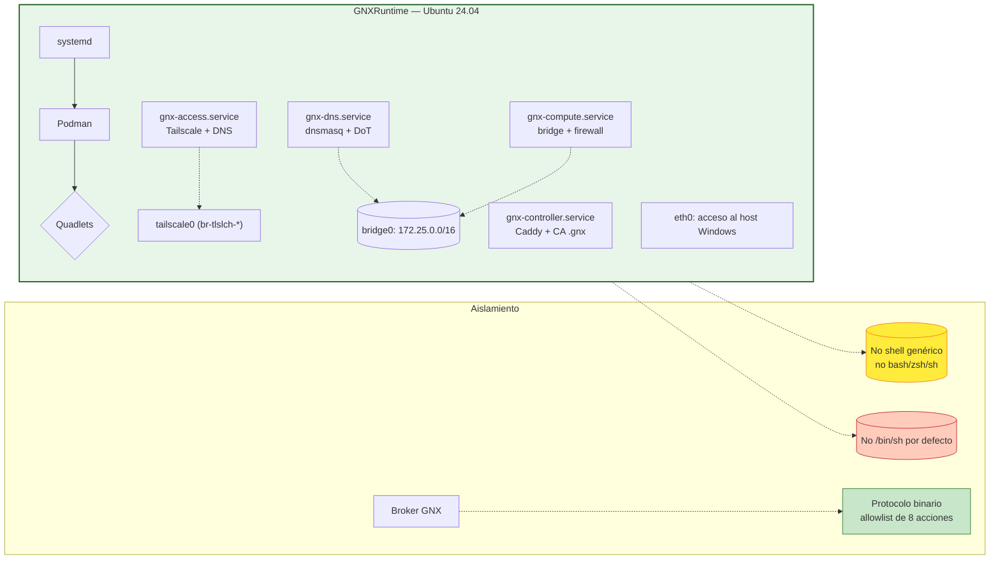
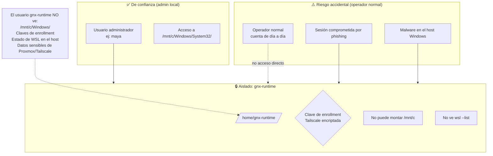
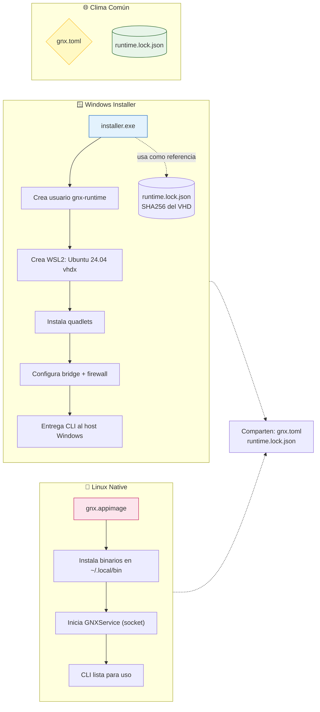
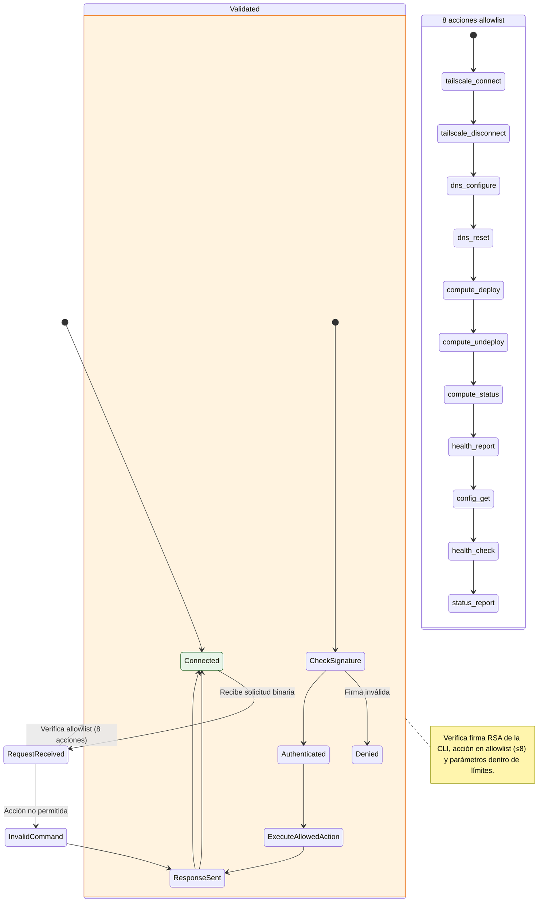
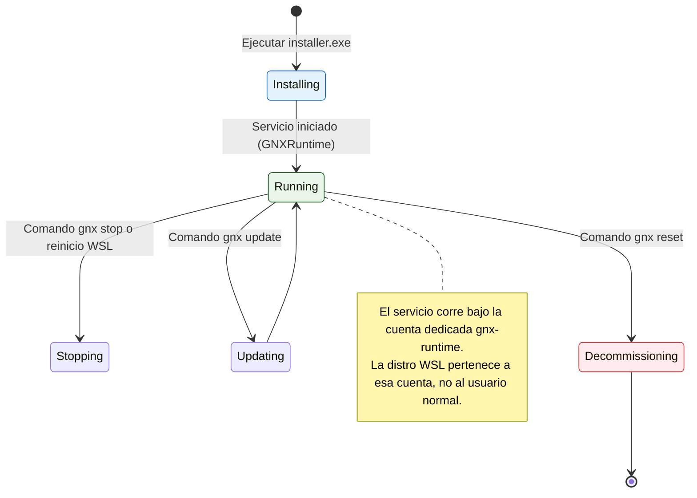
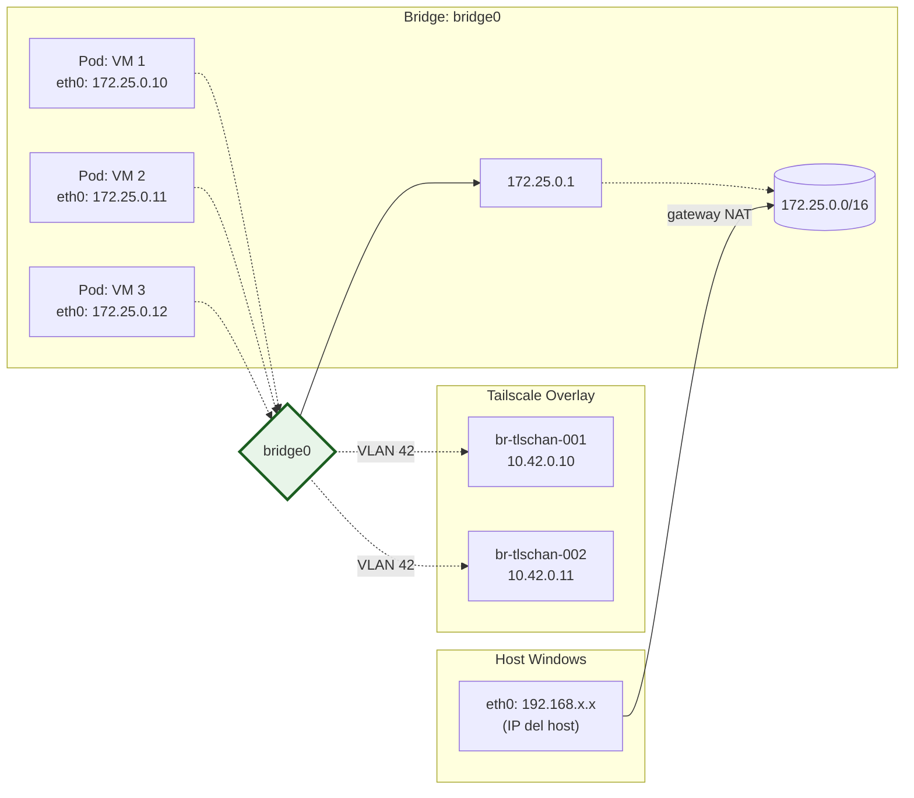

# GNX — Propuesta de Arquitectura Completa

## 🎯 Objetivo del Proyecto

Crear una plataforma que:

1. **En Windows:** Gestiona un usuario dedicado, crea una máquina WSL con Podman, instala cuadlets (Quadlets) y expone una CLI al host Windows.
2. **En Linux nativo:** Instala solo el binario de Linux (como AppImage), que pone la CLI + servicio con sockets para datos sensibles.

**Principio rector:** Menos código, máxima claridad conceptual. Los diagramas Mermaid son el mapa principal.

---

## 🗺️ Diagrama de Arquitectura Global



---

## 🏗️ Diagrama de Flujos de Instalación

### Flujo Windows



### Flujo Linux Nativo



---

## 🧩 Diagrama de Componentes del Runtime (WSL)



---

## 🔐 Diagrama de Límites de Confianza (Trust Boundaries)



---

## 📦 Diagrama de Artefactos de Distribución



---

## 📋 Diagrama de Protocolo Binario del Broker (Windows)



---

## 🔄 Diagrama del Ciclo de Vida del Servicio GNXRuntime



---

## 📐 Diagrama de Red Virtual (Quadlet Compute)



---

## 📋 Resumen de Artefactos (Checklist)

| Archivo | Propósito | ¿Dónde se crea? |
|---------|-----------|-----------------|
| `installer.exe` | Instalar usuario + WSL + quadlets en Windows | Se empaqueta desde artefactos comunes |
| `gnx.appimage` | Binario de Linux (CLI + service socket) | Se empaqueta con los binarios del runtime |
| `runtime.lock.json` | Hash SHA256 del VHD del runtime | Pinado, no se genera dinámicamente |
| `config/gnx.toml` | Configuración declarativa | Editable por el usuario |
| `.gnx-runtime/vhdx` | Imagen del runtime WSL | Se pinza en Windows Installer |

---

## ✅ Validación de la Propuesta

### ¿Por qué esta propuesta es correcta?

1. **Menos código:** Los diagramas Mermaid son el contrato principal; el código solo implementa lo que los diagramas definen.

2. **Artefacto Windows = gestor de infraestructura:** Crea usuario, WSL, quadlets. No es "más invasivo" porque todo ocurre bajo una cuenta dedicada (`gnx-runtime`) y la distro WSL no aparece en el contexto del operador normal.

3. **Artefacto Linux = binario nativo:** Solo instala los binarios necesarios (CLI + service con socket). No crea usuarios ni máquinas virtuales extra.

4. **El runtime es compartido:** Un solo rootfs (Ubuntu 24.04) sirve tanto para Windows como para Linux nativo. La lógica de infraestructura es idéntica tras cruzar la frontera del broker.

5. **Podman nace dentro de WSL, no como VM extra:** `podman machine` no se usa. Podman corre directamente en el rootfs compartido, junto con systemd.

6. **Límites de confianza claros:** El usuario administrador (`maya`) tiene acceso total. Lo que se reduce es la superficie accidental del operador normal (phishing, malware, errores humanos).

---

## 📎 Apéndices

### A. Límite de 8 acciones en el broker

```
1. tailscale.connect / disconnect
2. dns.configure / reset
3. compute.deploy / undeploy
4. compute.status
5. health.report
6. config.get (NO secrets)
7. health.check
8. status.report
```

### B. Qué NO hace GNXRuntime

- No instala shell genérico (`bash`, `zsh`).
- No tiene `/bin/sh` por defecto.
- No permite exec arbitrario.
- No expone sockets TCP al host Windows (solo Unix sockets en WSL).
- No usa Podman Machine ni VMs anidadas extra.

### C. Qué SÍ hace GNXRuntime

- Instala `podman`, `systemd`, `openssl`, `curl`, `iproute2`.
- Inicia quadlets como unidades systemd.
- Monta un bridge para la red virtual (VMs + Tailscale).
- Excluye `/mnt/c/Windows/System32/winevt/eventlog` del mount de WSL.

---

## 📝 Notas sobre diagramas vs código

> "Menos código" significa que los diagramas Mermaid son el **contrato principal**. El código solo implementa lo que los diagramas definen. Los desarrolladores leen los diagramas como si fueran especificaciones formales.

Los 6 diagramas principales cubren:
1. Arquitectura global (host ↔ WSL)
2. Flujos de instalación (Windows vs Linux)
3. Componentes del runtime (quadlets, bridge, tailscale)
4. Límites de confianza (quién puede ver qué)
5. Protocolo binario del broker
6. Red virtual y overlay Tailscale

Esto elimina ambigüedades que normalmente se pierden en cientos de líneas de código con comentarios.

---

**Fin del documento.**
