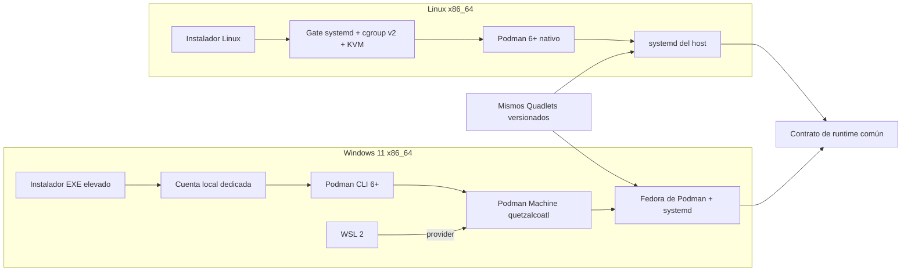
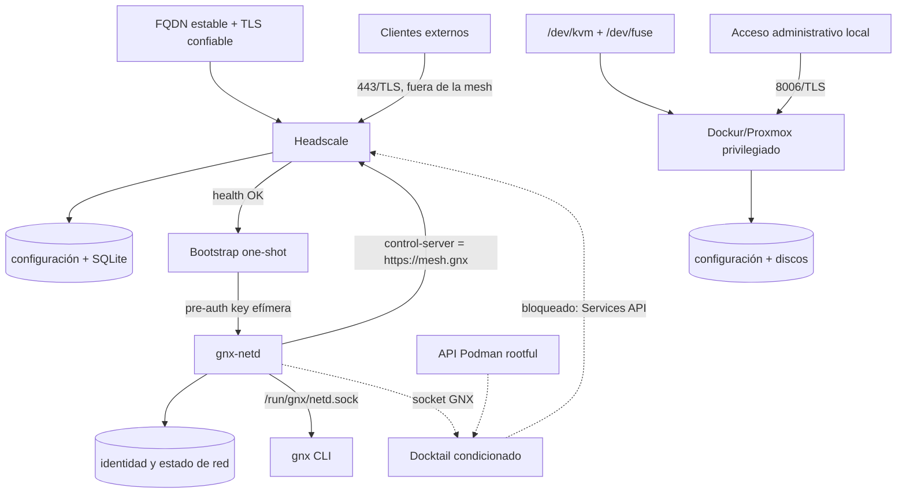
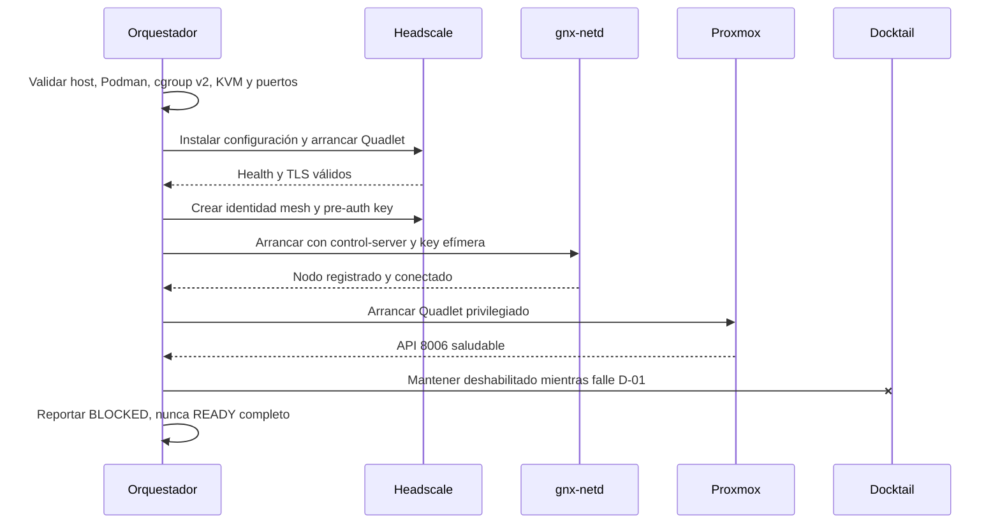

# Arquitectura base

**Estado:** propuesta auditable, todavía no implementable de extremo a extremo  
**Casos soportados:** Windows 11 x86_64 y Linux x86_64 con systemd  
**Corte:** 2026-09-01

## Decisión principal

Las diferencias terminan en la preparación del host. Windows necesita una
Podman Machine respaldada por WSL; Linux usa el motor nativo. Después de ese
límite, ambos reciben el mismo conjunto versionado de Quadlets.



No se usa Podman Machine en Linux: es opcional allí y añadiría otra VM justo
donde Proxmox necesita acceso directo y comprobable a `/dev/kvm`.

## Modelo Windows

1. El usuario abre el EXE y acepta UAC.
2. El instalador crea una identidad local de servicio sin inicio de sesión
   interactivo, sin exponer su nombre como parte del contrato del producto, y
   prepara su perfil con ACL exclusivas.
3. Instala Podman 6+ en alcance de máquina y habilita o actualiza WSL 2.
4. Ejecuta `podman machine init --provider wsl --rootful quetzalcoatl` bajo la
   identidad dedicada. La máquina resultante es una distribución Fedora WSL con
   systemd; no es una distro WSL adicional dentro de otra VM.
5. Un Windows Service ejecutado como la misma cuenta arranca la máquina y
   reconcilia los Quadlets. El usuario interactivo sólo usa una interfaz local
   acotada; no recibe el socket Podman ni las credenciales.

La separación protege frente al usuario estándar, no frente a un administrador
local. La creación y recuperación de una Podman Machine desde una cuenta de
servicio sigue siendo un gate físico obligatorio.

## Modelo Linux

1. El instalador obtiene privilegios administrativos.
2. Falla sin mutar si PID 1 no es systemd, cgroup v2 no está activo, no existe
   `/dev/kvm`, falta `/dev/fuse` o la arquitectura no es x86_64.
3. Instala o valida Podman 6+. El socket API de sistema permanece cerrado hasta
   que exista una decisión segura para Docktail.
4. Copia Quadlets a `/etc/containers/systemd/` y datos persistentes a
   `/var/lib/quetzalcoatl/`.
5. systemd inicia y recupera el runtime después de cada reboot.

El runtime es rootful en los dos hosts porque Dockur/Proxmox requiere un
contenedor privilegiado y acceso a KVM. Los demás contenedores conservan sólo
los permisos y montajes indispensables.

## Runtime común



Headscale debe ser alcanzable antes de que exista la mesh; por eso su endpoint
443 no puede depender de Docktail ni de la mesh. Proxmox queda limitado al host
hasta resolver la exposición por mesh.

Docktail no registra el nodo: observa el socket del motor y usa la LocalAPI de
`gnx-netd`. Su Quadlet puede estar empaquetado, pero no debe habilitarse por
defecto hasta pasar `D-01`. Montar el socket Podman con `:ro` no limita los
métodos de su API: antes de habilitarlo también debe pasar `D-02`, con una
restricción comprobable o una aceptación explícita del control total del motor.

`gnx-netd` será un fork mínimo de un daemon BSD-3 maduro y será el único
propietario de `/run/gnx/netd.sock`. La CLI `gnx` se conecta a ese socket; no lo
crea. Docktail monta el mismo socket y, mediante un adaptador GNX, invoca la CLI
`gnx`. No se publican nombres ni aliases heredados en paths, configuración o
interfaces del producto. La compatibilidad LocalAPI no concede a Headscale
capacidades nuevas de control plane.

## Orden de convergencia



## Fronteras y persistencia

| Recurso | Persistencia | Exposición inicial |
|---|---|---|
| Headscale | configuración, base SQLite, claves TLS | `443/tcp` mediante FQDN estable |
| gnx-netd | identidad, claves y preferencias del nodo | puerto mesh según su modo de red |
| Docktail | sin estado propio | ninguna; condicionado |
| Proxmox | `/var/lib/vz` y `/var/lib/pve-cluster` | `127.0.0.1:8006` o equivalente host-local |

El secreto de bootstrap se crea después de que Headscale esté sano, se entrega a
`gnx-netd` sin argumentos ni logs y se elimina después del registro. Las
imágenes se fijan por digest. Las claves TLS, la base de Headscale y los discos
de Proxmox nunca viven en la capa escribible del contenedor.

## Nombre del control plane

El nombre privado canónico es `https://mesh.gnx`. `mesh` identifica el servicio;
la identidad del nodo no forma parte del dominio. No se usa `mesh.node.gnx`
porque convertiría una implementación interna en jerarquía pública.

```toml
[mesh]
control_server = "https://mesh.gnx"
```

`.gnx` no es un dominio público delegado. Antes del primer registro, el
instalador debe entregar resolución privada y confianza en la CA de GNX. Un
despliegue que necesite DNS o certificados públicos debe reemplazar este valor
por un FQDN perteneciente al operador; no debe simular TLS público sobre `.gnx`.

## Árbol objetivo

```text
quetzalcoatl/
├── AGENTS.md
├── .agent/
│   └── gauntlet.md               # ciclo acotado de verificación
├── README.md
├── Cargo.toml
├── docs/
│   ├── architecture.md
│   ├── audit.md
│   └── decisions/
│       └── 0001-network-daemon.md
├── src/
│   ├── main.rs                    # composición y dispatch, nada de negocio
│   ├── bootstrap/                 # doctor + instalación inicial
│   │   ├── mod.rs
│   │   ├── preflight.rs
│   │   └── install.rs
│   ├── converge/                  # desired -> observed -> acción
│   │   ├── mod.rs
│   │   ├── desired.rs
│   │   └── observed.rs
│   ├── windows/                   # identidad, SCM, WSL y procesos
│   │   ├── mod.rs
│   │   ├── identity.rs
│   │   └── lifecycle.rs
│   └── linux/                     # systemd, paquetes y dispositivos
│       └── mod.rs
├── config/
│   └── gnx.example.toml           # sólo valores no secretos
├── runtime/
│   ├── manifest.toml              # versiones y digests
│   ├── quadlets/
│   │   ├── quetzalcoatl.network
│   │   ├── headscale.container
│   │   ├── gnx-netd.container
│   │   ├── docktail.container     # condicionado por D-01
│   │   ├── docktail-adapter.container
│   │   └── proxmox.container
│   └── headscale/                 # plantilla config y policy mínima
├── packaging/
│   ├── windows/
│   └── linux/
└── tests/
    ├── contract/
    └── physical/
```

La taxonomía sigue capacidades y transiciones, no dependencias concretas. Por
eso `service`, `config` o `podman` no son módulos raíz: son detalles de
`windows`, `bootstrap` o `converge`. Se abre un módulo nuevo sólo cuando existe
comportamiento propio que probar.

OpenTofu, automatización de LXC, tray, UI y catálogo de workloads no pertenecen
a esta primera arquitectura. Se agregarán sólo con una decisión explícita y un
caso de uso verificable.
