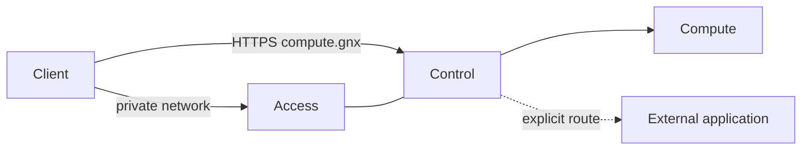

# Architecture — 0.3.1

Quetzalcoatl is organized around three capabilities and one shared Linux runtime.

| Capability | Contract | Does not own |
| --- | --- | --- |
| Access | private identity, transport and `.gnx` name reachability | application routing or Compute lifecycle |
| Control | HTTPS, explicit hostnames and reverse proxy | upstream lifecycle or credentials |
| Compute | persistent infrastructure and its health | client identity or public routing |

The shared runtime applies configuration, generates service units, persists state and reports health. It is support code, not a fourth capability.

## Topology



### Boundaries

- `compute.gnx` is the stable GNX name. Internal implementation names are not part of the client contract.
- Access owns the private network identity. Control and DNS consume its network namespace without receiving its private state.
- Compute has a separate namespace and is not published directly to clients.
- External routes only map a hostname to an existing origin. GNX does not start, update or repair that origin.
- Secrets are runtime state, never node intent.

## Intent versus release

`gnx.toml` describes the node. It does not select container repositories, image digests or implementation families.

```text
            gnx.toml
               │
            intent
               │
               ▼
              gnx  ◀── fixed release internals
               │
      ┌────────┼────────┐
      ▼        ▼        ▼
   Access   Control   Compute
```

The release keeps internal service addresses and immutable component references. This prevents a configuration file from silently changing the implementation being accepted.

## Windows

Windows uses the same Linux runtime through a dedicated WSL distribution named `GNX`.

```text
Windows
└─ gnx.exe
   └─ WSL: GNX
      └─ /usr/local/bin/gnx
         ├─ Access
         ├─ Control
         └─ Compute
```

The bridge sends a typed request on stdin with fixed argv. It does not use a remote shell or duplicate orchestration logic on Windows.

## Non-goals for 0.3.1

No plugin/provider framework, workload catalog, LXC/VM provisioning, scheduler, HA, automatic upgrades, tray application or commercial installer. Those require separate scope and acceptance.
