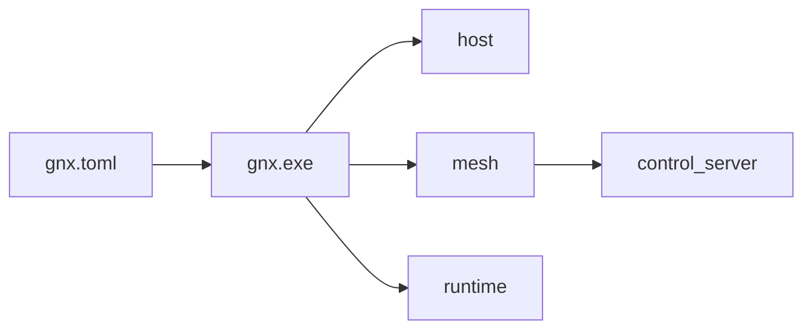

# Arquitectura GNX

**Corte:** Windows-first, Rust-first.

## Resultado único

`gnx.exe` lee configuración, valida Windows, prepara el runtime cuando el nodo
es `create`, instala o localiza el cliente de mesh y conecta el nodo local. Sólo
reporta `READY` cuando el estado observado coincide con la configuración.



El proveedor actual de mesh es NetBird. Su nombre, comandos y formatos quedan
encapsulados en el adaptador; se conservan en licencias, manifest, SBOM y
diagnósticos técnicos, no en la interfaz pública ni en la taxonomía.

## Contrato mínimo

```text
gnx install --config <archivo>
gnx connect --config <archivo>
gnx doctor --config <archivo>
```

```toml
version = 1

[node]
mode = "join" # create | join

[mesh]
control_server = "https://mesh.gnx"
```

- `create`: converge un control plane y después conecta el cliente local.
- `join`: conecta el cliente local; no puede iniciar un control plane.
- El endpoint se conserva exactamente y nunca cae a un servicio distinto.
- El login inicial es interactivo; GNX no transporta secretos por argv.

## Orden de implementación

1. Parsear y validar `gnx.toml` en Rust.
2. Implementar `doctor` de Windows sin mutaciones.
3. Implementar `connect` contra el cliente nativo.
4. Implementar `install` idempotente y el modo `create`.
5. Empaquetar el mismo binario como `gnx.exe`.

No se abre otra plataforma o workload antes de cerrar estos cinco puntos.

## Taxonomía

```text
gnx/
├── Cargo.toml
├── src/
│   ├── main.rs                 # composición y salida
│   ├── config.rs               # único esquema público
│   ├── app/
│   │   ├── install.rs
│   │   ├── connect.rs
│   │   └── doctor.rs
│   ├── port/
│   │   ├── host.rs
│   │   ├── mesh.rs
│   │   └── runtime.rs
│   └── adapter/
│       ├── host.rs             # Windows en el primer corte
│       ├── mesh.rs             # dependencia externa aislada
│       └── runtime.rs          # WSL + contenedores
├── config/
│   └── gnx.example.toml
├── runtime/
│   ├── release.toml            # versiones, archivos y digests
│   └── units/
│       ├── ingress.container
│       └── control.container
├── packaging/
│   └── windows/
└── tests/
    ├── contract.rs
    └── windows.rs
```

`app` contiene los tres casos de uso. `port` define lo que necesitan. `adapter`
traduce productos y sistema operativo. No existen módulos raíz llamados como
proveedores, versiones, daemons o servicios concretos.

## Fuera del corte

Linux, Proxmox, routing, reverse proxy, UI, HA y actualización automática. Cada
uno necesitará un caso probado antes de añadir módulos o configuración.
