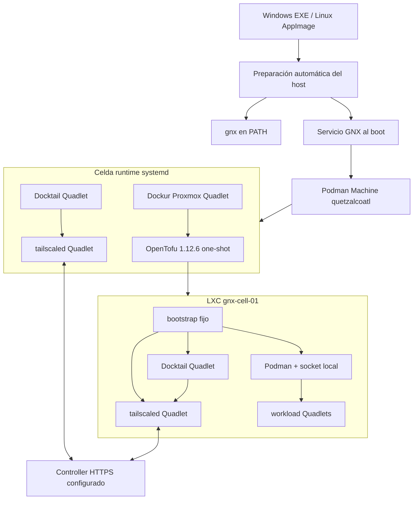
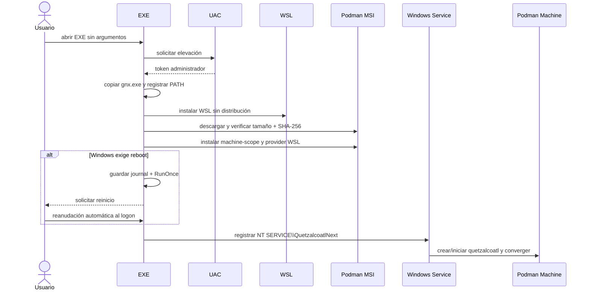
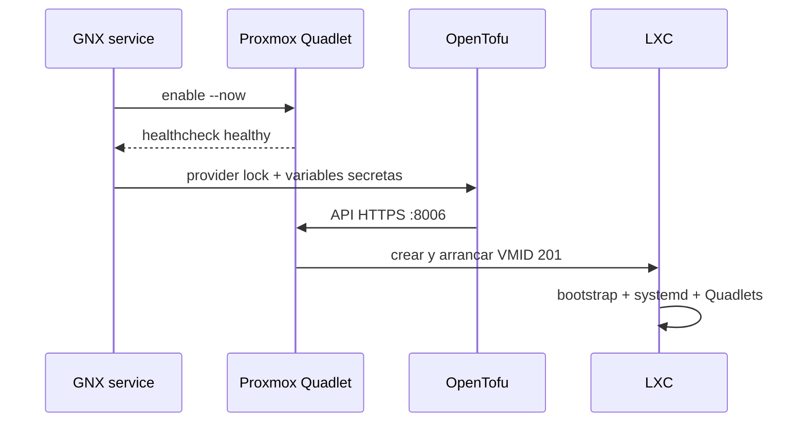
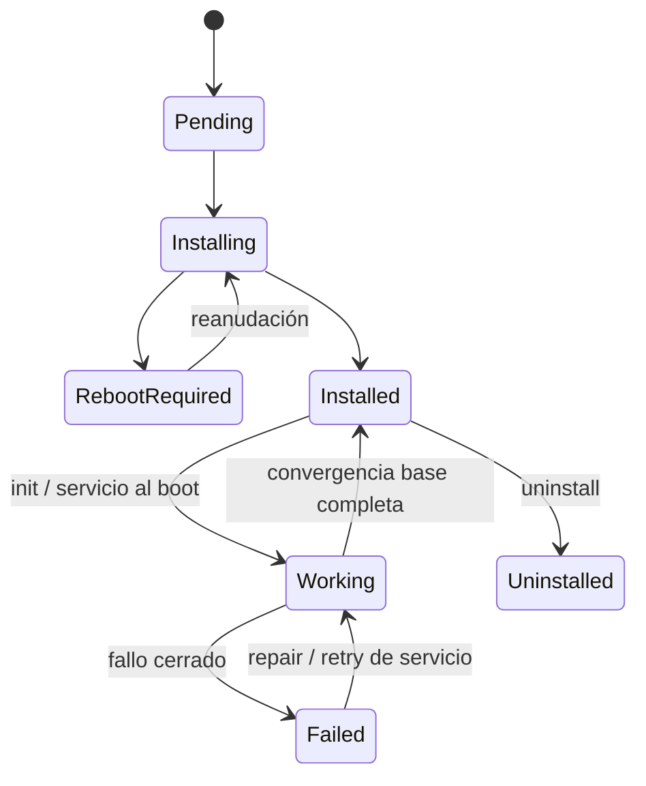

# Arquitectura de Quetzalcoatl Next

## Contrato del MVP

Quetzalcoatl Next (`gnx`) es una línea greenfield. El EXE y el AppImage son a la
vez instalador inicial y payload de la CLI. Un artefacto ejecutado fuera de la ruta
instalada inicia el instalador sin argumentos; el `gnx` ya instalado muestra ayuda
si se ejecuta sin subcomando.

El usuario final no prepara WSL, Podman, QEMU ni el `PATH`. GNX hace esa
preparación con elevación y deja un servicio de host que recupera el runtime después
de apagar o reiniciar el equipo.

## Topología objetivo implementada



Docktail no sustituye a `tailscaled`: consume el socket del daemon mesh y el
socket Podman de su propia celda. Ningún socket Podman cruza entre la celda runtime
y el LXC.

## Instalación y arranque

### Windows



El servicio usa la cuenta virtual dedicada `NT SERVICE\QuetzalcoatlNext`; el
usuario interactivo recibe la CLI, no el socket ni el perfil propietario de la
Podman Machine. El journal monotónico permite repetir o reanudar sin retroceder
checkpoints.

### Linux

```mermaid
flowchart LR
    A[abrir AppImage] --> S[sudo interno]
    S --> PKG[apt / dnf / pacman]
    PKG --> BIN[/usr/local/bin/gnx]
    BIN --> UNIT[gnx-host.service enabled]
    UNIT -->|boot o init| PM[Podman Machine quetzalcoatl]
```

El AppImage solicita `sudo`, instala Podman/QEMU/FUSE cuando faltan, copia la CLI
y habilita el servicio. La convergencia se inicia sin bloquear la disponibilidad
de `gnx` en una shell nueva.

## Runtime declarativo

La Podman Machine nueva se crea rootful con 4 CPU, 8 GiB RAM y 100 GiB de disco.
GNX instala y habilita:

| Unidad | Función | Persistencia |
|---|---|---|
| `tailscale.service` | daemon mesh local por imagen fijada | `/var/lib/gnx/tailscale` |
| `docktail.service` | reconciliación de Services | sockets locales únicamente |
| `proxmox.service` | Dockur/Proxmox con KVM/FUSE | `/var/lib/gnx/proxmox` |
| `gnx-opentofu.service` | `init`, `validate`, `apply` | `/var/lib/gnx/opentofu` |

El endpoint configurado se escribe en un environment file root-only como
`TS_EXTRA_ARGS=--login-server=<endpoint>`. El pre-auth key no forma parte del TOML,
state, journal ni argumentos de procesos. Su aprovisionamiento sigue siendo un gate
de integración; GNX no cambia de controller si falta.

## OpenTofu y primer LXC

`infra/opentofu` es un módulo ejecutable, no un placeholder:

- OpenTofu `1.12.6` y provider `bpg/proxmox` `0.111.1` están fijados;
- `.terraform.lock.hcl` contiene checksums firmados del provider para Linux amd64;
- descarga Ubuntu Noble `20260826` por URL inmutable y SHA-256;
- crea VMID `201`, DHCP, start-on-boot, TUN, nesting, FUSE y disco persistente;
- monta el bootstrap propiedad del repositorio, sin `local-exec`, `remote-exec` ni
  provisioners.

La contraseña Proxmox, credenciales del provider y contraseña inicial del LXC se
generan con aleatoriedad del sistema y quedan en archivos `0600` separados dentro
de la celda runtime. No se imprimen.



## Estado y operaciones



`uninstall` deshabilita la integración GNX y retira Podman CLI. Conserva
configuración, journal, Podman Machine, discos, volúmenes, Proxmox y LXC; no ejecuta
`podman machine rm`, `podman volume rm` ni destrucción OpenTofu.

## Límites y gates explícitos

| Gate | Evidencia aún física |
|---|---|
| `WIN-ID-01` | WSL/Podman Machine bajo la cuenta virtual en Windows limpio. |
| `KVM-01` | `/dev/kvm`, FUSE y nested virtualization en ambos hosts soportados. |
| `MESH-AUTH-01` | entrega segura de pre-auth key y enrolamiento exacto al controller. |
| `MESH-SVC-01` | Docktail Services contra la versión Headscale elegida. |
| `LXC-01` | bootstrap, TUN, Podman y Quadlets dentro del LXC real. |
| `SIGN-01` | Authenticode/AppImage y manifiesto de release firmado. |

Un gate pendiente nunca se convierte en `READY`. Backup, restore y disaster
recovery están fuera del alcance actual.
