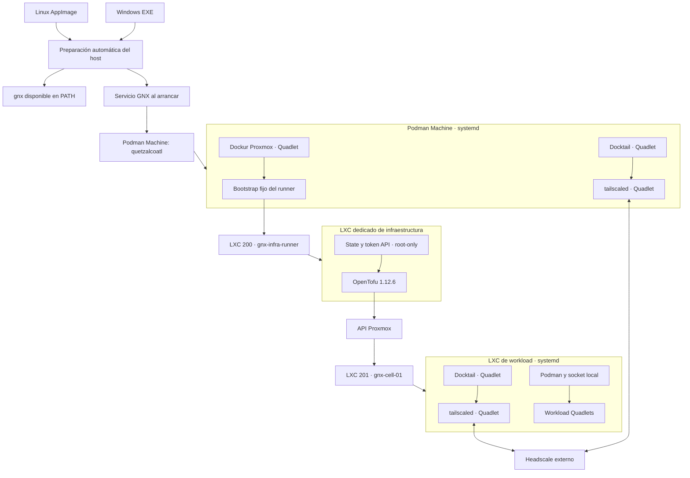
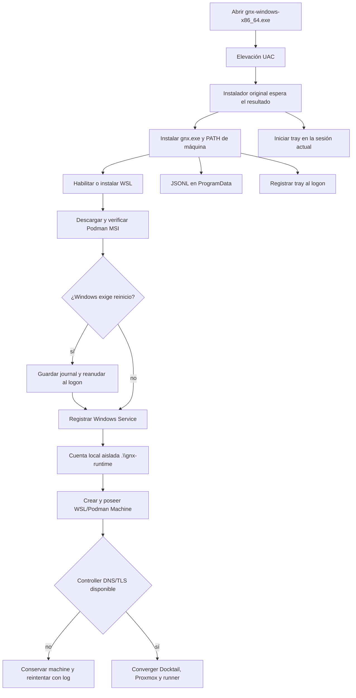
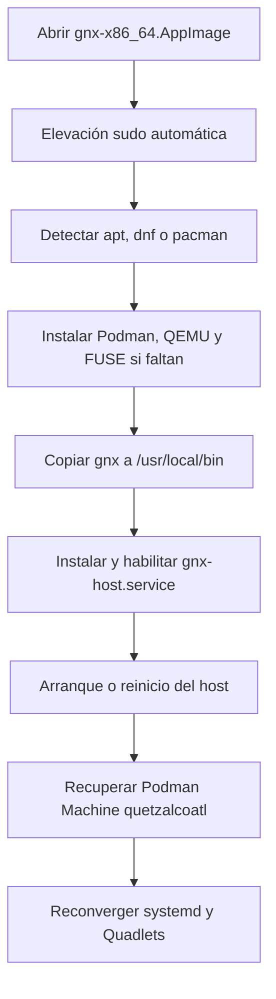
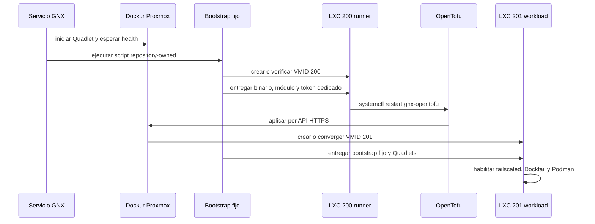

# Arquitectura de Quetzalcoatl Next

## Contrato del MVP

Quetzalcoatl Next es greenfield. El EXE de Windows y el AppImage de Linux son
instaladores autocontenidos: abrir el artefacto sin argumentos prepara el host e
instala `gnx` en el `PATH`. Después, ejecutar `gnx` sin subcomando muestra ayuda.
No existe un subcomando público de instalación.

El control plane es un Headscale externo. Los endpoints de referencia son
`https://headscale.node.gnx` y `https://controlplane.node.gnx`; GNX conserva el
endpoint configurado y aplica únicamente validación técnica HTTPS, DNS, puerto
443 y TLS del sistema. Docktail usa el `tailscaled` local de cada celda.

## Topología común

OpenTofu no está instalado ni se ejecuta en la Podman Machine. La máquina sólo
almacena un tarball verificado de staging y dispara un script fijo dentro de
Proxmox. Ese script crea el runner, le entrega el binario y el módulo, genera un
token Proxmox dedicado y ejecuta la convergencia dentro del LXC.

## Flujo Windows

El EXE contiene dos recursos visuales: branding del instalador y un icono separado
para la bandeja. La bandeja corre en la sesión interactiva, sólo lee el estado y
no recibe el socket ni las credenciales del runtime. Se inicia inmediatamente y
queda registrada para los siguientes logons. El servicio automático usa una
cuenta local real `gnx-runtime`, porque las distribuciones WSL y Podman Machine
son por usuario. Windows carga el perfil de esa cuenta al iniciar el servicio.
GNX le concede inicio como servicio y niega inicios interactivo, remoto y de red;
la contraseña aleatoria se entrega al Service Control Manager y no se persiste.

La preparación de la Podman Machine precede al gate DNS/TLS del controller. Una
caída del endpoint deja `machine=ready`, registra el error exacto y reintenta; no
confunde un fallo mesh con un fallo de máquina. Los eventos están disponibles con
`gnx logs` y como JSONL en
`C:\ProgramData\QuetzalcoatlNext\logs\gnx.jsonl`.

## Flujo Linux

El usuario final no instala prerequisitos. El servicio de host queda habilitado
para recuperar la topología después de reboot o power-off. El ELF separado es un
artefacto de build; el entregable Linux para usuario es el AppImage.

## OpenTofu y LXC

El módulo usa OpenTofu `1.12.6`, provider `bpg/proxmox` `0.111.1`, lock de
provider y Ubuntu Noble `20260826` por URL inmutable y SHA-256. No contiene
`local-exec`, `remote-exec` ni provisioners. State, token y contraseña inicial
quedan dentro del runner con permisos root-only.

## Fronteras de confianza

- El usuario Windows opera `gnx`; WSL y Podman Machine pertenecen al perfil
  `gnx-runtime`, no a su registro HKCU ni a su directorio de usuario.
- Un administrador local de Windows conserva por definición capacidad de tomar
  control del host; la cuenta dedicada aísla al usuario estándar, no protege
  contra un administrador host comprometido.
- Una máquina `quetzalcoatl` preexistente sin marcador de propiedad GNX falla
  como `MACHINE_NAME_CONFLICT`; nunca se adopta ni se modifica.
- Cada celda usa sus propios sockets de Podman y `tailscaled`.
- El LXC runner reduce exposición accidental de OpenTofu y credenciales.
- Una toma de `root` de la Podman Machine todavía implica control de su Proxmox
  privilegiado. El runner no puede crear aislamiento criptográfico contra su
  propio hipervisor; cerrar ese riesgo requeriría mover Proxmox fuera de la
  Podman Machine.
- Ningún gate incompleto se reporta como `READY`.

## Desinstalación

`gnx uninstall` retira servicio, integración de arranque, binario, `PATH` y
Podman CLI. Conserva configuración, journal, Podman Machine, volúmenes, discos,
Proxmox, state de OpenTofu, LXC y la cuenta `gnx-runtime` que los posee. No
ejecuta operaciones de destrucción sobre
infraestructura. Backup y recovery no forman parte de este alcance.
