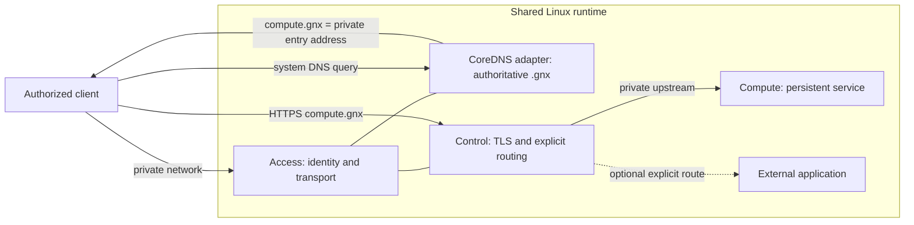
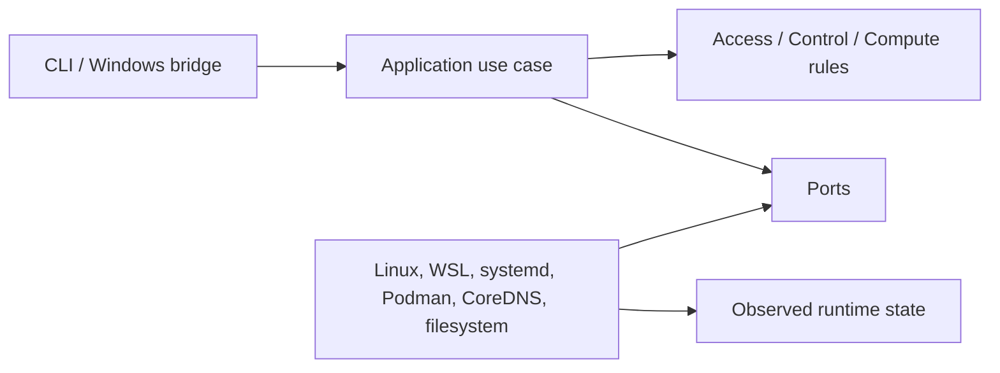
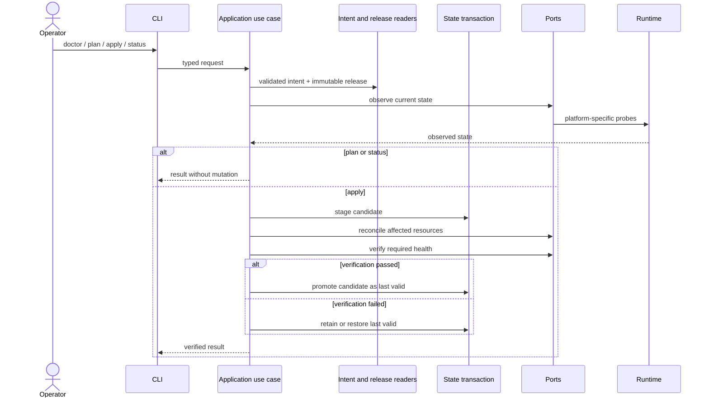
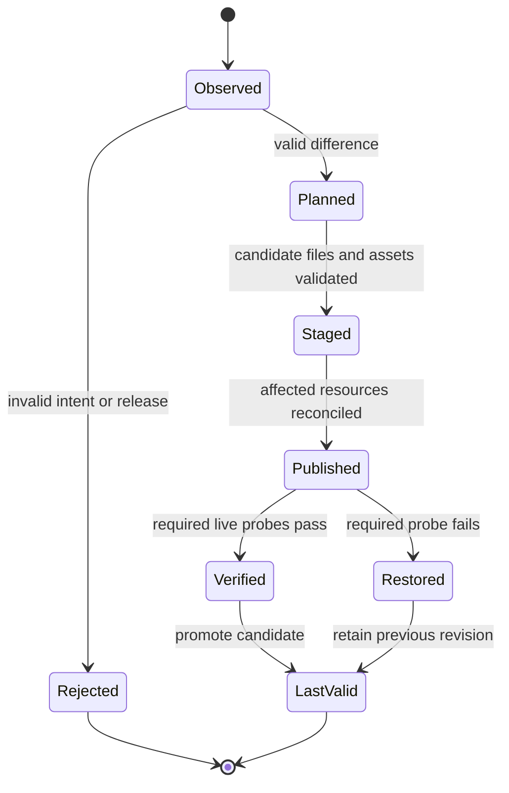

# Architecture — GNX 0.3.1

GNX is organized around business capabilities, application use cases, ports and
replaceable adapters. The dependency direction always points toward the domain.

This document is normative for structure and runtime boundaries. Product outcomes
come from `business-requirements.md`; executable acceptance comes from `poc.md`.
Examples explain the design but do not prove that an implementation exists.

## Architectural principles

1. **Capabilities describe outcomes, not products.** Access, Control and Compute
   remain stable even when a release changes an adapter or artifact.
2. **One core owns orchestration.** The four public use cases run through
   `src/app`; neither a CLI, host script, runtime asset nor Windows service owns a
   competing convergence flow.
3. **Observed state decides success.** Generated files and started processes are
   intermediate facts. Capability-specific probes decide `READY`.
4. **Intent, release and secrets are different inputs.** Operator intent is
   portable, release choices are immutable, and secrets stay in protected runtime
   state.
5. **Changes are transactional at the product boundary.** GNX stages and verifies
   a candidate before promoting it as last valid. Persistent identity and Compute
   data are not rollback material.
6. **Failure is contained.** A failed optional route is reported for that route;
   it does not rewrite the health of an otherwise working capability.

## Capability topology



CoreDNS is an implementation adapter, not a fourth capability. Access owns the
contract for private `.gnx` reachability. Control consumes that reachability and
owns HTTPS. Compute remains inaccessible except through Control.

## Capability ownership

| Capability | Owns | Exposes | Must not own |
| --- | --- | --- | --- |
| Access | persistent private identity, authorized transport, `.gnx` authority and private entry reachability | private entry address, declared DNS answers and observed identity health | HTTPS routing, Compute lifecycle, client application authentication |
| Control | server TLS identity, deliberate public-root export, explicit hostname-to-upstream routes and route health | HTTPS entrypoints and sanitized route diagnostics | client enrollment, Compute credentials, upstream lifecycle |
| Compute | service lifecycle, persistent data, service credentials and authenticated health | one private upstream contract plus the public CA/name data Control needs | client DNS, public routes, Windows mediation |

The shared Linux runtime supplies lifecycle mechanisms but is not a fourth
capability. A component used by two capabilities still belongs behind a port;
sharing a process, namespace or filesystem does not transfer business ownership.

## Use-case flow



- `plan` reads intent and observed state, then returns a change set without
  mutation.
- `apply` validates a candidate, reconciles it through ports and commits the last
  valid state only after required checks pass.
- `status` reports actual health for the three capabilities.
- `doctor` evaluates host prerequisites and returns actionable failures.

The CLI parses and renders. It contains no orchestration. Domain modules contain
rules and vocabulary but no filesystem, process, WSL, container or DNS vendor
calls. Adapters implement ports and are selected only in the composition root.

## Request and dependency flow



Dependency direction is enforced at compile and test time:

```text
cli/bin -> app -> domain
            |
            v
           port <- adapter <- operating system / release component
```

- `domain` imports neither `app`, `port` nor `adapter`.
- `app` may depend on domain types and port traits, never concrete adapters.
- `adapter` may depend on ports and external APIs, never call another public use
  case to create a hidden orchestration path.
- `runtime` files are rendered and installed by adapters; they do not decide
  desired state.
- the composition root is the only place that selects concrete adapters.

## Target repository tree

```text
gnx/
├── Cargo.toml
├── Cargo.lock
├── src/
│   ├── main.rs                     # composition and JSON output
│   ├── bin/
│   │   └── gnx-service.rs          # Windows SCM entrypoint; no business logic
│   ├── config.rs                   # validated node intent
│   ├── report.rs                   # shared result and exit semantics
│   ├── domain/
│   │   ├── mod.rs
│   │   ├── access.rs               # identity, transport and DNS rules
│   │   ├── control.rs              # TLS and explicit route rules
│   │   ├── compute.rs              # persistence and health rules
│   │   └── node.rs                 # desired and observed state
│   ├── app/
│   │   ├── mod.rs
│   │   ├── plan.rs
│   │   ├── apply.rs
│   │   ├── status.rs
│   │   └── doctor.rs
│   ├── port/
│   │   ├── mod.rs
│   │   ├── host.rs                 # host and prerequisite observation
│   │   ├── runtime.rs              # capability reconciliation and health
│   │   ├── state.rs                # candidate/last-valid state transaction
│   │   └── release.rs              # immutable release contract
│   └── adapter/
│       ├── mod.rs
│       ├── linux.rs                # native Linux host
│       ├── windows/
│       │   ├── mod.rs
│       │   ├── account.rs          # dedicated service identity and rights
│       │   ├── service.rs          # GNXRuntime lifecycle and recovery
│       │   ├── broker.rs           # local pipe, framing and opcode allowlist
│       │   └── runtime.rs          # isolated WSL and Linux bundle injection
│       ├── systemd.rs              # service lifecycle
│       ├── podman.rs               # fixed container runtime
│       ├── coredns.rs              # authoritative .gnx implementation
│       └── filesystem.rs           # state and release persistence
├── config/
│   └── gnx.example.toml            # operator intent only
├── runtime/
│   ├── release.toml                # fixed internal images and digests
│   ├── access/
│   │   ├── Corefile
│   │   └── gnx-access.container
│   ├── control/
│   │   ├── Caddyfile
│   │   └── gnx-control.container
│   └── compute/
│       └── gnx-compute.container
├── packaging/
│   └── windows/
│       ├── build.ps1               # builds Windows and Linux artifacts
│       ├── install.ps1             # elevated, verified host installation
│       └── runtime.lock.json        # pinned WSL rootfs and bundle digests
├── tests/
│   ├── contract.rs                 # CLI/JSON/exit contract
│   ├── architecture.rs             # dependency-boundary checks
│   └── acceptance.rs               # executable G0-G6 harness
└── docs/
    ├── documentation-audit.md
    ├── business-requirements.md
    ├── architecture.md
    ├── implementation-plan.md
    ├── poc.md
    ├── release.md
    └── windows-runtime.md
```

`app` contains the four public use cases. `port` describes everything those use
cases require from the environment. `adapter` translates Linux, Windows/WSL and
fixed release components. `runtime` contains deployable data, not business logic.
There are no parallel `ops` applications because orchestration belongs to the
single application core.

## Intent, release and state

```text
operator gnx.toml ──> validated intent ──> application use case
fixed release.toml ─> adapter selection ─┘
observed runtime ───> ports ─────────────┘
                              │
                              └─> candidate -> verify -> last-valid state
```

`gnx.toml` may declare instance, node, network and optional routes. Images,
digests, CoreDNS, internal addresses and runtime paths belong to the release.
Secrets belong only to protected runtime state.

## State and reconciliation model

GNX distinguishes five kinds of state:

| State | Example | Authority | Rollback rule |
| --- | --- | --- | --- |
| Desired intent | node name, network intent, optional routes | operator `gnx.toml` | replace only after schema and semantic validation |
| Release definition | component identities, digests, defaults | authenticated GNX release | immutable within a candidate |
| Observed state | identity, unit status, DNS/TLS answers, authenticated service health | live adapters | never inferred solely from desired files |
| Last valid state | last candidate that passed required checks | GNX state transaction | remains active when a candidate fails |
| Persistent runtime state | private identity, keys, credentials, Compute data | owning capability | preserved across apply, rollback and reboot |

`apply` is a transaction at the GNX contract, even when underlying systems cannot
change atomically:



The state record includes schema version, release identity, intent digest,
completed phase and sanitized failure information. It does not duplicate secrets
or treat transient process identifiers as product identity.

### Safe publication order

Resources are published in dependency order and withdrawn in authorization-first
order:

- adding a service: make Compute healthy, prepare and validate Control, publish
  Control, then publish its DNS name;
- changing an upstream: verify the candidate upstream and TLS contract before
  switching the route;
- removing a service: reject the hostname in Control first, remove its DNS answer
  second, and retire lifecycle state last;
- recreating Access: stop or detach DNS and Control consumers, recreate the
  private namespace/identity binding, then reattach and reverify them;
- a failed or interrupted phase is safe to retry from the recorded phase and
  never authorizes a name merely because a DNS cache still contains it.

An unchanged apply does not rotate identity, credentials or certificates; rewrite
unchanged files; increment DNS revisions; or restart healthy resources without a
release-defined reason.

## Data ownership and permissions

The exact paths are adapter details, but ownership is architectural:

| Data class | Owner | Consumers | Constraint |
| --- | --- | --- | --- |
| private transport identity | Access | Access adapter only | persistent, non-exportable as evidence |
| authoritative zone candidate | Access | CoreDNS adapter | generated from declared names; validate before atomic replace |
| GNX root private key and server key | Control | Control TLS adapter only | never crosses to Windows or Compute |
| GNX public root | Control | operator/client trust workflow | exportable only with fingerprint and deliberate trust action |
| Compute credentials and data | Compute | Compute adapter/service | absent from Control, Access, intent and command output |
| Compute public upstream contract | Compute | Control | contains only private endpoint name and public trust material |
| candidate and last-valid metadata | application state port | application core | protected, versioned, secret-free |
| acceptance evidence | test harness/operator | reviewers | sanitized; never used as runtime state |

Adapters create state with the least permissions available on the platform. On
Linux, persistent private state is root-owned and not group/world writable. The
stronger Windows ACL and identity rules are specified in `windows-runtime.md`.

## Health and failure containment

Capability health is based on the narrowest probe that proves its business
outcome:

| Scope | `READY` requires | A failure must not imply |
| --- | --- | --- |
| Access | persistent identity, expected private reachability and authoritative UDP/TCP `.gnx` behavior | that HTTPS or Compute authentication works |
| Control | valid configuration, hostname-verified client TLS, explicit route and verified upstream connection | that an optional external application is healthy |
| Compute | active lifecycle, authenticated service identity and writable/available persistent storage | that clients can resolve or reach the public name |
| Optional route | declared hostname reaches its specific upstream with the declared protocol | failure of Access, Control core or Compute |

`status` reports each scope independently and includes a stable diagnostic code,
phase and next action. Aggregation may return `FAILED` when a required capability
fails, while still preserving the individual facts. It must not hide a failure
behind a generic success or confuse local health with remote acceptance.

## Security model

The PoC protects against accidental secret disclosure, unauthorized private
clients, undeclared hostname routing, recursive DNS use, unauthenticated release
artifacts, malformed broker requests and routine operator access to isolated
Windows runtime state.

The trusted computing base includes the Linux root administrator, Windows SYSTEM
and local Administrators, the release signing authority and the selected runtime
components. The PoC does not claim isolation from a malicious host administrator,
a compromised kernel or a privileged Compute workload. Those are explicit
non-boundaries rather than undocumented assumptions.

Security-relevant defaults fail closed:

- DNS outside `.gnx` is refused and undeclared names are not synthesized;
- Control has no wildcard route or fallback upstream;
- upstream and client TLS verify names and trust roots; insecure-skip flags are
  not acceptance evidence;
- Compute keeps independent authentication even for authorized private clients;
- secret requests use `ACTION_REQUIRED` and a separate bounded channel;
- release digests are accepted only after authenticating the manifest producer;
- diagnostic output is sanitized before it reaches stdout, logs or evidence.

## Architectural verification

The implementation must add automated checks for:

- forbidden dependency edges between domain/application and adapters;
- exact four-operation public command surface;
- strict configuration and release schema handling;
- `plan` no-mutation behavior;
- last-valid preservation on validation and health failure;
- deterministic idempotence of an unchanged apply;
- no vendor/component names in domain types or operator intent;
- all platform adapters conforming to the same JSON and exit fixtures.

## Platform boundary

Linux runs the application core directly. On Windows, `gnx.exe` validates the
local request and sends one typed frame to `GNXRuntime` through the protected
local pipe. The service maps its allowlisted opcode to fixed argv and sends
intent or a separately framed secret on stdin to `/usr/local/bin/gnx` inside the
dedicated `GNX` WSL distribution. The common response schema avoids remote-shell
behavior and platform-specific orchestration forks.

The Windows installation, service identity, broker, secret channel and Linux
artifact flow are specified in [windows-runtime.md](windows-runtime.md).
