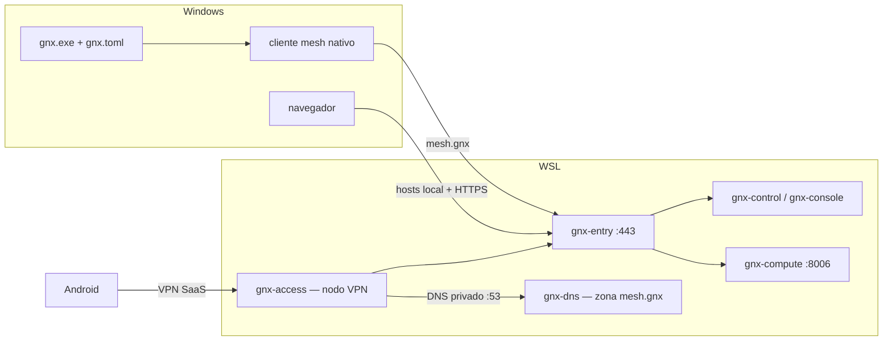

# Arquitectura GNX

**Corte:** cliente Windows + control plane y primer servicio en WSL; Rust-first.

## Resultado único

`gnx.exe` lee configuración, valida Windows, verifica e instala un MSI local del
cliente de mesh y conecta el nodo. Sólo reporta `READY` cuando el estado
observado coincide con la configuración.



El proveedor actual de mesh es NetBird. Su nombre, comandos y formatos quedan
encapsulados en el adaptador; se conservan en licencias, manifest, SBOM y
diagnósticos técnicos. La taxonomía propia usa capacidades GNX; el alias
`proxmox.mesh.gnx` es el nombre de servicio solicitado por el operador.

## Contrato mínimo

```text
gnx install --config <archivo> --release <manifest>
gnx connect --config <archivo>
gnx doctor --config <archivo>
```

```toml
version = 1

[mesh]
control_server = "https://mesh.gnx"
```

- El control plane es un prerrequisito de `connect`; `ops/control` lo prepara
  aparte en WSL. GNX no instala otro cliente nativo para la capa de acceso.
- El endpoint se conserva exactamente y nunca cae a un servicio distinto.
- El login es interactivo o usa `--setup-key-file`; la clave nunca viaja en argv.

## Operación

Rust genera credenciales, valida el login y cifra el respaldo. PowerShell cubre
UAC, DPAPI, certificados, hosts, tareas y copia USB; systemd y Podman reciben
Quadlets. `ops/control` prepara la mesh y `ops/compute` prepara un único servicio.
`ops/access` añade transporte operativo y DNS privado para Android; su núcleo
Rust compartido alimenta `gnx access configure/apply/dns`, sin cambiar el
adaptador mesh. La clave la introduce el humano sin eco y GNX gestiona su copia
temporal en RAM. [Contrato y gates](access.md).
El servicio `gnx-access-network` aplica la MTU configurada antes del nodo VPN.
`gnx credentials control/compute` presenta las cuentas DPAPI existentes sólo
en una consola temporal del humano; no es un almacén genérico ni una rotación.
La ejecución de agentes queda fuera del producto.

La entrada HTTPS comparte el puerto 443 y selecciona el servicio por nombre.
El salto a cómputo también valida TLS contra su CA. `8006` no se publica al host.
El acceso del navegador por `hosts` local no acredita transporte VPN entre pares.

## Taxonomía

```text
gnx/
├── Cargo.toml
├── Cargo.lock
├── src/
│   ├── main.rs                 # composición y salida
│   ├── config.rs               # configuración del cliente
│   ├── credentials.rs          # consulta humana de dos cuentas DPAPI
│   ├── app/
│   │   ├── install.rs
│   │   ├── connect.rs
│   │   └── doctor.rs
│   ├── port/
│   │   ├── host.rs
│   │   └── mesh.rs
│   └── adapter/
│       ├── host.rs             # Windows en el primer corte
│       └── mesh.rs             # dependencia externa aislada
├── config/
│   └── gnx.example.toml
├── runtime/
│   ├── release.example.toml    # MSI, versión, digest y licencia
│   ├── control/                # control plane, HTTPS y plantillas
│   ├── compute/                # Quadlet, endpoint y ruta del primer servicio
│   └── access/                 # nodo de acceso, zona privada y Quadlets
├── ops/
│   ├── control/                # bootstrap/cifrado Rust y rutinas del host
│   ├── compute/                # credenciales/login Rust y despliegue local
│   └── access/                 # núcleo Rust, entrada humana y pruebas
├── packaging/
│   └── windows/
│       └── build.ps1
└── tests/
    └── contract.rs
```

`app` contiene los tres casos de uso. `port` define lo que necesitan. `adapter`
traduce la dependencia y Windows. No existen módulos raíz llamados como
proveedores, versiones, daemons o servicios concretos.

## Fuera del corte

Cliente Linux, otros hosts, routing, publicación genérica de aplicaciones, HA,
creación de VMs y actualización automática. El cómputo actual es un laboratorio
privilegiado en el mismo WSL, autorizado por el operador. Las consolas conservan
su atribución. [Control](control.md), [cómputo](compute.md) y [evidencia](audit.md).
