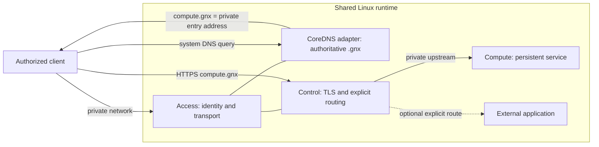
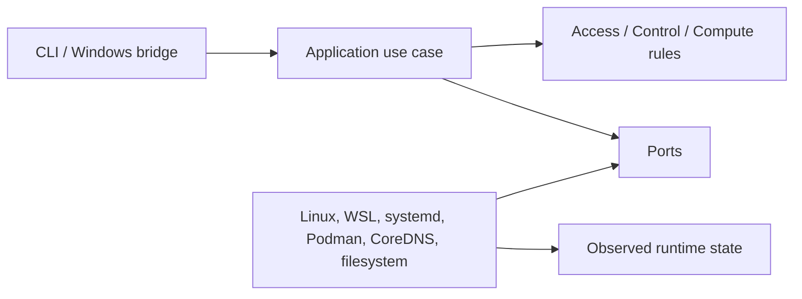

# Architecture — GNX 0.3.1

GNX is organized around business capabilities, application use cases, ports and
replaceable adapters. The dependency direction always points toward the domain.

## Capability topology



CoreDNS is an implementation adapter, not a fourth capability. Access owns the
contract for private `.gnx` reachability. Control consumes that reachability and
owns HTTPS. Compute remains inaccessible except through Control.

## Use-case flow



- `plan` reads intent and observed state, then returns a change set without
  mutation.
- `apply` validates a candidate, reconciles it through ports and commits the last
  valid state only after required checks pass.
- `status` reports actual health for the three capabilities.
- `doctor` evaluates host prerequisites and returns actionable failures.

The CLI parses and renders. It contains no orchestration. Domain modules contain
rules and vocabulary but no filesystem, process, WSL, container or DNS vendor
calls. Adapters implement ports and are selected only in the composition root.

## Target repository tree

```text
gnx/
├── Cargo.toml
├── Cargo.lock
├── src/
│   ├── main.rs                     # composition and JSON output
│   ├── bin/
│   │   └── gnx-service.rs          # Windows SCM entrypoint; no business logic
│   ├── config.rs                   # validated node intent
│   ├── report.rs                   # shared result and exit semantics
│   ├── domain/
│   │   ├── mod.rs
│   │   ├── access.rs               # identity, transport and DNS rules
│   │   ├── control.rs              # TLS and explicit route rules
│   │   ├── compute.rs              # persistence and health rules
│   │   └── node.rs                 # desired and observed state
│   ├── app/
│   │   ├── mod.rs
│   │   ├── plan.rs
│   │   ├── apply.rs
│   │   ├── status.rs
│   │   └── doctor.rs
│   ├── port/
│   │   ├── mod.rs
│   │   ├── host.rs                 # host and prerequisite observation
│   │   ├── runtime.rs              # capability reconciliation and health
│   │   ├── state.rs                # candidate/last-valid state transaction
│   │   └── release.rs              # immutable release contract
│   └── adapter/
│       ├── mod.rs
│       ├── linux.rs                # native Linux host
│       ├── windows/
│       │   ├── mod.rs
│       │   ├── account.rs          # dedicated service identity and rights
│       │   ├── service.rs          # GNXRuntime lifecycle and recovery
│       │   ├── broker.rs           # local pipe, framing and opcode allowlist
│       │   └── runtime.rs          # isolated WSL and Linux bundle injection
│       ├── systemd.rs              # service lifecycle
│       ├── podman.rs               # fixed container runtime
│       ├── coredns.rs              # authoritative .gnx implementation
│       └── filesystem.rs           # state and release persistence
├── config/
│   └── gnx.example.toml            # operator intent only
├── runtime/
│   ├── release.toml                # fixed internal images and digests
│   ├── access/
│   │   ├── Corefile
│   │   └── gnx-access.container
│   ├── control/
│   │   ├── Caddyfile
│   │   └── gnx-control.container
│   └── compute/
│       └── gnx-compute.container
├── packaging/
│   └── windows/
│       ├── build.ps1               # builds Windows and Linux artifacts
│       ├── install.ps1             # elevated, verified host installation
│       └── runtime.lock.json        # pinned WSL rootfs and bundle digests
├── tests/
│   ├── contract.rs                 # CLI/JSON/exit contract
│   ├── architecture.rs             # dependency-boundary checks
│   └── acceptance.rs               # executable G0-G6 harness
└── docs/
    ├── business-requirements.md
    ├── architecture.md
    ├── poc.md
    ├── release.md
    └── windows-runtime.md
```

`app` contains the four public use cases. `port` describes everything those use
cases require from the environment. `adapter` translates Linux, Windows/WSL and
fixed release components. `runtime` contains deployable data, not business logic.
There are no parallel `ops` applications because orchestration belongs to the
single application core.

## Intent, release and state

```text
operator gnx.toml ──> validated intent ──> application use case
fixed release.toml ─> adapter selection ─┘
observed runtime ───> ports ─────────────┘
                              │
                              └─> candidate -> verify -> last-valid state
```

`gnx.toml` may declare instance, node, network and optional routes. Images,
digests, CoreDNS, internal addresses and runtime paths belong to the release.
Secrets belong only to protected runtime state.

## Platform boundary

Linux runs the application core directly. Windows `gnx.exe` validates the local
request and sends one typed message on stdin to `/usr/local/bin/gnx` inside the
dedicated `GNX` WSL distribution. Fixed argv and the common response schema avoid
remote-shell behavior and platform-specific orchestration forks.

The Windows installation, service identity, broker, secret channel and Linux
artifact flow are specified in [windows-runtime.md](windows-runtime.md).
