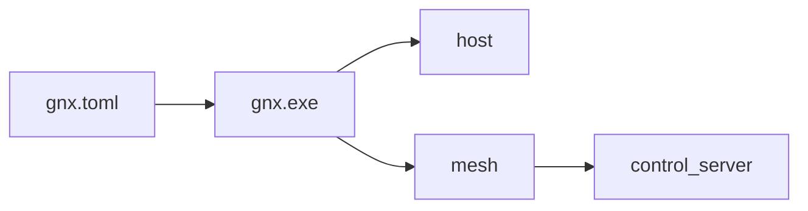

# Arquitectura GNX

**Corte:** Windows + control plane local en WSL; Rust-first.

## Resultado único

`gnx.exe` lee configuración, valida Windows, verifica e instala un MSI local del
cliente de mesh y conecta el nodo. Sólo reporta `READY` cuando el estado
observado coincide con la configuración.



El proveedor actual de mesh es NetBird. Su nombre, comandos y formatos quedan
encapsulados en el adaptador; se conservan en licencias, manifest, SBOM y
diagnósticos técnicos, no en la interfaz pública ni en la taxonomía.

## Contrato mínimo

```text
gnx install --config <archivo> --release <manifest>
gnx connect --config <archivo>
gnx doctor --config <archivo>
```

```toml
version = 1

[mesh]
control_server = "https://mesh.gnx"
```

- El control plane es un prerrequisito de `connect`; `ops/control` lo prepara
  aparte en WSL. Windows conserva un único cliente nativo.
- El endpoint se conserva exactamente y nunca cae a un servicio distinto.
- El login es interactivo o usa `--setup-key-file`; la clave nunca viaja en argv.

## Orden de implementación

1. Parsear y validar `gnx.toml` en Rust.
2. Implementar `doctor` de Windows sin mutaciones.
3. Implementar `connect` contra el cliente nativo.
4. Implementar `install` idempotente desde un release local verificado.
5. Empaquetar el mismo binario como `gnx.exe`.

El bootstrap de operación también es Rust. PowerShell cubre UAC, certificados,
hosts y tareas; systemd y Podman reciben archivos declarativos. No hay daemon
VPN propio ni agentes dentro del runtime.

## Taxonomía

```text
gnx/
├── Cargo.toml
├── Cargo.lock
├── src/
│   ├── main.rs                 # composición y salida
│   ├── config.rs               # único esquema público
│   ├── app/
│   │   ├── install.rs
│   │   ├── connect.rs
│   │   └── doctor.rs
│   ├── port/
│   │   ├── host.rs
│   │   └── mesh.rs
│   └── adapter/
│       ├── host.rs             # Windows en el primer corte
│       └── mesh.rs             # dependencia externa aislada
├── config/
│   └── gnx.example.toml
├── runtime/
│   ├── release.example.toml    # MSI, versión, digest y licencia
│   └── control/                # servicios, HTTPS y plantillas sin secretos
├── ops/
│   └── control/                # bootstrap Rust y rutinas nativas del host
├── packaging/
│   └── windows/
│       └── build.ps1
└── tests/
    └── contract.rs
```

`app` contiene los tres casos de uso. `port` define lo que necesitan. `adapter`
traduce la dependencia y Windows. No existen módulos raíz llamados como
proveedores, versiones, daemons o servicios concretos.

## Fuera del corte

Cliente Linux, otros hosts, Proxmox, routing, publicación de aplicaciones, HA y
actualización automática. La consola administrativa del proveedor conserva su
atribución. [Operación local](control.md) y [evidencia](audit.md).
