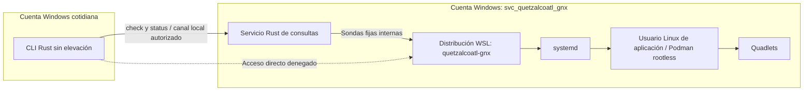
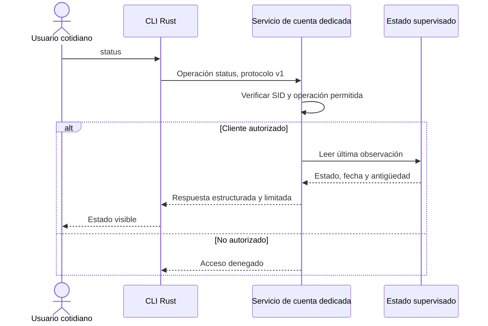
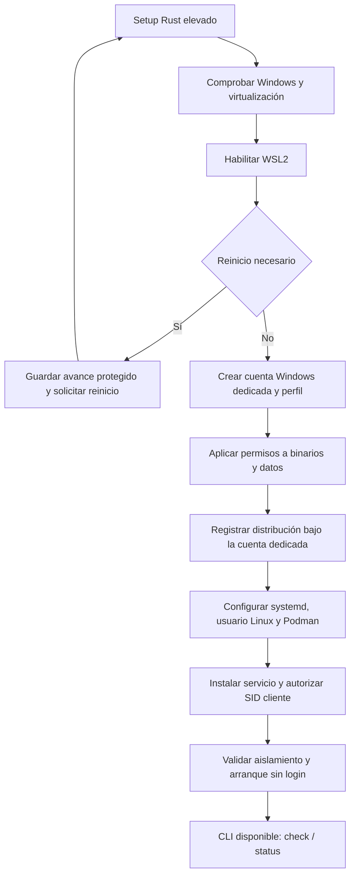

# Quetzalcoatl GNX: WSL privado y CLI de consulta

Estado: diseño con implementación experimental; instalación completa y aislamiento todavía no verificados en el host.

## Acuerdo de partida

Una cuenta Windows dedicada es propietaria de la distribución WSL del producto. La cuenta cotidiana solo consulta mediante los comandos `check` y `status` de la CLI. No recibe credenciales de la cuenta dedicada, shell Linux, acceso al disco de la distribución ni acceso al socket de Podman.

La identidad aprobada es **Quetzalcoatl GNX**. Los nombres compartidos viven en `src/lib.rs`; los identificadores privados de instalación, en `src/windows.rs`. Sus valores están documentados en la [matriz de naming y auditoría](naming-auditoria.md). Los nombres de tecnologías externas identifican dependencias reales.

El instalador y los componentes propios se escriben en Rust. WSL, systemd y Podman son dependencias del sistema; el usuario final no necesita Rust ni compiladores.

## Separación de identidades

La cuenta Windows dedicada y el usuario Linux son identidades distintas. La primera posee WSL; el segundo limita los permisos de los contenedores dentro de Linux.

Microsoft documenta que las distribuciones WSL se registran por usuario Windows. Esa separación se complementa con permisos NTFS sobre el almacenamiento privado y con autorización en el servicio; no basta con ocultar la distribución de la CLI.

## Componentes propuestos

| Componente | Identidad | Responsabilidad |
| --- | --- | --- |
| Instalador Rust | Administrador, durante instalación | Habilitar dependencias, crear cuenta, aplicar permisos e instalar servicio; registrar WSL en el contexto de la cuenta dedicada |
| CLI Rust | Usuario cotidiano sin elevación | Presentar exclusivamente `check` y `status` |
| Servicio Rust de consultas | Cuenta Windows dedicada, sin pertenecer a Administradores | Autorizar consultas, supervisar el entorno y devolver resultados limitados |
| Distribución del producto | Registro y almacenamiento privados de la cuenta dedicada | Ejecutar systemd, Podman y Quadlets |

La implementación tiene dos binarios del mismo paquete Rust: el setup y la CLI, que también proporciona la entrada interna del servicio (`--service`). Esa entrada solo funciona cuando la inicia el administrador de servicios de Windows. La CLI de consulta no requiere elevación; el setup sí. El empaquetado autocontenido queda pendiente.

El arranque de WSL desde un servicio Windows bajo esta cuenta es una hipótesis que debemos probar: perfil cargado, registro por usuario, ejecución sin sesión interactiva, reinicio y recuperación. No se da por resuelto al crear la cuenta.

## Canal seguro de consulta

Canal: named pipe local `\\.\pipe\quetzalcoatl-gnx-control-v1`, protegido mediante una DACL explícita. El instalador autoriza el SID del usuario cotidiano; el servicio verifica la identidad real del cliente, nunca un nombre enviado en JSON. Se rechazan clientes remotos.

El protocolo solo admite dos operaciones enumeradas. No recibe comandos, rutas, nombres de distribución, nombres de unidades ni argumentos de shell. Las sondas internas usan ejecutables y argumentos fijos. Los datos recibidos de Linux también se tratan como entrada no confiable.

La DACL concede únicamente los derechos de comunicación necesarios; no permite a clientes crear instancias del pipe. El servidor reserva la primera instancia y falla si el nombre ya está ocupado. La CLI debe validar la identidad del servidor antes de confiar en respuestas. Añadir límites de tamaño, tiempo y frecuencia; registros sin secretos.

## Significado de los dos comandos

| Comando | Respuesta | Efectos permitidos |
| --- | --- | --- |
| `check` | Lista de comprobaciones: autorización, instalación, servicio, configuración y salud observada de WSL/systemd/Podman/Quadlets | Consulta; nunca instala, repara ni inicia una distribución detenida |
| `status` | Estado resumido, última observación y antigüedad | Lectura de estado; nunca inicia ni reinicia servicios |

Estados propuestos: `ready`, `degraded`, `stopped`, `unknown`. Errores de consulta separados: `access_denied`, `broker_unavailable`, `protocol_mismatch`. Un servicio inaccesible no equivale a una distribución detenida. Datos caducados se muestran como tales, no como salud actual.

La supervisión pertenece al servicio y tiene su propio ciclo de vida. Invocar `wsl.exe -d ...` puede iniciar una distribución: por ello las consultas del usuario leen observaciones del supervisor y no lanzan WSL indiscriminadamente. La respuesta indica cuándo se observó cada condición.

## Instalación y arranque

El instalador debe ser reanudable y no reemplazar cuentas o distribuciones ajenas que coincidan en nombre. No debe registrar la distribución bajo el administrador que ejecutó el setup. La cuenta dedicada necesita inicio de sesión como servicio; se impide su uso interactivo y por RDP. Su credencial no se guarda en argumentos, archivos de configuración ni registros; la gestión de la credencial y su rotación requiere diseño explícito usando mecanismos de Windows.

Binarios en una ubicación modificable solo por administradores. Datos, perfil y VHDX privados bajo permisos explícitos para cuenta dedicada y administración del sistema. No publicar SSH, API de Podman ni otros puertos de administración que permitan eludir la CLI. El acceso de mantenimiento queda reservado a administración.

## Qué significa «mi usuario no tiene acceso a WSL»

Garantía objetivo: la cuenta cotidiana estándar no tiene acceso directo a la distribución del producto, sus archivos ni sus interfaces de administración. Solo tiene las dos consultas autorizadas.

Dos límites que debemos distinguir:

1. Un administrador local elevado o SYSTEM puede cambiar permisos y tomar control del equipo. Esta arquitectura no puede aislar WSL frente al administrador del mismo host. Para que la restricción sea efectiva sobre la cuenta cotidiana, esta debe ser estándar y la administración debe usar otra identidad controlada.
2. Registrar nuestra distribución bajo otra cuenta no prohíbe por sí mismo que el usuario utilice otras distribuciones WSL. Si el requisito es bloquear todo uso de WSL para la cuenta cotidiana, necesitamos además una política de ejecución administrada, que preserve el acceso de la cuenta de servicio, y pruebas de sus posibles vías de elusión.

## Primera prueba técnica antes de construir el instalador completo

| Prueba | Resultado requerido |
| --- | --- |
| Reiniciar Windows sin iniciar sesión con la cuenta dedicada | El servicio accede a su distribución con su perfil correcto |
| Consultar desde usuario autorizado estándar | `check` y `status` responden sin UAC |
| Consultar desde otro usuario estándar | Canal denegado |
| Intentar abrir la distribución o leer su VHDX desde usuario cotidiano | Acceso denegado |
| Enviar una operación o argumentos no admitidos | Rechazo antes de ejecutar procesos |
| Detener WSL mediante mantenimiento y ejecutar consultas | Informan detenido/desconocido sin arrancarlo |
| Reiniciar y comprobar Linux | systemd, cgroups v2 y Quadlets rootless operativos |

Queda pendiente precisar si la restricción cubre únicamente la distribución del producto o cualquier uso de WSL. No se instalarán cuentas, políticas ni servicios durante esta fase de diseño.

La preparación del entorno de compilación es independiente del instalador del producto. Instalar una distribución bajo la cuenta del desarrollador no implementa este modelo de aislamiento.

## Referencias

- [Microsoft: distribuciones WSL por usuario](https://learn.microsoft.com/en-us/windows/wsl/setup/environment).
- [Microsoft: permisos de named pipes](https://learn.microsoft.com/en-us/windows/win32/ipc/named-pipe-security-and-access-rights).
- [Microsoft: cuentas de inicio de sesión de servicios](https://learn.microsoft.com/en-us/windows/win32/ad/about-service-logon-accounts).
- [Microsoft: configuración de WSL](https://learn.microsoft.com/en-us/windows/wsl/wsl-config).
- [Podman: Quadlets y requisito de cgroups v2](https://docs.podman.io/en/stable/markdown/podman-systemd.unit.5.html).
