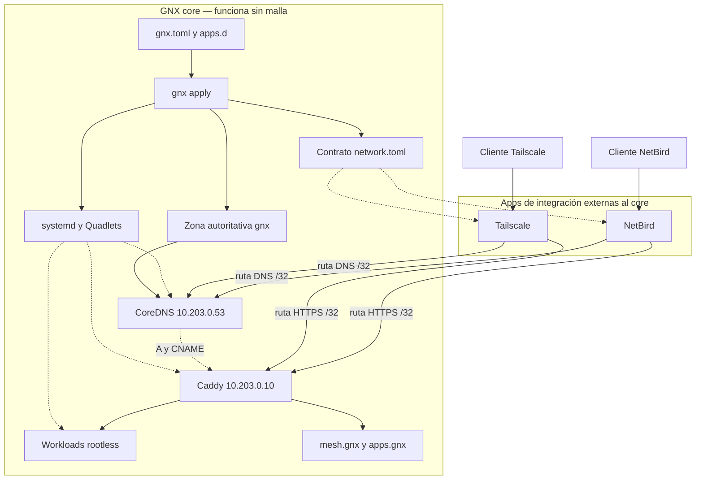

# GNX — Arquitectura del nuevo POC

Estado: propuesta para revisión, 7 de septiembre de 2026. Alcance: un nodo, DNS privado, dos integraciones de malla y aplicaciones privadas. El contrato de instalación, la adaptación de WatchTower y las pruebas de cierre están en [POC.md](POC.md).

## 1. Decisión central

GNX será una plataforma Linux dirigida por archivos, con systemd como supervisor y Podman Quadlets como descripción de contenedores. Windows alojará ese mismo runtime en WSL2 bajo una identidad dedicada, y ofrecerá una CLI y un tray nativos al operador.

CoreDNS será la única autoridad para `.gnx`. Generará respuestas desde una zona local derivada de la configuración GNX y de las aplicaciones declaradas. No habrá dnsmasq, DNS embebido de NetBird ni otro sincronizador. CoreDNS no dependerá de API, grupos ni control plane de una malla.

Tailscale, NetBird y futuras redes serán **apps de integración opcionales**. Cada una hace alcanzables las IP de DNS e ingress y configura su plataforma para enviar el sufijo `gnx` a CoreDNS. GNX core no tendrá un `MeshProvider`, modelos NetBird ni ramas condicionales por fabricante. La interoperabilidad nace de un contrato de red pequeño, no de una abstracción interna.

**Entregables de producto:** `GNX-Setup-x64.exe` y `gnx-linux-x86_64.run`. Dos instaladores, un runtime Linux. El primer POC soportará x86-64; otras arquitecturas serán builds futuros del mismo diseño.

## 2. Taxonomía y responsabilidad única

| Dominio GNX | Responsabilidad | Implementación elegida | No le corresponde |
|---|---|---|---|
| `host` | Instalación, identidades y frontera Windows/Linux | Instaladores, broker Windows y servicio local Linux | Resolver DNS o desplegar workloads |
| `fabric` | Direcciones y tránsito local del nodo | Bridge Podman y firewall | Conocer APIs de malla |
| `dns` | Zona privada y respuestas autoritativas | CoreDNS + archivo de zona generado | Crear rutas o identidades de red |
| `ingress` | HTTPS y encaminamiento HTTP por nombre | Caddy y su CA interna | Administrar contenedores de usuario |
| `apps` | Workloads, integraciones, releases, datos y backups | Manifiestos GNX + Quadlets | Convertirse en supervisor o scheduler |

`gnx` será una CLI y un aplicador pequeño. Las operaciones públicas propuestas son `gnx plan`, `gnx apply`, `gnx status`, `gnx doctor`, `gnx apps deploy <id>` y `gnx apps rollback <id>`. Los dominios organizan código, archivos, permisos y diagnóstico; no implican cinco procesos propios.

Existen dos tipos de app:

| Tipo | Ejemplo | Ejecución | Privilegios |
|---|---|---|---|
| `workload` | `demo.gnx`, PostgreSQL | Quadlets rootless de `gnx-apps` | Sin TUN, rutas ni sockets de infraestructura |
| `integration` | NetBird, Tailscale, almacenamiento externo | Bundle revisado + Quadlets dedicados | Capacidades explícitas concedidas al instalar |

El campo `kind` es clasificación y política de permisos, no una interfaz común de proveedores. Una integración incluye sus archivos y lógica específicos; GNX valida su manifiesto, instala Quadlets y lee un resultado uniforme `READY`, `FAILED` o `ACTION_REQUIRED`. No existe un método genérico `connect()` que intente ocultar plataformas distintas.

`mesh.gnx` será la entrada de GNX para estado, accesos y diagnóstico. `apps.gnx` abrirá el área de aplicaciones. Cada workload tendrá `<app-id>.gnx`, por ejemplo `demo.gnx`. Identificadores estables en minúsculas y con guiones; archivos y unidades usan `gnx-<dominio>-<id>`. `controller` no se usa como cajón de funciones y un peer de red no se modela como aplicación de negocio.

## 3. Topología



Direcciones ilustrativas, seleccionadas de nuevo si chocan con LAN, VPN o rutas existentes:

| Elemento | Dirección del ejemplo | Función |
|---|---|---|
| Bridge privado `gnx-fabric` | `10.203.0.1/24` | Tránsito local de infraestructura |
| Caddy | `10.203.0.10` | Entrada HTTPS común |
| CoreDNS | `10.203.0.53` | DNS autoritativo para `gnx` |
| Integraciones | Asignación dinámica en `gnx-fabric` | Routers hacia DNS e ingress |

Las apps de integración de malla corren en namespaces separados, con TUN y capacidades de red acotadas. Se conectan al bridge; no comparten namespace ni usan `Network=host`. Esto aísla interfaces, rutas y DNS aunque dos mallas utilicen direcciones de `100.64.0.0/10`. No se anuncia el rango de una malla dentro de la otra.

Cada integración publica únicamente `10.203.0.10/32` y `10.203.0.53/32`. Usa SNAT/masquerade hacia el bridge para que las respuestas regresen por la misma malla. El firewall permite HTTPS al ingress y DNS TCP/UDP a CoreDNS desde los routers autorizados; bloquea tránsito entre overlays y acceso lateral a puertos de control.

Los endpoints consumen una malla a la vez en el primer corte. Ejecutar Tailscale y NetBird juntos en el mismo escritorio puede provocar competencia de DNS y rutas; esa coexistencia no es necesaria para probar que ambos clientes, por separado, consumen el mismo contrato GNX.

## 4. CoreDNS como autoridad única

La fuente de intención es `gnx.toml` junto con `apps.d/*.toml`. `gnx apply` valida nombres y destinos, ordena los registros, incrementa el serial SOA y reemplaza el archivo de zona de forma atómica. CoreDNS sirve ese archivo con el plugin `file` y lo recarga al cambiar el serial. No hay base de datos DNS, API propia ni sincronización entre dos autoridades. [CoreDNS file](https://coredns.io/plugins/file/).

Registros iniciales: `mesh.gnx`, `apps.gnx` y `demo.gnx` apuntan a `10.203.0.10`, con TTL 60. El sufijo entregado a split DNS es `gnx`, no la cadena `*.gnx`. El perfil inicial incluye un registro wildcard para conservar la experiencia `*.gnx`; puede desactivarse. El wildcard no crea aplicaciones: Caddy rechaza cualquier hostname que no tenga sitio declarado.

Archivo de zona ilustrativo:

```text
$ORIGIN gnx.
$TTL 60
@       IN SOA  ns.gnx. hostmaster.gnx. 2026090701 60 30 86400 60
@       IN NS   ns.gnx.
ns      IN A    10.203.0.53
mesh    IN A    10.203.0.10
apps    IN A    10.203.0.10
demo    IN A    10.203.0.10
*       IN A    10.203.0.10
```

Corefile ilustrativo. El bloque más específico atiende únicamente `gnx`; el bloque raíz rechaza cualquier otra zona:

```text
gnx:53 {
    bind 10.203.0.53
    errors
    health 127.0.0.1:8080
    ready 127.0.0.1:8181 {
        monitor continuously
    }
    file /etc/coredns/zones/gnx.db gnx {
        reload 5s
    }
}

.:53 {
    bind 10.203.0.53
    template ANY ANY {
        rcode REFUSED
    }
}
```

El plugin `file` responde autoritativamente por `gnx`; el fallback rechaza nombres fuera de la zona. No existe `forward` a DNS público, por lo que una consulta privada no puede fugarse por una caída de malla o de control plane. Los endpoints HTTP de salud escuchan solo en loopback. [CoreDNS health](https://coredns.io/plugins/health/), [ready](https://coredns.io/plugins/ready/), [template](https://coredns.io/plugins/template/).

Antes de publicar una revisión, GNX valida el zonefile con la misma versión de CoreDNS fijada para el runtime. Después del reemplazo consulta SOA, A, wildcard, NXDOMAIN/NODATA y rechazo fuera de zona por UDP y TCP. Un gate fallido conserva la revisión anterior y se reporta; no se marca el servicio como listo solo porque el proceso siga activo.

## 5. Contrato externo para integraciones

El núcleo publica un contrato de datos sin credenciales ni nombres de proveedor:

```toml
schema = 1
zone = "gnx"
nameservers = ["10.203.0.53"]
routes = ["10.203.0.10/32", "10.203.0.53/32"]
protocols = ["udp:53", "tcp:53", "tcp:443"]
health_name = "mesh.gnx"
```

Una app `kind = "integration"` consume ese contrato y entrega instrucciones o automatización específicas. Su resultado debe indicar qué rutas y DNS quedaron configurados, pero GNX core no interpreta objetos de NetBird o Tailscale. Si la integración necesita un token administrativo, el secreto le pertenece a ella y se entrega por el canal de credenciales; nunca se copia a la configuración global.

NetBird puede apuntar un Internal Nameserver con match domain `gnx` a `10.203.0.53` y enrutar las dos direcciones `/32` por el nodo GNX. Esto usa a NetBird como transporte y cliente DNS, sin Custom Zones ni registros internos. [Internal DNS Servers](https://docs.netbird.io/manage/dns/internal-dns-servers), [Networks](https://docs.netbird.io/manage/networks).

Tailscale puede registrar `10.203.0.53` como nameserver restringido a `gnx` y aprobar las mismas rutas `/32`. Se preservan MagicDNS y los resolvers restantes. [DNS de Tailscale](https://tailscale.com/kb/1054/dns), [subnet routers](https://tailscale.com/docs/features/subnet-routers).

En ambos casos la configuración manual del control plane es válida para el POC. Una integración posterior puede automatizarla dentro de su propio bundle. El núcleo no guarda tokens de panel, no observa dashboards y no reconcilia estado remoto. La integración verifica el resultado desde un cliente; no presume éxito por una respuesta API.

Ejemplo de manifiesto conceptual:

```toml
schema = 1
id = "netbird"
kind = "integration"

[bundle]
source = "catalog:gnx/netbird"
digest = "sha256:example-only"

[capabilities]
tun = true
route_publish = true
contract = "network"
```

El mismo esquema mínimo sirve para clasificar una integración, pero su contenido no se traduce a una API universal. El bundle NetBird contiene lógica NetBird; el de Tailscale contiene lógica Tailscale. Nuevos clientes implementan otro bundle sin modificar `core`, `dns` o `ingress`.

## 6. HTTPS e identidad

DNS nombra, las integraciones transportan y Caddy termina TLS. Los certificados automáticos de Tailscale corresponden a nombres de su dominio `ts.net`; no habilitan TLS para `mesh.gnx`. [HTTPS de Tailscale](https://tailscale.com/docs/how-to/set-up-https-certificates).

Para conservar `.gnx`, el POC usa `tls internal` de Caddy con almacenamiento persistente y privado. Caddy gestiona emisión y renovación; GNX no implementa otra CA ni un script de renovación. El instalador registra el certificado raíz público en los almacenes de confianza necesarios mediante una acción identificable. Cada cliente remoto necesita esa raíz y verifica su huella por un canal autenticado. La clave privada permanece en el runtime. [HTTPS local de Caddy](https://caddyserver.com/docs/automatic-https).

`.gnx` es una convención privada del producto. `dns.zone` será configurable para adoptar más adelante un subdominio bajo un dominio propio sin cambiar IDs de aplicaciones. Un cliente nuevo queda listo solo cuando pasan conectividad, DNS y confianza TLS.

`apps.gnx` exige autenticación de aplicación además de pertenecer a la malla. Caddy elimina o sobrescribe cabeceras de identidad recibidas del cliente. El panel, el socket Podman y la API de Caddy permanecen en interfaces privadas. Las bases de datos no se publican a las mallas por defecto.

## 7. Configuración y ejecución

```text
/etc/gnx/gnx.toml                   # Nodo, DNS, ingress y referencias públicas
/etc/gnx/apps.d/<app-id>.toml       # Workloads e integraciones instaladas
/var/lib/gnx/dns/gnx.db             # Zona efectiva generada
/var/lib/gnx/contracts/network.toml # Contrato consumible por integraciones
/var/lib/gnx/releases/<id>/         # Digests y revisiones efectivas
/var/lib/gnx/secrets/               # Secretos privados, fuera de Git
/run/gnx/                           # Sockets y datos efímeros
```

Configuración base propuesta:

```toml
schema = 1
node_id = "poc-01"

[fabric]
subnet = "10.203.0.0/24"
service_ip = "10.203.0.10"
dns_ip = "10.203.0.53"

[dns]
zone = "gnx"
ttl = 60
wildcard = true

[ingress]
tls = "internal"

[apps]
runtime = "quadlet"
```

Un escritor por recurso: los manifiestos declaran intención y GNX genera zona, Caddyfile y Quadlets efectivos. `apply` valida, calcula diferencias y publica una revisión bajo un bloqueo por nodo. Una segunda aplicación idéntica no reinicia servicios ni recrea volúmenes. Una actualización de workload cambia su digest y upstream; solo modifica DNS si cambia su hostname.

Unidades base: `gnx-dns.container`, `gnx-ingress.container` y `gnx-fabric.network`. Las integraciones agregan sus propias unidades con prefijo `gnx-integration-`. Workloads y bases usan `.container`, `.network` y `.volume`; tareas programadas usan `.service` y `.timer`. No hay `.pod`, `.kube`, Compose ni un supervisor alternativo. [Quadlet](https://docs.podman.io/en/latest/markdown/podman-systemd.unit.5.html).

La infraestructura usa systemd de sistema. Los workloads corren rootless en systemd de usuario de `gnx-apps`, con linger y UID/subUID asignados por el instalador. Los servicios web publican puertos altos únicamente en el bridge, alcanzables por Caddy. Bases y aplicaciones comparten redes rootless por proyecto sin exponer puertos de base de datos. El build usa otra identidad sin acceso a secretos de ejecución.

`Restart=on-failure`, límites y frecuencia de reinicios pertenecen a systemd. Readiness y health HTTP pertenecen a la aceptación de una release. El aplicador no contiene un bucle supervisor permanente.

## 8. Windows, Linux y secretos

Windows instala `gnx.exe`, un broker SCM bajo la cuenta estándar `gnx-runtime` y el tray del usuario. El broker importa y opera la distro GNX bajo esa identidad; carga su perfil y comprueba la pertenencia de WSL. La cuenta puede iniciar como servicio y tiene denegado el inicio interactivo/remoto. No se agrega a Administrators para hacer funcionar WSL.

La distro habilita systemd y deshabilita automount e interop de Windows. ACL privadas protegen VHD, estado y credenciales; Administrators y SYSTEM siguen dentro de la frontera de confianza. [Configuración WSL](https://learn.microsoft.com/en-us/windows/wsl/wsl-config).

El pipe local autoriza SIDs concretos, rechaza clientes remotos y acepta mensajes versionados con operación, ID y payload limitado. El broker ejecuta un comando GNX fijo en Linux y pasa el payload por stdin. No acepta shell, argv ni rutas arbitrarias. Linux usa el mismo contrato lógico por Unix socket, comprobando UID, grupo y permiso de operación.

Los secretos viajan por entrada protegida, pipe/socket y archivos de credenciales con acceso mínimo. No entran en TOML, argumentos, imágenes, URLs, logs o Git. Una app de integración solo recibe sus propias credenciales. La app de despliegue no puede leer credenciales de malla, claves de CA o secretos de otra aplicación.

## 9. Base FOSS y crecimiento

La base autónoma queda formada por CoreDNS, Caddy, Podman y systemd. Puede funcionar en LAN o con cualquier red capaz de transportar dos rutas `/32` y split DNS. NetBird y Tailscale son opciones externas del catálogo; sus licencias, avisos y dependencias se evalúan dentro de cada bundle y no contaminan el núcleo.

El diseño no requiere desplegar un control NetBird para instalar GNX. Si un cliente elige NetBird autohospedado, ese control conserva su propio ciclo de vida, identidad, backup y licencia. Tailscale conserva igualmente su control externo. El instalador GNX no se convierte en instalador universal de control planes.

Escalar significa añadir nodos con el mismo contrato y asignar workloads de forma explícita. No se introduce scheduler distribuido en el POC. CoreDNS puede tener una segunda réplica autoritativa generada desde la misma intención; la alta disponibilidad completa también requiere ingress y estado redundantes.

Se preserva del [POC anterior](https://github.com/mayas-alas/quetzalcoatl/blob/codex/poc-archive/docs/arquitectura.md) el runtime único y la frontera Windows/Linux. La [propuesta anterior](https://github.com/mayas-alas/quetzalcoatl/blob/codex/poc-archive/docs/PROYECTO_GNX.md) se toma como intención, corrigiendo sus contradicciones: Linux necesita Podman/systemd; una cuenta sensible no es SysAdmin; el host Linux no consume un VHDX Windows. Proxmox queda como capacidad futura y no es requisito para desplegar apps. `legacy` conserva su historia y la base nueva no incluye migradores.
