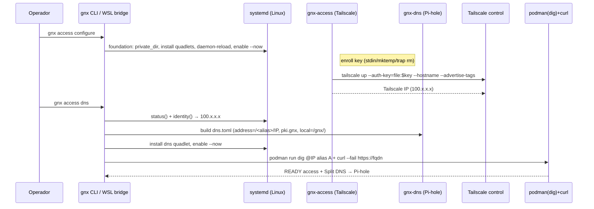
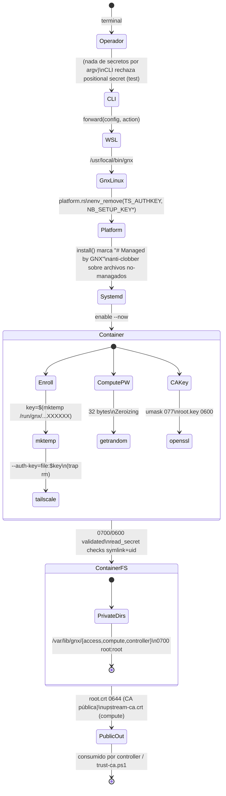

# Arquitectura

GNX es un orquestador Rust (AGPL-3.0) *thin binary* que despliega y verifica una
stack privada en un nodo Linux/WSL. Windows es un puente delgado que delega al
binario Linux dentro de WSL2. No hay estado de agente fuera del runtime del
producto; los assets (`runtime/`) se compilan dentro del binario vía
`include_str!` y usan marcadores visibles (`@MONTE@`) — no hay archivos `.in`
en disco.

## Big picture: trust boundaries y flujos de datos

```mermaid
flowchart TB
    subgraph "Operador (host)"
        OP[terminal gnx.exe / gnx]
        CFG[/gnx.toml\n(sin secretos)/]
    end

    subgraph "WSL2 / Linux (root)"
        BIN[gnx]
        PLAT[platform.rs\nroot() private_dir() install()]
    end

    subgraph "Podman Quadlets"
        ACC[gnx-access\nTailscale + socket /run/gnx/access.sock]
        DNS[gnx-dns\nPi-hole .gnx autoridad]
        CMP[gnx-compute\nProxmox 127.0.0.1:8006]
        CTRL[gnx-controller\nCaddy + CA autónoma]
    end

    subgraph "Externo (tailnet)"
        CLI[Tailscale CLI]
        TAIL[Tailscale control plane *.ts.net]
    end

    OP -->|delega exec| BIN
    BIN -->|valida + forward| PLAT
    PLAT -->|systemd enable/run| ACC
    PLAT -->|systemd enable/run| DNS
    PLAT -->|systemd enable/run| CMP
    PLAT -->|systemd enable/run| CTRL

    ACC -->|Tailscale IPs| CLI
    CLI -->|enroll key (stdin, mktemp, trap rm)| ACC
    ACC <-->|serve svc:compute| TAIL
    DNS -->|Split DNS .gnx| ACC
    CMP -->|upstream-ca.crt| CTRL
    CTRL -->|reverse_proxy https| CMP

    CFG -.->|config única| BIN
    style OP fill:#1e293b,stroke:#0f172a,color:#f1f5f9
    style CFG fill:#0f1f2e,stroke:#1e3a5f,color:#cbd5e1
    style ACC fill:#0f172a,stroke:#0ea5e9,color:#e2e8f0
    style DNS fill:#0f172a,stroke:#2dd36f,color:#e2e8f0
    style CMP fill:#0f172a,stroke:#f59e0b,color:#e2e8f0
    style CTRL fill:#0f172a,stroke:#8b5cf6,color:#e2e8f0
```

- **Trust boundary única:** el binario (`BIN`) es la frontera. `platform.rs`
  corre como `root` y valida permisos (`private_dir` 0700, `write_new` 0600,
  `read_secret` 0600 + anti-symlink + UID 0) antes de tocar el filesystem.
- **Secretos:** `cfg` nunca contiene secretos; la enrolamiento key entra sólo
  por prompt oculto (`rpassword`) → `stdin` → `mktemp` con `trap rm`
  dentro del contenedor (`enroll.sh`). `platform::linux_command` borra
  `TS_AUTHKEY`/`NB_SETUP_KEY` del env siempre.
- **Salida:** `main.rs` imprime `READY <payload>` en *stdout* o
  `FAILED <ETIQUETA>` en *stderr* con código estructurado (2 args/config,
  4 host-no-supported, 6 runtime) — contrato estable probado en
  `tests/contract.rs`.

## Uso 1 — `gnx access`: red privada + Split DNS



Flujo de datos del DNS: `fields()` produce `Split DNS: gnx → <IP>` +
`Tailscale nameserver: <IP>` + alias→IP; `records()` genera las entradas
dnsmasq que Pi-hole resuelve autoritativamente. `service_addresses()`
consulta el IP del `svc:compute` aprobado en el tailnet.

## Uso 2 — `gnx compute`: ciclo de vida del nodo Proxmox

```mermaid
flowchart LR
    OP[Operador] -->|gnx compute apply| BIN[gnx\n(root)]
    BIN -->|install entrypoint.sh + quadlet\nprivate_dir(0700)| CMP[gnx-compute\nProxmox dockurr]
    BIN -->|password() = getrandom(32)\nwrite_new(0600)| PWD[/root.password/]
    PWD -.->>|injected|\nro mount| CMP
    CMP -->|pve-root-ca.pem → upstream-ca.crt| BIN
    BIN -->|READY compute| OP

    subgraph healthcheck
        OP -->|gnx compute status| BIN
        BIN -->|is-active svc| SYS[systemd]
        BIN -->|POST /access/ticket (username/password)| CMP
        BIN -->|GET /nodes/X/status (cookie)| CMP
        CMP -->|uptime>0| BIN
        BIN -->|READY compute\nNode uptime| OP
    end

    style PWD fill:#0f1f2e,stroke:#ef4444,color:#fecaca
```

- El password se genera con entropía del kernel (`getrandom`, 32 bytes, base64url)
  y nunca se loguea. `read_secret` valida modo 0600, no-symlink, UID root.
- `verify_endpoint` debe ser `http://127.0.0.1:*` (validado en `config.rs`).
- `gnx compute credentials` abre una consola privada (modo alt-screen) que
  revela nombre de usuario + password guardado; el password se lee con el
  mismo contrato de permisos.

## Uso 3 — `gnx controller`: proxy + CA autónomo (opcional)

```mermaid
flowchart TB
    subgraph "Linux root"
        CTRL[gnx-controller\nCaddy]
        CA[ca.sh\nopenssl root.key/root.crt\nNameConstraints DNS:.gnx\npathlen:0]
        TLS[/tls/server.key server.crt\n0600/]
        PUB[/public/root.crt\n0644/]
    end
    subgraph "Cliente"
        WIN[Windows\nopcional trust-ca.ps1\n(requiere admin)]
    end
    subgraph "Upstream"
        CMP[gnx-compute 127.0.0.1:8006\n(tls_trust_pool upstream-ca.crt)]
    end

    CA -->|firma| TLS
    CA -->|root.crt| PUB
    CTRL -->|reverse_proxy| CMP
    CTRL -->|serve .gnx {tls server.crt}| PUB
    PUB -.->>|confianza explícita| WIN
    style CA fill:#0f172a,stroke:#8b5cf6,color:#ddd
    style PUB fill:#0f1f2e,stroke:#f59e0b,color:#ddd
```

- El CA autónomo (`ca.sh`) genera una raíz con `basicConstraints=critical,CA:TRUE,pathlen:0`
  y `nameConstraints=critical,permitted;DNS:.gnx`. La raíz **nunca** se instala de
  forma implícita: `trust-ca.ps1` es la única acción que la confía en Windows
  (valida `CN=GNX Autonomous Root` + sin private key, requiere admin).
- `Caddyfile` enruta `http://127.0.0.1:8443 { import compute }` usando
  `tls_trust_pool` del `upstream-ca.crt` del compute.
- TLS automático `*.ts.net` (de Tailscale) sigue siendo el camino principal;
  el CA es una ruta secundaria, marcada **experimental** (falta revocation,
  ceremonia/backup de raíz, pruebas de restauración).

## Trust map de secretos



Contrato de secretos (AGENTS.md §3): los tokens, claves privadas y URLs de
actualización **no** entran en Git, argv, logs, capturas ni evidencia. Los
ejemplos contienen sólo valores no secretos.

## CI/CD y packaging (build gate)

```mermaid
flowchart LR
    SRC[src/ + runtime/ + Cargo.toml] -->|cargo| LINUX[Linux native\ngnx (release, LTO thin)\npanic=abort, strip=symbols]
    SRC -->|cargo| WIN[gnx.exe (Windows)]
    subgraph "build.ps1 (Windows)"
        GATES["cargo test --locked\ncargo clippy -- -D warnings\ncargo build --release"]
        WSLBUILD["wsl podman rust@sha256\ntest+clippy+release (Linux)"]
        HASH["SHA-256 gnx.exe / gnx"]
        DIST["dist/: gnx.exe gnx *.sha256 runtime/ install.sh LICENSE"]
    end
    LINUX --> WSLBUILD
    WIN --> GATES --> WSLBUILD --> HASH --> DIST
    DIST --> INST["install-host.ps1\n(checksum 0/0, PATH machine)\ninstall-linux.sh\n(sha256sum -c)"]
    style DIST fill:#0f172a,stroke:#2563eb,color:#ddd
```

## Árbol del repositorio

```text
gnx/
├── src/              # orquestador Rust (shared)
│   ├── main.rs       # entrypoint: READY / FAILED contract
│   ├── cli.rs        # clap: access|compute|controller (no secret positions)
│   ├── config.rs     # gnx.toml declarativo + validación estricta
│   ├── platform.rs   # Linux root + WSL bridge (env limpio)
│   ├── access.rs     # Tailscale/Pi-hole Quadlets + Split DNS checks
│   ├── compute.rs    # Proxmox Quadlet + API2 health + password 0600
│   ├── controller.rs # Caddy proxy + CA autónomo opcional
│   ├── error.rs      # etiquetas estables + códigos de salida
│   └── lib.rs        # feature gates: linux-only modules
├── runtime/          # assets compilados (include_str!), no .in
│   ├── access/       # Tailscale + Pi-hole Quadlet + enroll.sh
│   ├── compute/      # Proxmox Quadlet + entrypoint.sh
│   ├── controller/   # Caddyfile + ca.sh + Quadlet
│   └── artifacts/    # .msi/.LICENSE  (gitignored)
├── config/gnx.example.toml
├── packaging/{linux,windows}/  # install.sh, build.ps1, install-host.ps1, trust-ca.ps1
├── tests/contract.rs   # tests de integración (exit code + stderr contract)
├── docs/{arquitectura,operar}.md
├── Cargo.toml         # AGPL-3.0, MSRV 1.98, release LTO/abort/strip
└── AGENTS.md          # contrato de agentes (out-of-runtime, GNX names, secret safety)
```

Lo que viene (roadmap implícito): el CA autónomo es experimental — pendiente
revocación (CRL/OCSP), ceremonia y backup de la raíz (`c5ff496` ya documenta
encrypted USB backup), y pruebas de restauración. El *human console* de
credenciales (`b44f115`) podría convertirse en una fuente de backup de
recuperación. Las decisiones de `docs/decisions/` (vacío hoy) quedan por
llenarse para registrar los trade-offs de confianza `.gnx` vs `*.ts.net`.
