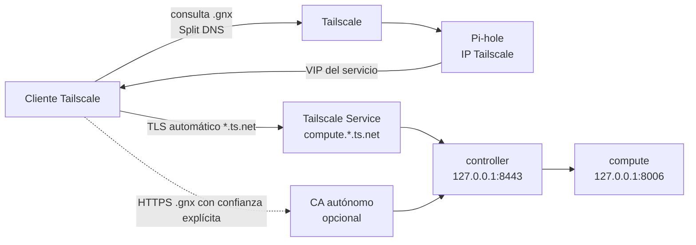

# Arquitectura

## Red y confianza



Tailscale transporta las consultas y conexiones. Pi-hole es la autoridad de la
zona `gnx`; el panel DNS del tailnet debe restringir esa zona a la IP Tailscale
de Pi-hole. El CA no sustituye el TLS automático: sirve para investigar y operar
la ruta privada `.gnx` cuando el negocio decida confiar en su raíz.

## Árbol objetivo

```text
gnx/
├── src/
│   ├── access.rs       # red, Tailscale Services y contrato Split DNS
│   ├── compute.rs      # estado y credenciales del cómputo
│   ├── controller.rs   # proxy y CA autónomo optativo
│   ├── config.rs       # única fuente declarativa, sin secretos
│   ├── platform.rs     # Linux real + puente mínimo desde Windows/WSL
│   └── cli.rs          # taxonomía pública: access|compute|controller
├── config/
│   └── gnx.example.toml # intención completa y revisable
├── runtime/
│   ├── access/         # Quadlet Tailscale/Pi-hole
│   ├── compute/        # Quadlet y entrada segura
│   └── controller/     # Quadlet Caddy y generación local del CA
├── packaging/
│   ├── linux/          # instalación del binario usado también por WSL
│   └── windows/        # build, instalación y confianza CA explícita
└── docs/               # este mapa + guía operativa
```

No hay archivos `.in`: la configuración usa marcadores visibles (`@...@`) sólo
en assets compilados dentro del binario. Así se evita confundir plantillas con
archivos listos para ejecutar.
