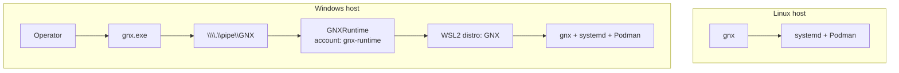
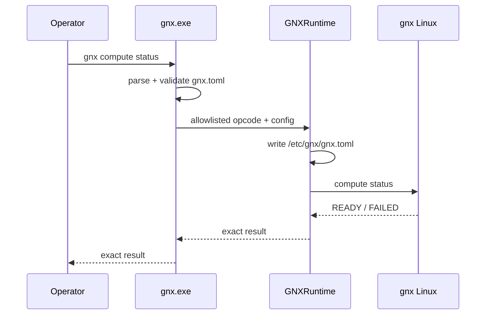
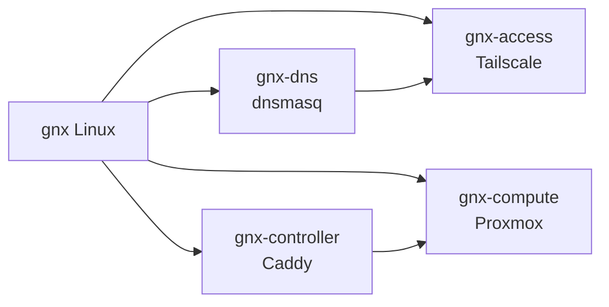
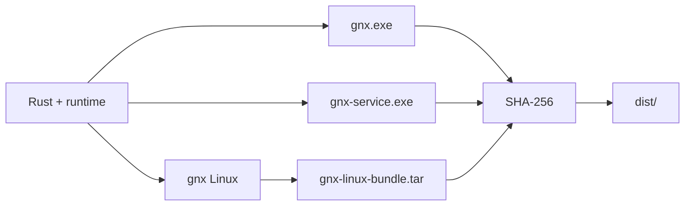

# Arquitectura

GNX mantiene un único runtime Linux para `access`, `compute` y `controller`.

En un host Linux, `gnx` ejecuta directamente contra systemd y Podman. En Windows, el usuario opera `gnx.exe`, pero el runtime Linux pertenece a una cuenta local dedicada: `gnx-runtime`.

La separación de Windows busca reducir la superficie visible y mutable desde la sesión cotidiana del operador sin reintroducir Podman Machine, tray, un runtime Windows paralelo ni componentes del producto legacy.

## Principios

1. **Un solo runtime Linux.** La lógica real de infraestructura vive en `gnx` Linux.
2. **Windows es cliente + broker.** `gnx.exe` no ejecuta `wsl.exe` directamente.
3. **Identidad dedicada.** `GNXRuntime` corre como `gnx-runtime` y esa identidad posee la distro WSL `GNX`.
4. **Sin shell genérica.** El broker acepta únicamente acciones GNX conocidas.
5. **Podman nativo.** Dentro de WSL se usa Podman Linux; no existe Podman Machine.
6. **Config driven.** La configuración declarativa cruza el broker; los secretos siguen otro canal.
7. **Verificación explícita.** Cada capacidad conserva sus gates `READY` / `FAILED`.

## Vista general



`access`, `compute` y `controller` son iguales después de entrar al runtime Linux. La diferencia de plataforma termina en la frontera del broker.

## Linux nativo

En Linux no existe broker Windows ni cuenta `gnx-runtime` del host.

```text
gnx
└── Linux host
    ├── /etc/gnx/gnx.toml
    ├── /var/lib/gnx/
    ├── systemd
    └── Podman Quadlets
```

`src/platform.rs` ejecuta comandos nativos y conserva las validaciones de permisos, ownership y archivos administrados.

## Windows aislado

### Identidades

La instalación crea una cuenta local estándar:

```text
.\gnx-runtime
```

La cuenta recibe únicamente los derechos necesarios para el servicio y, al mismo tiempo, derechos explícitos de denegación para uso humano:

```text
SeServiceLogonRight
SeDenyInteractiveLogonRight
SeDenyRemoteInteractiveLogonRight
SeDenyNetworkLogonRight
```

También se oculta de la pantalla normal de inicio de sesión.

El servicio SCM se registra como:

```text
Service:  GNXRuntime
Account:  .\gnx-runtime
Startup:  Automatic
```

El Service Control Manager carga el perfil del usuario de servicio. Por ello, las operaciones WSL realizadas por el proceso quedan en el contexto de `gnx-runtime`, no en el HKCU del operador.

### Propiedad de la distro

La distro del producto tiene nombre interno fijo:

```text
GNX
```

El operador no ejecuta `wsl --import` para esa distro. La importación la realiza `GNXRuntime` después de iniciar como `gnx-runtime`:

```text
operator/elevated installer
        │
        ├── enable WSL engine if required
        ├── install gnx.exe + gnx-service.exe
        ├── create gnx-runtime
        └── start GNXRuntime
                 │
                 └── wsl --import GNX ...
                         executed as gnx-runtime
```

WSL mantiene el registro de distros por usuario. En consecuencia, la distro `GNX` no pertenece al contexto WSL habitual del operador y no aparece en su `wsl -l` normal.

Esto es aislamiento frente al contexto operativo cotidiano, **no frente a un administrador local elevado ni frente a SYSTEM**, que siguen siendo trust principals del host.

### Filesystem Windows

El estado Windows del runtime vive bajo:

```text
C:\ProgramData\GNX\
├── operator.sid
├── bootstrap\
├── public\
└── wsl\
    └── ext4.vhdx
```

La ACL elimina herencia y concede acceso al runtime únicamente a:

```text
SYSTEM          Full Control
Administrators  Full Control
gnx-runtime     Full Control
```

El operador normal no necesita acceso al state directory. Su superficie de producto es `C:\Program Files\GNX\gnx.exe` y `gnx.toml`.

## Named Pipe broker

La frontera entre la CLI Windows y el runtime es:

```text
\\.\pipe\GNX
```

El pipe usa byte mode, rechaza clientes remotos y aplica una DACL protegida para:

- SYSTEM;
- Administrators;
- el SID exacto del operador que realizó la instalación.

El SID se captura durante la instalación y se guarda dentro del state directory privado.

### Allowlist

El protocolo no transporta argv arbitrario. Un byte de operación representa únicamente una de estas acciones:

```text
access configure
access apply
access dns
compute apply
compute status
compute credentials
controller apply
controller status
```

No existe una operación `exec`, `shell`, `sh -c` ni passthrough de comandos Windows/WSL.

### Framing

El protocolo local tiene framing binario mínimo:

```text
GNX1
operation
config_length
secret_length
config
secret
```

Límites actuales:

```text
config    <= 1 MiB
secret    <= 64 KiB
response  <= 4 MiB por stream
```

El servicio valida el opcode antes de ejecutar cualquier operación.

## Configuración Windows → Linux

`gnx.toml` sigue siendo la fuente declarativa del operador.



La configuración se sincroniza a `/etc/gnx/gnx.toml` antes de la acción. El broker no acepta rutas Windows para ejecutar ni convierte paths con `wslpath`.

`host.distribution` desaparece de `gnx.toml`: la distro `GNX` es un detalle interno de packaging, no una opción de producto.

## Handling de secretos

Los secretos no viajan dentro del bloque de configuración.

### Tailscale enrollment

En Linux nativo se conserva el prompt oculto existente.

En Windows:

1. `gnx.exe` envía `access configure` sin secret.
2. El runtime comprueba si `gnx-access` ya está enrolado.
3. Sólo si falta identidad devuelve `ACCESS_SECRET_REQUIRED`.
4. `gnx.exe` solicita la auth key mediante prompt oculto.
5. La key cruza el named pipe como payload secreto.
6. `GNXRuntime` la entrega a `gnx` Linux por `stdin`.
7. `enroll.sh` crea un archivo temporal dentro del contenedor, ejecuta `tailscale up --auth-key=file:...` y elimina el archivo con `trap`.

La key no entra en:

```text
gnx.toml
argv
Windows environment
Linux environment
logs
Git
```

### Compute credentials

La contraseña de Proxmox permanece en `/var/lib/gnx/compute/root.password` dentro de la distro aislada.

Cuando Windows solicita `gnx compute credentials`, la lectura la realiza Linux y el valor cruza únicamente el pipe autorizado. `gnx.exe` lo muestra en pantalla alternativa y limpia la pantalla al confirmar el operador. El broker no lo persiste en Windows.

## WSL runtime

### Rootfs

La distro se importa desde el rootfs Ubuntu 24.04 declarado en:

```text
packaging/windows/runtime.lock.json
```

El manifest fija URL y SHA-256. `install-host.ps1` descarga el archivo sólo cuando no existe todavía el VHD de GNX y verifica el digest antes de dejarlo en el área `bootstrap`.

La cuenta `gnx-runtime` consume el rootfs después de iniciar el servicio.

### Aislamiento dentro de WSL

GNX escribe `/etc/wsl.conf` con:

```ini
[boot]
systemd=true

[automount]
enabled=false

[interop]
enabled=false
appendWindowsPath=false
```

Por diseño, el runtime no monta automáticamente `C:` ni hereda el Windows PATH, y los procesos Linux no usan interop para lanzar ejecutables Windows.

### Podman

Después del import, el servicio instala únicamente los prerequisitos Linux necesarios:

```text
podman
openssl
curl
iproute2
ca-certificates
```

Podman corre directamente en Ubuntu WSL. No existe una VM Fedora/Podman Machine dentro del runtime.

## Linux bundle

El build genera un bundle Linux independiente:

```text
gnx-linux-bundle.tar
├── gnx
├── gnx.sha256
├── gnx.example.toml
├── LICENSE
├── install-linux.sh
└── runtime/
```

En Windows, el bundle se copia al state privado y el servicio lo introduce a la distro por `stdin` hacia `tar`; no depende de `/mnt/c`.

Después de una instalación correcta, los artefactos bootstrap descargados se eliminan del state Windows.

## Runtime administrado



Los servicios continúan administrados mediante systemd y Podman Quadlets. El aislamiento Windows no cambia esta arquitectura.

## Access

`gnx access` conserva dos componentes:

```text
gnx-access    Tailscale
gnx-dns       dnsmasq
```

`gnx-dns` publica TCP/UDP 53 únicamente sobre la IP Tailscale del runtime. `runtime/access/dnsmasq.conf` contiene la configuración mínima y GNX genera los registros `.gnx` desde `gnx.toml`.

No hay DHCP, bloqueo de anuncios, UI DNS ni resolver general.

## Compute

`gnx compute` administra Proxmox mediante el Quadlet `gnx-compute`.

El password root:

- se genera con entropía del sistema;
- usa 32 bytes aleatorios;
- se almacena en el state Linux con permisos restrictivos;
- no aparece en configuración ni logs.

`compute status` autentica contra la API de Proxmox y verifica identidad y uptime.

## Controller

`gnx controller` administra Caddy y la CA `.gnx` opcional.

La private root key permanece exclusivamente en:

```text
/var/lib/gnx/controller/pki/root.key
```

En Windows, cuando existe la CA, el servicio puede copiar únicamente el certificado público a:

```text
C:\ProgramData\GNX\public\root.crt
```

`packaging/windows/trust-ca.ps1` consume ese certificado público mediante una acción elevada y explícita. Ya no depende de `\\wsl.localhost`, porque la distro pertenece a otra identidad Windows.

## Frontera de archivos Linux

Antes de modificar estado persistente, GNX conserva los controles actuales:

- directorios privados `0700`;
- secretos persistentes `0600`;
- ownership validado;
- rechazo de symlinks en rutas sensibles;
- rechazo de sobrescritura de archivos no administrados.

Los archivos administrados empiezan con:

```text
# Managed by GNX
```

## Build Windows



`packaging/windows/build.ps1` usa la distro WSL del **equipo de desarrollo** únicamente para construir el binario Linux. Esa `BuildDistribution` no forma parte del runtime instalado y no se copia a la configuración del producto.

## Instalación Windows

El corte de instalación es:

```text
1. verify release hashes
2. ensure machine-wide WSL engine
3. stop existing GNXRuntime if present
4. install gnx.exe + gnx-service.exe
5. create/update gnx-runtime
6. grant service/deny-logon rights
7. restrict C:\ProgramData\GNX ACL
8. stage verified Linux bundle/rootfs
9. start GNXRuntime
10. service imports/updates isolated GNX distro
11. wait for broker PONG
```

No se instala una distro bajo el usuario humano y no se instala Podman en su entorno Windows o WSL.

## Contrato de salida

La CLI conserva:

```text
READY <payload>
FAILED <LABEL>
```

El broker devuelve stdout, stderr y exit code del binario Linux para que Windows mantenga el mismo contrato observable.

## Límites de confianza

La frontera Windows reduce acceso accidental y acoplamiento con el perfil del operador, pero no pretende resistir a un administrador local hostil.

Trust principals del host:

```text
SYSTEM
local Administrators
gnx-runtime    para su runtime
operator SID   únicamente para conectar al pipe
```

El aislamiento buscado es que el usuario cotidiano no posea ni administre directamente:

```text
GNX WSL distro
Podman runtime
Linux state
runtime secrets
```

mientras conserva una CLI única y pequeña.
