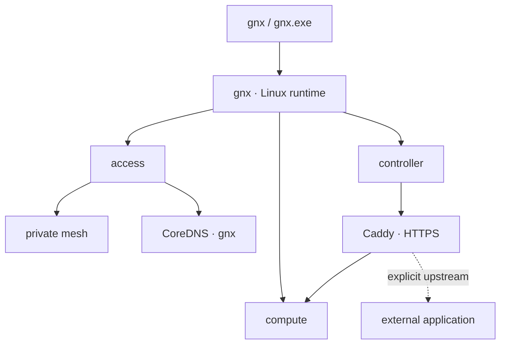
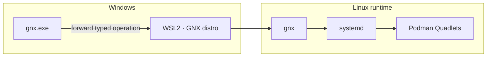
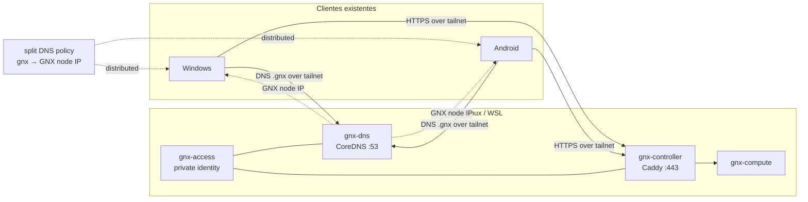
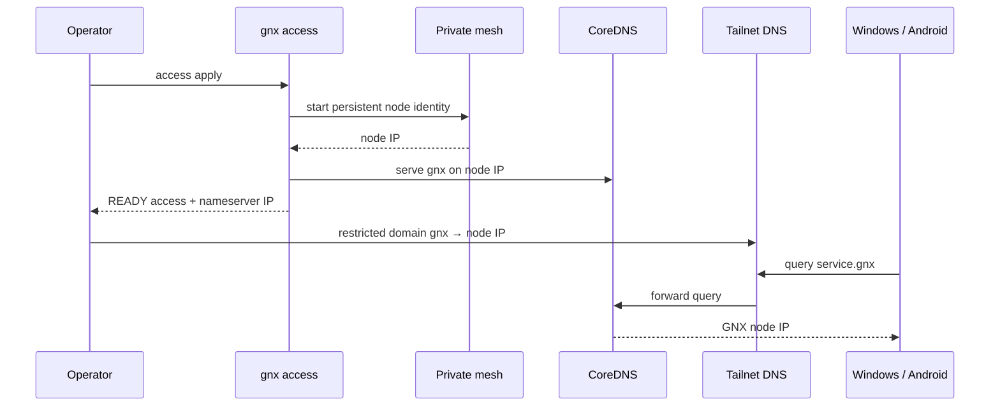
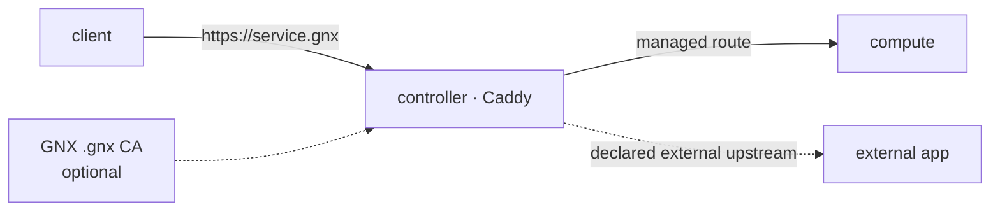
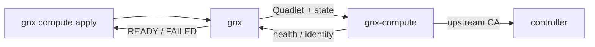

# Quetzalcoatl — Arquitectura del PoC

Quetzalcoatl es un orquestador Rust pequeño. `gnx` instala, configura y verifica un plano privado de servicios sobre Linux; en Windows, `gnx.exe` es un puente hacia el mismo runtime dentro de WSL2. El PoC conserva un solo modelo operativo y tres capacidades: **access**, **compute** y **controller**.

La arquitectura no intenta convertirse en una plataforma genérica de aplicaciones. Las aplicaciones consumen el plano GNX; no forman parte del core.

## 1. Núcleo

| Capacidad | Responsabilidad | Implementación del PoC |
|---|---|---|
| `access` | Identidad privada, transporte cifrado y resolución `.gnx` | nodo Tailscale + CoreDNS |
| `compute` | Ciclo de vida y salud del nodo de cómputo | Proxmox administrado por GNX |
| `controller` | Entrada HTTPS y routing por nombre | Caddy + CA `.gnx` opcional |

`gnx` es la única superficie de control. systemd supervisa y Podman Quadlet describe los servicios; GNX aplica configuración y verifica resultados, pero no introduce un supervisor propio.



## 2. Modelo de ejecución

Linux es el runtime nativo. Windows no implementa infraestructura por segunda vez.



El contrato público sigue siendo pequeño: configuración declarativa, operaciones tipadas y salida `READY …` / `FAILED …`. Windows puede preparar WSL y delegar; no necesita implementar DNS, routing o lifecycle de contenedores en el host.

## 3. Access: mesh + `.gnx`

El cambio respecto al PoC reiniciado es deliberado: la malla vuelve a **Access** porque es parte de la hipótesis que queremos probar. No existe una capa abstracta de “fabric”, un SDK de proveedores ni bundles intercambiables en este PoC.

El nodo GNX conserva una identidad Tailscale persistente. CoreDNS sirve únicamente la zona `gnx` y Caddy recibe HTTPS sobre la misma identidad privada. En Quadlet, DNS y controller pueden reutilizar el namespace de red de `gnx-access`; así el IP del tailnet pertenece a una sola frontera de red sin anunciar bridges internos.



### DNS

CoreDNS es autoritativo para `gnx` y no es resolver general. Un wildcard puede enviar `*.gnx` al IP privado del nodo; Caddy conserva una lista explícita de sitios, por lo que resolver un nombre no concede acceso ni crea una aplicación.

La configuración de tailnet usa un **restricted nameserver / split DNS** para `gnx` apuntando al IP Tailscale del nodo GNX. MagicDNS puede permanecer habilitado para nombres de dispositivos; `.gnx` se resuelve por el nameserver restringido.

Esto elimina lógica DNS del endpoint:

1. GNX levanta su identidad privada y obtiene su IP estable.
2. CoreDNS queda alcanzable en ese IP por TCP/UDP 53.
3. El operador registra una vez `gnx → <GNX_TAILNET_IP>` en el DNS del tailnet.
4. Los clientes Tailscale que aceptan DNS reciben la política.
5. Windows, Android u otro cliente consultan `.gnx` sin que el instalador GNX modifique su DNS local.



La configuración del control plane puede ser manual durante el PoC. Automatizarla es una mejora posterior; no es requisito para demostrar el flujo.

## 4. Controller

Controller recibe nombres `.gnx` y termina TLS. Solo rutas declaradas alcanzan un upstream.



La CA `.gnx` sigue siendo explícita. Resolver DNS y confiar un certificado son problemas distintos: GNX no debe esconder la instalación de una raíz de confianza dentro de la configuración de red. Para el PoC basta una acción de confianza separada y auditable en los clientes donde se quiera probar HTTPS `.gnx`.

## 5. Compute

Compute sigue siendo una capacidad de primer nivel, no un “workload” genérico. GNX administra su lifecycle, credencial local, health y CA upstream; Controller publica únicamente la superficie que deba ser visible.



El servicio de cómputo no recibe acceso al estado de Access ni a la clave privada de la CA de Controller.

## 6. Aplicaciones externas

Una aplicación externa no se convierte en módulo GNX. Mantiene su repositorio, imagen, Compose, datos, secretos, actualización y licencia fuera de Quetzalcoatl.

Para demostrar esta frontera, el PoC puede arrancar **WatchTower** con los artefactos que ya publica upstream y registrar únicamente un upstream en Controller, por ejemplo `watchtower.gnx → <endpoint privado>:8000`.

GNX no:

- copia o modifica su código;
- sustituye su runtime;
- administra su base de datos o secretos;
- implementa su modelo de despliegue;
- incluye su Compose dentro de `runtime/`.

Si la aplicación se detiene o se elimina, Access, Compute y Controller deben seguir saludables. Esa independencia es parte de la prueba.

## 7. Runtime mínimo

```text
quetzalcoatl/
├── src/
│   ├── main.rs
│   ├── cli.rs
│   ├── config.rs
│   ├── platform.rs
│   ├── access.rs
│   ├── compute.rs
│   ├── controller.rs
│   └── error.rs
├── runtime/
│   ├── access/
│   │   ├── gnx-access.container
│   │   └── gnx-dns.container
│   ├── compute/
│   │   └── gnx-compute.container
│   └── controller/
│       └── gnx-controller.container
├── config/
│   └── gnx.example.toml
├── packaging/
├── tests/
└── docs/
    ├── POC.md
    └── architecture.md
```

El árbol no contiene aplicaciones externas ni un framework de integraciones.

## 8. Fronteras de confianza

- `gnx.toml` no contiene secretos.
- La identidad de Access persiste en estado privado; una clave de enrolamiento entra por un canal efímero y no por argv/logs.
- CoreDNS responde solo por `gnx`; no reenvía consultas públicas.
- Controller publica solo hosts declarados y no expone sockets de runtime.
- Compute conserva secretos y API fuera del acceso directo de clientes.
- Una aplicación externa recibe únicamente conectividad a su propio upstream; no monta estado, sockets ni credenciales GNX.
- El host Windows no necesita cambios de DNS para `.gnx`; esa política pertenece al cliente/tailnet.

## 9. Invariantes del PoC

1. Tres capacidades: `access`, `compute`, `controller`.
2. Un runtime Linux; Windows solo delega.
3. systemd supervisa; Quadlet describe contenedores.
4. La malla privada pertenece a Access y cifra el camino remoto.
5. CoreDNS es la única autoridad `.gnx`.
6. Split DNS distribuye `gnx` a clientes; el installer no administra DNS de endpoints.
7. Controller es la única entrada HTTP(S) administrada.
8. Compute permanece capacidad propia.
9. Las aplicaciones externas permanecen externas.
10. El PoC prueba estas fronteras antes de diseñar una plataforma o instalador final.
