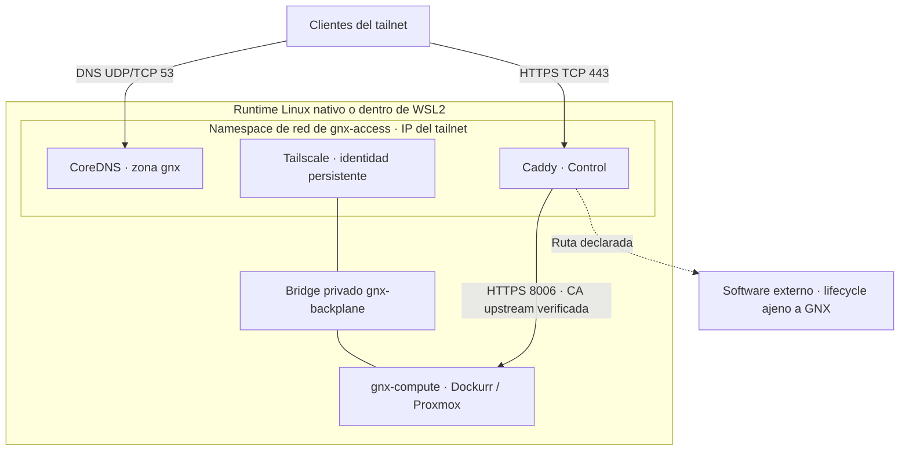
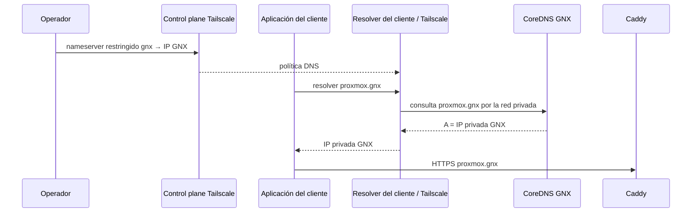

# Quetzalcoatl — Arquitectura

Versión documental: 1.0, 7 de septiembre de 2026. Define el diseño a implementar; la aceptación y la evidencia están en [POC.md](POC.md). La documentación no acredita que el runtime ya funcione.

Quetzalcoatl ofrece tres capacidades: **Access conecta, Control publica y Compute ejecuta**. `gnx` aplica configuración y verifica resultados sobre un único runtime Linux; `gnx.exe` delega a ese mismo runtime en WSL2.

**Decisión de negocio fija:** Compute ejecuta **Proxmox VE mediante Dockurr**, administrado con **Podman Quadlet**, y se accede a su interfaz en **`https://proxmox.gnx`**. Las pruebas resuelven la implementación de este requisito; no autorizan sustituirlo por otro appliance, un mock o una instalación nativa de Proxmox.

## 1. Capacidades y decisiones

| Capacidad | Implementación del PoC | Responsabilidad | Frontera |
|---|---|---|---|
| Access | Tailscale + CoreDNS | Identidad privada persistente, transporte cifrado y autoridad DNS de `gnx` | No configura rutas HTTP ni administra Proxmox |
| Control | Caddy | TLS, hosts declarados y reverse proxy | No arranca, actualiza ni repara upstreams |
| Compute | `docker.io/dockurr/proxmox`, fijada por digest | Estado, arranque y salud del appliance Proxmox | No administra todavía sus LXC, VM o workloads |
| Runtime compartido | CLI Rust, systemd y Podman Quadlet | Validación, aplicación e inspección de esas tres capacidades | Es soporte común, no una cuarta capacidad |

Se conserva Rust del diseño existente. Hay un módulo por capacidad y módulos pequeños para configuración, errores y transporte Windows/Linux. No se añade un framework de proveedores, scheduler ni supervisor permanente GNX. systemd del host Linux supervisa los contenedores; los servicios internos de Proxmox conservan su propia gestión dentro del appliance.

El PoC usa una sola malla Tailscale. CoreDNS sigue siendo la única autoridad de `gnx`; MagicDNS conserva los nombres de dispositivos y no reemplaza esa zona. La familia de cada componente queda elegida aquí; sus versiones y digests exactos se registran antes de aceptar el primer corte.

## 2. Topología de referencia



- `gnx-access.container` posee el namespace, la interfaz TUN y la identidad Tailscale. Usa networking de kernel, sin exit node ni publicación de subredes.
- `gnx-dns.container` y `gnx-control.container` usan `Network=gnx-access.container`. Comparten red, pero no volúmenes de identidad, sockets Tailscale ni claves privadas.
- Access se conecta al bridge `gnx-backplane`. Compute tiene un namespace separado en ese bridge; su API HTTPS escucha en 8006 y no tiene `PublishPort` hacia LAN, Windows o tailnet.
- El bridge es un recurso interno de runtime. Su subred se elige tras comprobar colisiones con LAN, WSL, VPN y redes Podman. El endpoint interno de Compute es estable dentro de la configuración del nodo; no se anuncia a clientes.
- CoreDNS y Caddy escuchan en la IP privada Tailscale, no en todas las interfaces del host. El arranque espera esa IP con timeout. Un cambio de identidad/IP requiere reaplicar configuración y revisar split DNS; no se simula continuidad.
- La política del tailnet permite a los clientes autorizados DNS TCP/UDP 53 y HTTPS TCP 443. No concede 8006, acceso al bridge, socket Podman ni API administrativa de Caddy. La conexión de GNX a un upstream externo necesita su permiso específico.
- El PoC publica IPv4. No genera registros AAAA ni anuncia soporte IPv6 sin una prueba separada. Se usa HTTPS directo; no se necesita publicar HTTP 80.

Quadlet admite compartir la red de otro archivo `.container` y exige cgroup v2. Estos mecanismos sustentan la topología; sus unidades efectivas deben verificarse en las versiones fijadas. [Referencia Podman Quadlet](https://docs.podman.io/en/latest/markdown/podman-systemd.unit.5.html).

La recreación de Access cambia el namespace del que dependen DNS y Control: el aplicador debe recrear sus consumidores en orden y comprobarlos de nuevo. Compute conserva su proceso y sus datos. Un simple `After=` no demuestra que esa recuperación funcione.

## 3. Access: identidad y DNS

Access mantiene estado Tailscale persistente y no efímero. El enrolamiento usa entrada protegida o el flujo interactivo oficial. Una segunda aplicación reutiliza la identidad; no ejecuta logout, borra estado ni registra otro nodo para resolver un fallo.

El operador configura una vez un **nameserver restringido a `gnx`** apuntando a la IP Tailscale de GNX. Los clientes deben estar unidos al tailnet y aceptar su política DNS. GNX no modifica `hosts`, NRPT, adaptadores ni resolvers de endpoints; el cliente oficial Tailscale sí aplica la política de red mediante sus mecanismos normales. No se promete que el sistema operativo permanezca sin cambios producidos por Tailscale. [Split DNS de Tailscale](https://tailscale.com/docs/reference/dns-in-tailscale).

El control plane distribuye configuración; **no es el servidor que recibe cada consulta DNS**:



La zona base contiene SOA, NS, `ns.gnx`, `proxmox.gnx` y los nombres externos declarados, con TTL 60. Los registros de servicio apuntan a la IP de Access. `gnx` identifica la zona, no una aplicación ni un registro A obligatorio.

El perfil inicial desactiva wildcard para que nombres no declarados den NXDOMAIN. Si se habilita después, deberá probarse explícitamente y no creará rutas en Caddy. Un nombre existente sin AAAA responde NOERROR sin datos; no se confunde con NXDOMAIN.

CoreDNS usa una zona de archivo con serial SOA creciente; GNX valida la candidata antes de reemplazarla atómicamente. Fuera de `gnx` responde REFUSED: no incluye `forward` ni funciona como resolver general. Una zona inválida conserva la anterior. Los endpoints de diagnóstico escuchan solo en loopback del namespace. [CoreDNS file](https://coredns.io/plugins/file/), [respuesta REFUSED con template](https://coredns.io/plugins/template/).

La ausencia de forward en GNX no garantiza el comportamiento de todos los resolvers del mundo. Las pruebas distinguen rechazo de CoreDNS, split DNS efectivo y cualquier desvío observado en el cliente. El perfil calificado usa el resolver del sistema, sin un DoH de navegador que lo eluda.

## 4. Control: HTTPS y rutas explícitas

La ruta obligatoria es:

```text
https://proxmox.gnx:443
    → Caddy
    → https://<endpoint-privado-compute>:8006
    → interfaz y API reales de Proxmox
```

Hay **dos conexiones TLS** que se validan por separado:

| Conexión | Confianza requerida |
|---|---|
| Cliente → Caddy | Certificado para `proxmox.gnx`, emitido con `tls internal`; el cliente confía explícitamente en la raíz pública de Caddy |
| Caddy → Proxmox | Certificado upstream verificado contra la CA pública de Proxmox, con nombre TLS/SNI coincidente con su certificado |

La CA privada de Caddy persiste dentro de Control. Se desactiva su instalación automática de confianza; el operador exporta solo la raíz pública, verifica su huella e instala confianza en el cliente de prueba. DNS puede funcionar antes de ese paso. Los certificados `ts.net` no sustituyen el certificado de `proxmox.gnx`. [HTTPS local de Caddy](https://caddyserver.com/docs/automatic-https).

Compute exporta únicamente su CA pública y el endpoint/nombre TLS por un contrato de archivo de solo lectura para Control. Esa confianza se obtiene por el runtime local administrado, no aceptando un certificado encontrado en una conexión de red sin autenticar. Las claves y credenciales Proxmox no se entregan a Caddy.

La configuración del proxy fija `tls_server_name` y un trust pool con esa CA. El PoC no acepta `tls_insecure_skip_verify` ni `curl -k` como prueba de HTTPS válido. Caddy debe transportar login, sesiones, API y WebSocket de la interfaz sin romper Host, Origin o redirecciones. [Transporte HTTPS de reverse_proxy](https://caddyserver.com/docs/caddyfile/directives/reverse_proxy).

Control mantiene una lista explícita de hostnames y rechaza nombres no declarados; no usa un proxy catch-all hacia Proxmox. La prueba cubre SNI desconocido y Host HTTP no autorizado, incluso cuando la conexión TLS usa un nombre válido.

La autenticación sigue perteneciendo a Proxmox y a cada aplicación externa. Pertenecer al tailnet no sustituye sus credenciales. La API administrativa de Caddy permanece local al namespace, sin acceso remoto ni montaje de sockets en upstreams.

## 5. Compute: Proxmox mediante Dockurr y Quadlet

El upstream elegido es [dockur/proxmox](https://github.com/dockur/proxmox); su imagen se publica como `docker.io/dockurr/proxmox`. La grafía del repositorio y del registro es distinta. GNX usará `Image=docker.io/dockurr/proxmox@sha256:<digest-verificado>`, nunca una etiqueta mutable durante la aceptación.

La unidad `gnx-compute.container` traduce el arranque de esa imagen a Podman Quadlet. El Compose de upstream es referencia de sus requisitos; no se introduce Docker Compose como supervisor del runtime GNX.

El perfil de partida conserva el modo privilegiado requerido por la receta de Dockurr, systemd interno y un apagado con al menos 120 segundos de gracia. GNX ejecuta la infraestructura con systemd de sistema y Podman rootful. Se registran dispositivos, capacidades y mounts efectivos; no se afirma que el appliance sea rootless.

**Límite de confianza:** Proxmox privilegiado comparte la frontera de confianza del host Linux/WSL. Los directorios separados evitan compartir datos accidentalmente, pero no aíslan al host frente a una toma de control del appliance. Es infraestructura administrada por operadores de confianza; no una frontera para tenants hostiles.

### Estado y salud

| Estado GNX | Destino dentro de Dockurr | Condición |
|---|---|---|
| `/var/lib/gnx/compute/config/` | `/var/lib/pve-cluster` | Conserva configuración e identidad |
| `/var/lib/gnx/compute/storage/` | `/var/lib/vz` | Conserva contenido persistente |
| `/var/lib/gnx/compute/private/` | Credenciales suministradas por canal privado | Nunca se monta en Access o Control |
| `/var/lib/gnx/compute/public/` | Exportación local de CA pública y endpoint | Solo los datos públicos necesarios para Control |

El primer arranque crea credenciales no predeterminadas. GNX no coloca contraseñas en TOML público, argumentos, URLs, configuración OCI visible en `inspect` ni evidencia. Si el entrypoint fijado necesita `PASSWORD`, un adaptador mínimo la lee de un archivo protegido dentro del contenedor justo antes de invocarlo; se verifica su manejo posterior. Esto no oculta el secreto al administrador del host, que está dentro de la frontera de confianza.

`READY compute` requiere unidad activa, API HTTPS autenticada, usuario/nodo esperados y storage disponible. Se comprueban la identidad del login, el estado del nodo y el inventario de almacenamiento; un HTML de bienvenida o un 200 público no bastan. La configuración, CA y un archivo testigo no sensible en storage deben sobrevivir reboot y reaplicación.

El preflight verifica KVM utilizable, cgroup v2, TUN, espacio, memoria y compatibilidad del kernel/WSL. Los mínimos y dispositivos de la versión elegida se registran antes de instalar. Dockurr documenta requisitos propios de plataforma; su soporte anunciado no demuestra que nuestra combinación WSL + Podman + Quadlet ya esté probada. [Requisitos de Dockurr](https://github.com/dockur/proxmox#requirements-%EF%B8%8F).

Si una plataforma no cumple, se reporta la causa concreta y el paso para habilitarla. Se conserva el requisito Dockurr/Quadlet/`proxmox.gnx`; no se declara aprobado con otro producto.

## 6. Configuración, aplicación y diagnóstico

`/etc/gnx/gnx.toml` es la intención administrada del nodo. Contiene versión de schema, nombre de nodo, zona DNS, referencias de imágenes fijadas, parámetros públicos y rutas. Los upstreams externos son entradas tipadas `hostname → endpoint`, no comandos de ejecución.

El validador rechaza hosts duplicados, destinos circulares hacia el propio proxy, credenciales embebidas en URLs, opciones desconocidas y rutas/flags arbitrarios de Podman. Compute declara su ruta obligatoria `proxmox.gnx`; el operador no debe duplicarla como app externa.

Contrato público propuesto, que la implementación deberá respetar:

```text
gnx plan
gnx apply
gnx status --json
gnx doctor --json
gnx access apply|status
gnx control apply|status
gnx compute apply|status
```

Cada operación devuelve estado, capacidad, fase, código estable, revisión y siguiente acción cuando corresponda. `READY` termina con exit 0; `FAILED`, con exit 1; `ACTION_REQUIRED`, con exit 2. Los mensajes humanos van separados de JSON. Ejemplo de estado local, sin afirmar aceptación remota:

```json
{"schema":1,"capability":"access","state":"READY","phase":"local_dns","code":"OK","scope":"local","revision":"<revision>","next_action":null}
```

`access status` verifica identidad y DNS locales; `control status`, TLS/routing y validación de su configuración; `compute status`, API e identidad del appliance. El diagnóstico agregado identifica rutas caídas por separado. Una aplicación externa caída no vuelve FAILED a Compute ni a Access, y un `READY` local no acredita el PoC remoto.

El aplicador usa un bloqueo por nodo y prepara cambios antes de publicarlos. Valida zona, Caddyfile y unidades; guarda la última configuración válida y solo reinicia los recursos afectados. En una segunda ejecución idéntica no cambia seriales, credenciales, CA ni IDs de contenedor sin causa.

DNS y proxy no pueden actualizarse en una sola operación atómica global: al añadir una ruta se prepara primero el proxy; al retirarla se rechaza primero el host en el proxy y después se retira DNS. Una interrupción se recupera desde la fase registrada. Una caché DNS antigua nunca autoriza un host retirado.

systemd mantiene reinicios con límites. GNX no contiene un loop permanente de reparación, no borra datos para recuperar salud y no reinstala identidades automáticamente.

## 7. Windows y ciclo de vida WSL

La implementación Windows prepara una invocación fija a la CLI Linux dentro de la distro GNX, valida la operación y pasa el payload por stdin. Conserva códigos de salida y diagnósticos. No acepta una shell o un comando arbitrario procedente de una aplicación remota.

El PoC usa una distro dedicada perteneciente al operador del laboratorio, quien es administrador autorizado del runtime. El broker bajo otra cuenta de servicio, la separación fuerte entre operador y dueño de WSL y el instalador comercial son trabajo posterior.

Se distinguen dos reinicios:

- **Linux nativo:** systemd recupera GNX tras reboot sin volver a ejecutar instalación.
- **Windows:** se reinicia Windows, inicia sesión el propietario y arranca la distro mediante el bootstrap documentado. systemd recupera entonces GNX. Durante la prueba se mantiene una sesión WSL activa; no se confunde esto con servicio desatendido de Windows.

Después de `wsl --shutdown` se permite el mismo arranque explícito, pero nunca reimportar la distro ni reconstruir estado. El PoC debe documentar este gesto. El arranque sin login y la permanencia autónoma de WSL quedan fuera del cierre actual: systemd por sí solo no mantiene viva una instancia WSL. [Ciclo de vida WSL con systemd](https://learn.microsoft.com/en-us/windows/wsl/systemd).

Windows anfitrión y Windows cliente remoto son identidades distintas en las pruebas. El cliente que abre `proxmox.gnx` no necesita acceso a la distro, a su disco ni a credenciales del runtime.

## 8. Software externo y evolución

Una aplicación externa conserva repositorio, imagen, configuración, datos, actualización y supervisor propios. El operador entrega a Control un endpoint privado alcanzable y una ruta, por ejemplo `external.gnx`. Agregar o retirar la ruta cambia configuración declarativa; no exige modificar código GNX ni incorporar el lifecycle de esa aplicación.

El PoC usa un servicio HTTP externo sencillo con respuesta identificable, instalado fuera del repositorio. WatchTower puede consumir la misma frontera posteriormente; no se exige adaptarlo ni integrarlo al core.

Se prueba detenerlo, reiniciarlo y retirar su ruta: la salud de Access y Compute permanece y `proxmox.gnx` sigue usable. Una respuesta de error en la ruta externa debe ser observable, no ocultarse como éxito.

Después del PoC, Compute podrá añadir aprovisionamiento de LXC con systemd + Quadlet dentro. Esa extensión requiere una prueba propia de nesting, cgroups, privilegios y ejecución de un workload. El cierre actual demuestra el appliance Proxmox y su plano de administración; no certifica todavía LXC anidados, VMs de usuario, rendimiento o aislamiento de workloads.
