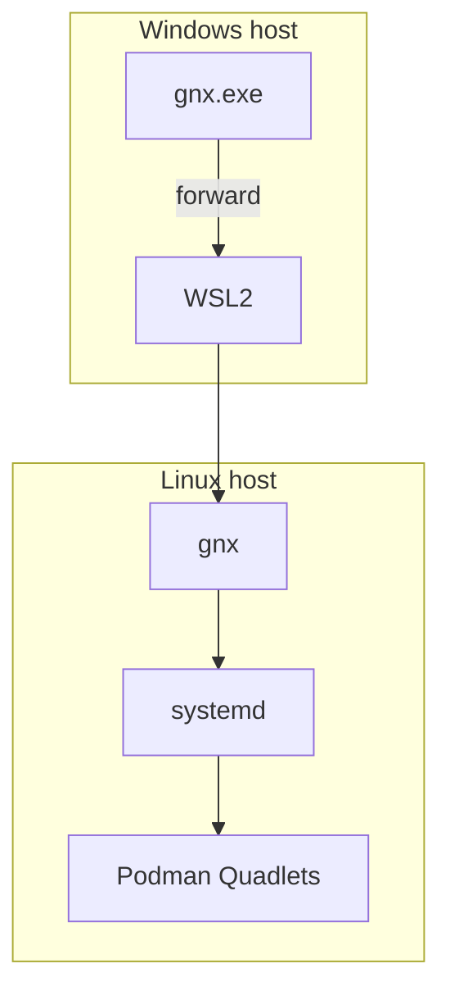
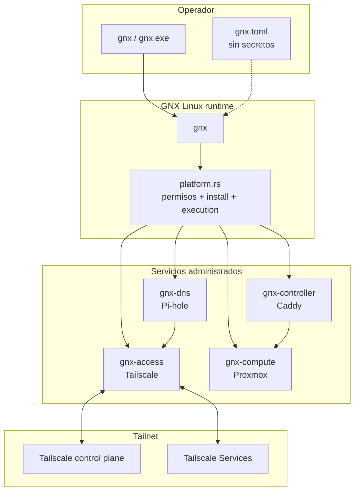
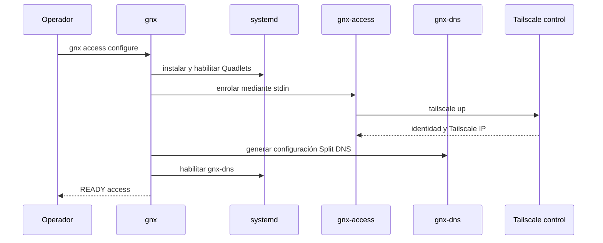
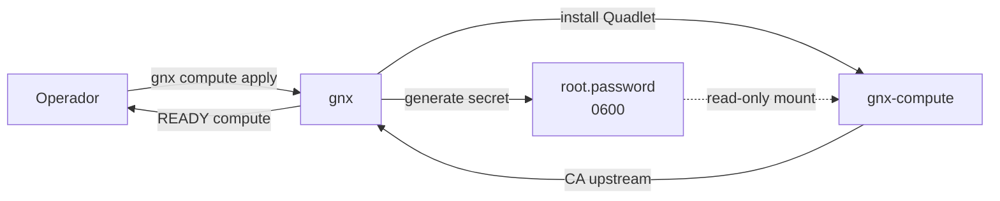
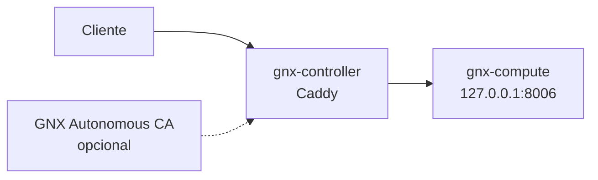
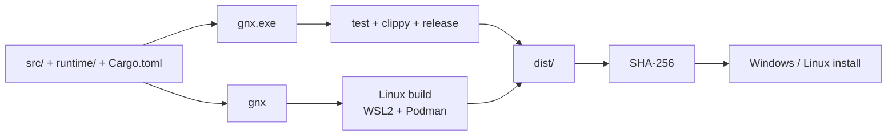

# Arquitectura

GNX es un orquestador escrito en Rust que despliega, configura y verifica una infraestructura privada sobre Linux.

Linux es la plataforma de ejecución nativa. En Windows, `gnx.exe` funciona como un puente delgado hacia el mismo binario Linux dentro de WSL2; no existe una segunda implementación del runtime para Windows.

Los servicios administrados por GNX se ejecutan con systemd y Podman Quadlets.

## Alcance

La arquitectura actual se divide en tres capacidades:

- **Access** — conectividad privada con Tailscale y Split DNS con Pi-hole.
- **Compute** — ciclo de vida y verificación del servicio Proxmox.
- **Controller** — proxy HTTP/TLS con Caddy y CA `.gnx` opcional.

El binario `gnx` es la superficie de control común para las tres.

## Modelo de ejecución



En Linux, `gnx` ejecuta las operaciones directamente.

En Windows:

1. `gnx.exe` valida la invocación.
2. Convierte las rutas Windows a rutas WSL cuando es necesario.
3. Ejecuta `/usr/local/bin/gnx` dentro de la distribución WSL configurada.
4. El binario Linux realiza la operación real.

Esta separación mantiene un único runtime y evita duplicar lógica de infraestructura entre plataformas.

## Vista general



## Frontera de confianza

La frontera principal es el binario `gnx`.

Antes de modificar estado persistente, GNX aplica controles explícitos sobre rutas y permisos:

- directorios privados con modo `0700`;
- secretos persistentes con modo `0600`;
- rechazo de symlinks en rutas sensibles;
- validación de ownership;
- rechazo de sobrescritura de archivos no administrados por GNX.

Los archivos administrados utilizan el marcador:

```text
# Managed by GNX
```

Si un archivo existente no contiene ese marcador, `platform::install()` rechaza reemplazarlo.

## Configuración y secretos

`gnx.toml` contiene configuración declarativa, no secretos.

El flujo de enrolamiento de Tailscale solicita la clave mediante prompt oculto. La clave:

1. entra por `stdin`;
2. se mantiene en memoria protegida durante la operación;
3. se escribe temporalmente dentro del contenedor mediante `mktemp`;
4. se elimina con `trap`;
5. no se pasa como argumento visible del proceso.

`platform::linux_command()` también elimina `TS_AUTHKEY` del entorno antes de ejecutar procesos hijos.

Las credenciales de compute se generan localmente con entropía del kernel y se almacenan con permisos restrictivos.

## Access

`gnx access` administra dos componentes:

```text
gnx-access    Tailscale
gnx-dns       Pi-hole
```

### Flujo



Tailscale se ejecuta dentro del contenedor `gnx-access`, usando:

```text
/run/gnx/access.sock
```

GNX utiliza ese socket para consultar estado, identidad, DNS y Tailscale Services.

Pi-hole responde autoritativamente la zona privada `.gnx` y los aliases configurados por GNX.

## Compute

`gnx compute` administra el servicio Proxmox.



El password root:

- se genera con entropía del kernel;
- utiliza 32 bytes aleatorios;
- no se registra en logs;
- se guarda dentro del state directory privado;
- se lee sólo después de validar permisos y ownership.

La verificación del servicio usa la API de Proxmox y exige una respuesta de salud válida antes de devolver `READY`.

El endpoint de verificación queda restringido a loopback:

```text
http://127.0.0.1:*
```

## Controller

`gnx controller` administra Caddy y, opcionalmente, una CA autónoma para `.gnx`.



La ruta primaria de acceso privado utiliza TLS gestionado por Tailscale.

La CA autónoma `.gnx` es una capacidad secundaria y explícita. GNX puede generar:

```text
root.key
root.crt
server.key
server.crt
```

La clave raíz permanece privada.

El certificado raíz público puede exportarse para confianza manual, pero GNX no instala automáticamente esa CA en Windows ni en otros clientes.

`packaging/windows/trust-ca.ps1` es una acción separada y deliberada.

## Estado persistente

GNX mantiene estado únicamente en las rutas que administra el runtime.

Ejemplos:

```text
/var/lib/gnx/access/
/var/lib/gnx/compute/
/var/lib/gnx/controller/
```

Los directorios privados se validan como `root:root` y `0700`.

Los secretos persistentes se validan como `0600`.

## Assets de runtime

Los assets versionados bajo `runtime/` incluyen Quadlets, scripts y archivos de configuración utilizados por el binario.

Los módulos Rust los incorporan en tiempo de compilación mediante `include_str!`, por ejemplo:

```rust
const ACCESS_UNIT: &str =
    include_str!("../runtime/access/gnx-access.container");
```

El release bundle también conserva `runtime/` como material de packaging y auditoría.

No se utilizan plantillas `.in`; las sustituciones se realizan con marcadores explícitos como:

```text
@STATE@
@IP@
@UPLINK@
@MTU@
```

## Contrato de salida

La CLI mantiene un contrato de salida simple:

```text
READY <payload>
```

para éxito, y:

```text
FAILED <LABEL>
```

para error.

Los códigos de salida distinguen errores de argumentos/configuración, host no soportado y fallos de runtime.

Este contrato se valida en `tests/contract.rs`.

## Build y packaging



El build de Windows genera:

```text
gnx.exe
gnx
gnx.exe.sha256
gnx.sha256
gnx.toml
runtime/
LICENSE
install-linux.sh
```

El instalador Windows valida hashes antes de copiar los artefactos y después delega la instalación Linux a WSL2.

El instalador Linux:

- exige ejecución como root;
- verifica prerequisitos;
- valida `gnx.sha256`;
- instala `/usr/local/bin/gnx`;
- instala la configuración inicial si aún no existe.

## Árbol del repositorio

```text
gnx/
├── src/
│   ├── main.rs
│   ├── cli.rs
│   ├── config.rs
│   ├── platform.rs
│   ├── access.rs
│   ├── compute.rs
│   ├── controller.rs
│   ├── error.rs
│   └── lib.rs
│
├── runtime/
│   ├── access/
│   ├── compute/
│   └── controller/
│
├── config/
│   └── gnx.toml
│
├── packaging/
│   ├── linux/
│   │   └── install.sh
│   └── windows/
│       ├── build.ps1
│       ├── install-host.ps1
│       └── trust-ca.ps1
│
├── tests/
│   └── contract.rs
│
├── docs/
│   ├── arquitectura.md
│   └── operar.md
│
├── Cargo.toml
├── Cargo.lock
├── LICENSE
├── README.md
└── AGENTS.md
```

## Principios actuales

La arquitectura mantiene cuatro decisiones simples:

1. **Un solo runtime Linux.** Windows delega; Linux ejecuta nativamente.
2. **Infraestructura declarativa y verificable.** Cada `apply` termina con comprobaciones reales.
3. **Secretos fuera de configuración y argumentos.**
4. **Servicios del producto administrados mediante systemd + Podman Quadlets.**

La documentación de arquitectura describe únicamente capacidades implementadas en el código actual.
