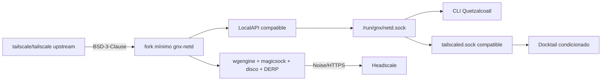

# ADR-0001: daemon de red

**Estado:** aceptado para el MVP  
**Fecha:** 2026-09-01

## Decisión

El daemon de red del producto será `gnx-netd`, un fork mínimo y trazable del
`tailscaled` incluido en `tailscale/tailscale`. `tailscaled-rs` se mantiene como
referencia y laboratorio para una posible migración futura, no como dependencia
de producción.

## Por qué

- El repositorio oficial confirma que `tailscaled` y la CLI están incluidos en
  el código abierto y bajo BSD-3-Clause.
- Reutiliza una implementación madura de WireGuard, DERP, NAT traversal,
  roaming, routing, DNS y LocalAPI.
- Reduce el riesgo criptográfico y operativo frente a reimplementar el data
  plane durante el MVP.
- Permite una identidad de producto, rutas propias y defaults fail-closed sin
  inventar otro protocolo.

## Límite del fork

Cambios permitidos inicialmente:

1. nombre de binario, servicio y paths de estado;
2. socket principal `/run/gnx/netd.sock`;
3. alias local `tailscaled.sock` para consumidores compatibles;
4. Headscale como único control URL permitido por configuración;
5. telemetría deshabilitada salvo consentimiento explícito;
6. branding y mensajes sin sugerir afiliación o endorsement de Tailscale.

No se modifican criptografía, WireGuard, DERP, magicsock, disco, Noise ni el
formato del protocolo salvo que exista un caso probado, tests de interoperabilidad
y una decisión nueva. El objetivo es mantener un patch set pequeño que pueda
rebasarse sobre releases upstream.

## Lo que esta decisión no resuelve

Docktail no depende únicamente del socket local. Usa Tailscale Services y
sincroniza definiciones con el control plane. Headscale mantiene Tailscale
Services como feature gap abierto. Renombrar o extender `tailscaled` no hace que
Headscale almacene, autorice, distribuya o resuelva esos servicios.

La integración Docktail necesita una decisión separada entre:

- contribuir/forkear Headscale para implementar Services y adaptar Docktail a su
  API;
- forkear Docktail para un modelo de exposición compatible con las capacidades
  reales de Headscale;
- sustituir Docktail.

Hasta entonces, el Quadlet de Docktail permanece deshabilitado y el producto no
reporta `READY` completo.

## Por qué no `tailscaled-rs` todavía

El proyecto aporta el modelo correcto —daemon Rust, preferencias persistentes y
LocalAPI sobre Unix socket—, pero declara explícitamente:

- estado experimental y no apto para producción;
- criptografía no auditada y sin garantías de compatibilidad;
- TUN, routing/DNS del OS, instalación de servicio, Serve y Funnel todavía
  incompletos o fuera del MVP base;
- una variable obligatoria que reconoce el uso de software inestable.

Puede reemplazar al fork Go sólo después de auditoría criptográfica externa,
paridad funcional, pruebas Windows/Linux, interoperabilidad Headscale y soporte
de la LocalAPI consumida por Quetzalcoatl.

## Obligaciones del fork

- conservar `LICENSE`, copyrights, disclaimer y avisos de terceros;
- no usar Tailscale ni sus contribuidores como endorsement;
- documentar el commit upstream base en cada release;
- automatizar comparación de patches, CVEs, tests upstream y actualización;
- publicar código fuente y SBOM del binario distribuido.

Esto es una lectura de la licencia, no asesoría legal.

## Gates

| ID | Evidencia |
|---|---|
| `N-01` | Build reproducible desde commit upstream fijado y patch set enumerado. |
| `N-02` | Registro, reconexión, DERP, conexión directa, DNS y routing en Headscale. |
| `N-03` | LocalAPI usada por CLI y compatibilidad de socket usada por Docktail. |
| `N-04` | Rebase sobre una release upstream con suite completa y rollback probado. |
| `N-05` | NOTICE/licencias/SBOM incluidos en artefactos Windows y Linux. |

## Fuentes

- [Tailscale OSS](https://github.com/tailscale/tailscale)
- [Licencia BSD-3-Clause](https://github.com/tailscale/tailscale/blob/main/LICENSE)
- [tailscaled-rs](https://github.com/GeiserX/tailscaled-rs)
- [tailscale-rs y advertencias de seguridad](https://github.com/GeiserX/tailscale-rs)
- [Feature gap de Tailscale Services en Headscale](https://github.com/juanfont/headscale/issues/2845)

