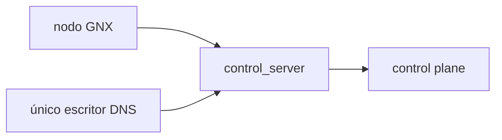

# ADR-0002: identidad y endpoint de la mesh

**Estado:** aceptado; implementación pendiente

**Revisado:** 2026-09-02

## Decisión

Una mesh tiene un `control_server` estable y un solo control plane. Cada host
genera y conserva una identidad distinta. El estado del cliente nunca se copia
a otro host o al runtime WSL.

`create` es dueño del control plane. `join` sólo registra el nodo local. Una
caída no autoriza cambiar el endpoint ni usar un servicio predeterminado.

## Endpoint

- Producción usa un FQDN HTTPS controlado por el operador.
- `https://mesh.gnx` sólo funciona con DNS y CA privados preparados antes de
  conectar.
- Cada FQDN tiene un escritor; los miembros no reciben la credencial DDNS.

## Custodia

| Material | Regla |
|---|---|
| Identidad del nodo | almacén nativo del cliente; no se clona |
| Estado del control plane | volumen persistente y backup cifrado |
| Credencial DNS | sólo el escritor asignado |
| Material de login | interactivo o canal temporal; nunca argv |
| `control_server` | configuración íntegra; no es un secreto |

## Gates

| ID | Evidencia |
|---|---|
| `E-01` | Un nodo nuevo resuelve el FQDN y valida TLS antes de conectar. |
| `E-02` | Dos nodos conservan identidades distintas y el mismo endpoint. |
| `E-03` | Restore recupera el control plane sin dos escritores activos. |
| `S-02` | Ningún secreto aparece en configuración, argv, logs o evidencia. |

## Fuentes

- [Configuración self-hosted](https://docs.netbird.io/selfhosted/maintenance/configuration-files)
- [DPAPI](https://learn.microsoft.com/en-us/windows/win32/seccrypto/example-c-program-using-cryptprotectdata)
