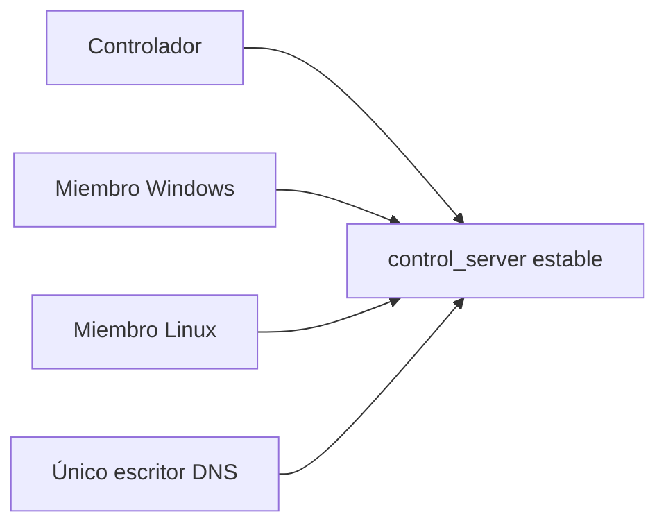

# ADR-0002: identidad y endpoint de la mesh

**Estado:** aceptado; implementación pendiente
**Fecha:** 2026-09-01

## Decisión

Una mesh tiene exactamente un control plane autoritativo y un
`control_server` estable. La primera instalación usa modo `create`; las demás
usan `join` y no arrancan otro Headscale. Crear otro control plane crea otra
mesh, aunque ambos servidores usen nombres o credenciales parecidos.

Cada instalación genera una identidad persistente distinta. Nunca se copian el
estado ni las claves de `gnx-netd` entre Windows y Linux. Reinstalar conserva la
identidad; clonar una instalación exige generar una nueva antes de conectarla.

El endpoint público y su IP son metadatos visibles, no autenticadores. Su valor
queda en configuración protegida contra escritura no autorizada. La URL de
actualización completa, los tokens y las claves privadas sí son secretos.

## Propiedad DNS

- Cada FQDN tiene un solo escritor.
- Los miembros nunca actualizan el FQDN del control plane.
- Varias meshes reciben FQDN distintos.
- Un servicio GNX de endpoints conserva el mapeo fijo
  `installation_id -> mesh_id -> FQDN`; el cliente no puede elegir otro nombre.
- Sólo ese servicio conoce la credencial maestra del proveedor DDNS. Cada
  controlador usa una credencial GNX individual, revocable y limitada a su
  asignación.
- Varios nombres en una misma IP no crean alta disponibilidad ni resuelven NAT;
  necesitan un ingreso capaz de enrutar cada nombre y TLS válido.

Hasta que exista el servicio de endpoints, sólo puede operar un actualizador
administrado. Su credencial no se copia a los instaladores ni a los miembros.

## Custodia

| Material | Custodia | Ciclo de vida |
|---|---|---|
| Credencial maestra DDNS | almacén del servicio de endpoints | rotación global; nunca se distribuye |
| Credencial GNX del controlador | DPAPI de la cuenta de servicio en Windows; credencial systemd en Linux | individual y revocable |
| Key de enrolamiento | memoria o credencial temporal | un uso, TTL corto y eliminación tras registro |
| Identidad `gnx-netd` | estado root-only de cada instalación | única; no se clona |
| Estado de Headscale | controlador y backup cifrado | restauración explícita; nunca activo-activo |
| `control_server` | configuración root/service-owned | estable e íntegro; no necesita cifrado |

Ningún secreto entra en TOML, argumentos, variables de entorno, URLs registradas,
logs, capturas ni evidencia. Los procesos reciben credenciales mediante handles
del sistema o archivos efímeros en memoria con permisos mínimos.

## Reconexión y recuperación

`gnx-netd` conserva el mismo endpoint y su identidad después de reinicios. Una
caída del control plane no autoriza cambiar de servidor. La recuperación restaura
el estado del controlador detrás del mismo FQDN; transferir su propiedad requiere
detener al dueño anterior para evitar dos escritores.

Una credencial expuesta se considera comprometida. La rotación segura detiene
los actualizadores directos, regenera la credencial maestra, actualiza sólo el
servicio de endpoints y verifica DNS, TLS y `/health` antes de reanudar.

## Gates

| ID | Evidencia |
|---|---|
| `M-02` | Dos instalaciones con identidades distintas permanecen conectadas al mismo `control_server` tras reinicios. |
| `M-03` | Un miembro no puede arrancar Headscale ni modificar el FQDN del control plane. |
| `E-01` | Dos escritores para el mismo FQDN son rechazados; la asignación no puede cambiarse desde el cliente. |
| `S-02` | Config, argv, entorno, logs, capturas y evidencia no contienen credenciales ni URLs de actualización. |
| `R-02` | El controlador se restaura detrás del mismo FQDN sin duplicar identidad ni escritor DNS. |

## Fuentes

- [API del proveedor DDNS actual](https://www.duckdns.org/spec.jsp)
- [Rotación de su token de cuenta](https://www.duckdns.org/faqs.jsp)
- [Requisitos del control plane](https://headscale.net/stable/setup/requirements/)
- [Backup del control plane](https://headscale.net/stable/setup/upgrade/)
- [DPAPI ligado a usuario y host](https://learn.microsoft.com/en-us/windows/win32/seccrypto/example-c-program-using-cryptprotectdata)
- [Credenciales de systemd](https://www.freedesktop.org/software/systemd/man/latest/systemd.exec.html#Credentials)
