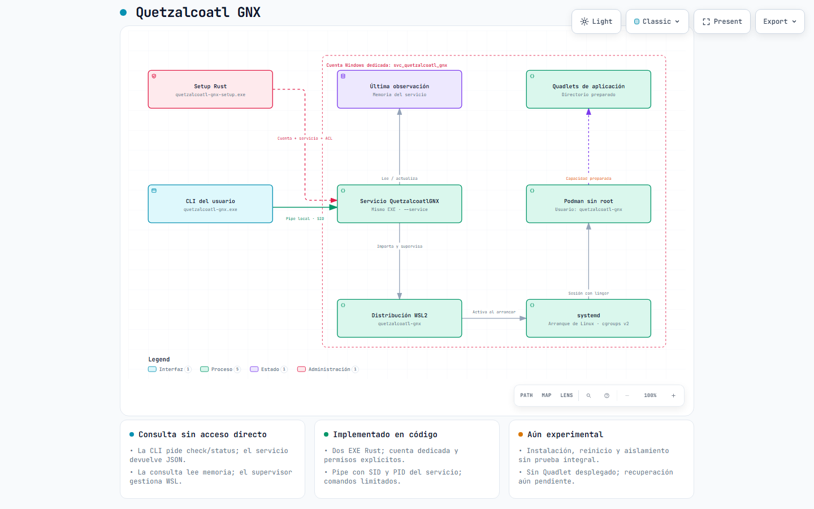

# Quetzalcoatl GNX — diagrama Archify



El diagrama representa la implementación experimental del commit `75d866d1069d90d37e5a57e26cf5089a85de3749`, revisada en `src/windows.rs`, `src/protocol.rs` y `src/bootstrap.sh`. No demuestra una instalación operativa: las tarjetas señalan que faltan pruebas integrales y un Quadlet de aplicación.

- Fuente editable: [quetzalcoatl-gnx.architecture.json](quetzalcoatl-gnx.architecture.json).
- HTML interactivo local: `dist/diagrams/quetzalcoatl-gnx.html`.
- [Recibo de validación y revisión](quetzalcoatl-gnx.receipt.json).

El contenido es español; los controles fijos del visor y su atributo HTML de idioma usan el inglés de Archify. Sin animación automática. Incluye temas claro/oscuro, búsqueda, navegación y exportación del visor.

Para regenerar, con Archify instalado en `.agents/skills/archify`:

```powershell
node .agents/skills/archify/bin/archify.mjs validate architecture docs/diagrams/quetzalcoatl-gnx.architecture.json --quality showcase --json
node .agents/skills/archify/bin/archify.mjs deliver architecture docs/diagrams/quetzalcoatl-gnx.architecture.json dist/diagrams/quetzalcoatl-gnx.html --quality showcase --json
node .agents/skills/archify/bin/archify.mjs visual-check dist/diagrams/quetzalcoatl-gnx.html --json
```

El último comando necesita Chrome/Chromium; acepta su ruta en `ARCHIFY_CHROME`. La comprobación automática pasó en 1440×900, 1600×1000, 1920×1080 y 2048×1320. Las cuatro capturas claro/oscuro de los tamaños extremos fueron revisadas visualmente. Esto comprueba la presentación del diagrama, no la seguridad del software representado. Las interacciones de búsqueda y exportación no se probaron manualmente.
