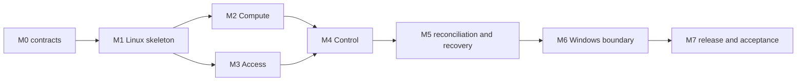

# Implementation plan — GNX 0.3.1 PoC

This plan turns the product contract into thin, testable vertical slices. The
milestones are ordered by dependency and risk. A milestone is complete only when
its exit condition is executable; creating the planned files is not completion.

## Delivery rules

1. **Trace behavior to requirements.** Every change identifies the relevant
   `BR-*` requirements and G0-G6 gates.
2. **Build one application core.** Public operations enter through `src/app`.
   Adapters implement ports and do not orchestrate alternative flows.
3. **Observe before changing.** Reconciliation starts with validated intent,
   immutable release data and observed state.
4. **Keep the last valid state.** Candidate intent is never promoted before all
   required checks pass.
5. **Test refusal paths early.** Unknown schema versions, unexpected broker
   opcodes, recursive DNS, undeclared routes and secret leakage are product
   failures, not later hardening work.
6. **Keep evidence reproducible and secret-free.** A reviewer must be able to
   repeat a gate from the recorded revision and release identifiers.

## Dependency path

Compute and Access can progress independently after the common Linux skeleton.
Control needs a real private entry path and a real upstream. Windows integration
comes after the Linux contract is stable so the bridge cannot become a second
orchestrator.

## M0 — Freeze executable contracts

**Goal:** remove ambiguity from configuration, release, state and result formats
before runtime adapters exist.

Deliver:

- Rust workspace and module skeleton matching `architecture.md`;
- versioned `gnx.toml` model with strict validation and unknown-field behavior;
- internal, versioned release model for immutable artifacts and defaults;
- versioned JSON result schema shared by all four operations;
- stable states, diagnostic codes and exit-code mapping;
- port traits for host observation, runtime reconciliation, state transactions
  and release access;
- architecture checks that reject adapter imports from `domain` and `app`;
- fixtures for valid, invalid and forward-incompatible inputs.

Decide explicitly:

- whether unknown configuration fields are rejected or ignored by schema
  version;
- the minimum common JSON envelope and operation-specific payloads;
- how diagnostics identify capability, phase, code and next action;
- state-directory layout, file ownership and atomic replacement mechanism.

**Exit condition:** all contract fixtures pass on Linux and Windows builds; no
runtime command reports `READY` unless backed by an observation port.

## M1 — Linux application skeleton

**Goal:** execute the four use cases through one composition root using a real
Linux host adapter and deliberately incomplete capability adapters.

Deliver:

- `doctor` checks the declared host prerequisites and returns actionable codes;
- `plan` compares intent, release and observed state without filesystem or
  process mutation;
- `status` returns honest per-capability `FAILED` or `ACTION_REQUIRED` while the
  runtime is absent;
- `apply` validates a candidate, acquires a per-node lock and refuses to promote
  an unverifiable state;
- stdout/stderr separation and exit semantics enforced by contract tests;
- a fake adapter used only in tests to prove orchestration and transaction
  behavior.

**Exit condition:** G0 can run on the supported Linux test host; repeated `plan`
has no observable mutation; an intentionally incomplete runtime never produces
`READY`.

## M2 — Compute vertical slice

**Goal:** run the release-selected Compute service with persistent storage and a
real authenticated health probe.

Deliver:

- pinned Compute artifact in the internal release definition;
- systemd/Podman assets under `runtime/compute`;
- adapter implementation for install, start, observe and health;
- protected secret intake and persistent-state layout;
- a public, non-secret handoff containing only what Control needs to reach and
  verify the upstream;
- tests for restart, reapply, bad credentials, unavailable storage and artifact
  mismatch.

**Exit condition:** G1 passes locally; an unchanged `apply` preserves identity,
credentials and a non-sensitive storage witness.

## M3 — Access vertical slice

**Goal:** establish persistent private identity and authoritative `.gnx` DNS for
authorized clients.

Deliver:

- release-selected private transport adapter and documented enrollment flow;
- persistent identity state that survives service and host restart;
- CoreDNS configuration generated from declared names only;
- binding restricted to the private entry interface;
- UDP and TCP DNS checks, including authoritative answers, `NXDOMAIN` for an
  undeclared `.gnx` name and `REFUSED` outside `.gnx`;
- `ACTION_REQUIRED` flow for enrollment material, with negative leakage tests.

**Exit condition:** G2 passes from an authorized remote client and the same node
identity remains after reapply and reboot.

## M4 — Control vertical slice

**Goal:** publish `https://compute.gnx` through an explicit, verified route while
keeping Compute private.

Deliver:

- pinned HTTPS/reverse-proxy artifact and configuration adapter;
- persistent GNX root and server identity with a documented lifecycle;
- manual export and fingerprint verification for the public root only;
- verified TLS on both client-to-Control and Control-to-Compute connections;
- explicit route generation with no wildcard or undeclared-host fallback;
- route-specific health so an optional upstream failure is degraded, not a
  failure of Access, Control or Compute;
- negative exposure, SNI, Host and upstream-certificate tests.

**Exit condition:** G3 passes remotely; direct Compute and local Control
interfaces are unreachable from that client; the optional-route failure scenario
behaves as documented.

## M5 — Transactional reconciliation and recovery

**Goal:** make the complete Linux path safe to change and recover.

Deliver:

- candidate staging, validation, publication and last-valid promotion;
- dependency-aware order for adding, changing and removing routes;
- rollback of runtime assets and configuration without deleting persistent
  identity or Compute data;
- phase recording sufficient to resume or safely retry an interrupted apply;
- bounded systemd recovery and reboot tests;
- concurrency lock and deterministic handling of a second apply.

**Exit condition:** G4 and the Linux portion of G5 pass, including invalid
candidate, interrupted publication, unchanged apply and full reboot scenarios.

## M6 — Windows isolation boundary

**Goal:** expose the stable Linux operations on Windows without duplicating their
logic or giving the normal operator ownership of runtime state.

Deliver in the order defined by `windows-runtime.md`:

- `gnx-service.exe` with SCM lifecycle and bounded restart policy;
- creation/reconciliation of `gnx-runtime` rights and protected ProgramData ACL;
- local-only named pipe with exact DACL, protocol version, bounded frames and
  four opcodes;
- fixed `GNX` distribution import owned by the dedicated account, with systemd
  enabled and Windows interop/automount disabled;
- verified streaming install of the product-built Linux bundle;
- two-phase secret channel and complete negative leakage suite;
- JSON and exit parity fixtures against the Linux binary.

**Exit condition:** the Windows portions of G0, G5 and G6 pass. Unknown opcodes,
remote pipe clients, oversized frames, arbitrary argv and digest mismatches are
rejected without changing the last valid runtime.

## M7 — Candidate, evidence and PoC closure

**Goal:** produce one reproducible candidate and execute the complete acceptance
protocol from clean hosts.

Deliver:

- locked release definition and authenticated manifest;
- Linux and Windows artifacts produced by the same pipeline;
- clean-host installation path and sanitized evidence collector;
- exact supported-platform record;
- one evidence bundle per platform plus the remote-client observations;
- known limitations and recovery procedure tied to the candidate revision.

**Exit condition:** G0-G6 pass from the declared candidate without manual steps
outside the documented `ACTION_REQUIRED` flows. The release checklist in
`release.md` is complete and every result is reproducible.

## First implementation backlog

The first pull request should be deliberately small:

1. create the Rust workspace and target module boundaries;
2. define the JSON envelope, status/exit mapping and golden fixtures;
3. parse and strictly validate the current `gnx.toml` example;
4. define observed/desired state and a read-only fake observation port;
5. implement `plan` and honest incomplete `status` through `src/app`;
6. add architecture and no-mutation tests;
7. document the commands used and attach sanitized test output.

It should not add containers, Windows service code or provider frameworks. Those
would make review harder before the application contract is fixed.

## Review checklist for every milestone

- Which `BR-*` requirements and gates does this change advance?
- Is business vocabulary confined to domain/application modules?
- Can an adapter or artifact be replaced without changing a use case?
- What real state establishes success, and how can that probe fail?
- What is persisted, by whom, with which permissions and rollback behavior?
- Does an unchanged apply avoid identity, certificate, secret and container
  churn?
- Is the negative path tested and its next action useful?
- Does evidence omit all material listed as secret in BR-P09?
