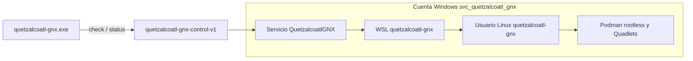

# Quetzalcoatl GNX: naming fijo y doble revisión

Fecha: 2026-09-15, hora local de México. Alcance: nombres, revisión de código, compilación y pruebas sin instalar. No se crearon cuentas, servicios ni distribuciones y no se ejecutó `install`.

## Identificadores aprobados

| Elemento | Nombre fijo |
| --- | --- |
| Producto | Quetzalcoatl GNX |
| Paquete Cargo / CLI | `quetzalcoatl-gnx` / `quetzalcoatl-gnx.exe` |
| Setup Windows | `quetzalcoatl-gnx-setup.exe` |
| Servicio Windows | `QuetzalcoatlGNX` |
| Nombre visible del servicio | Quetzalcoatl GNX - Consultas WSL |
| Cuenta Windows dedicada | `svc_quetzalcoatl_gnx` |
| Distribución WSL | `quetzalcoatl-gnx` |
| Usuario Linux | `quetzalcoatl-gnx` |
| Named pipe | `\\.\pipe\quetzalcoatl-gnx-control-v1` |
| Directorio de instalación | `C:\ProgramData\QuetzalcoatlGNX` |
| Datos privados | `C:\ProgramData\QuetzalcoatlGNX\private` |
| Quadlets del usuario | `/home/quetzalcoatl-gnx/.config/containers/systemd` |

Fuente única de identificadores: `src/naming.rs`. El script Linux se genera desde esa identidad y se normaliza a LF. Los nombres no dependen del nombre del equipo, usuario cotidiano o versión; las actualizaciones futuras deberán respetarlos o implementar una migración. No existe migración automática desde el prototipo anterior.

## Primera revisión: identidad de extremo a extremo

Se contrastaron manifiesto, constantes, ayuda, búsqueda del EXE compañero, registro del servicio, ruta de instalación, protocolo, configuración Linux, documentación y archivos de entrega. Las pruebas verifican la coherencia del manifiesto con los nombres de EXE, el límite de 20 caracteres de la cuenta Windows y la sustitución del usuario Linux.

## Segunda revisión: hallazgos y correcciones

| Hallazgo | Corrección / evidencia |
| --- | --- |
| La ACL del pipe omitía un permiso que pedía el cliente (`FILE_WRITE_ATTRIBUTES`) | Una constante compartida define los derechos pedidos y concedidos; se verifica que no incluya creación de instancias del servidor |
| Git podía convertir el bootstrap a CRLF y romper Bash | `.gitattributes` fija LF y el render del bootstrap elimina CR; prueba de regresión |
| Un estado saludable antiguo podía seguir apareciendo como válido | Observaciones mayores de 45 segundos pasan a `unknown`; fechas futuras, versiones y estados inconsistentes se rechazan |
| El rootfs se verificaba antes de copiarlo, pero no se comprobaba la copia | Se conserva el handle de origen y se vuelve a verificar el archivo copiado y antes de importarlo; prueba SHA256 con entrada alterada |
| La contraseña existía también como `String` sin borrado y algunas salidas tempranas evitaban limpiar el buffer | Generación directa en UTF-16 y limpieza mediante `Drop`, incluida salida con error; revisión estática, no garantía de borrado de copias internas del sistema |
| Los componentes numéricos del SID podían exceder 32 bits | Validación de rango y prueba de rechazo |
| La sonda Podman no activaba `pipefail` | Se propagan fallos de la tubería Bash |

La revisión es de dos pasadas sobre el código, no una auditoría independiente ni certificación de seguridad.

## Bloqueos encontrados que siguen abiertos

1. **Instalación y aislamiento sin prueba integral.** Falta una VM Windows de prueba, reinicio y comprobación bajo otra cuenta estándar. El perfil de la cuenta de servicio y el acceso a WSL bajo esa identidad no están demostrados.
2. **Instalación parcial y recuperación.** Una falla después de crear la cuenta puede dejar recursos; no hay rollback, reparación, rotación de credenciales ni desinstalación. El instalador se detiene ante colisiones.
3. **ACL y canal requieren prueba entre identidades.** Las pruebas locales de derechos no demuestran rechazo efectivo de otra cuenta. El cierre del pipe usa una espera fija y podría perder la respuesta con un cliente lento; falta un cierre confirmado y pruebas de concurrencia.
4. **Apagado y procesos Linux.** Matar `wsl.exe` por timeout no demuestra que terminen los procesos Linux que inició. Falta gestión completa del cierre del servicio y su supervisión.
5. **Paquete sin firma y con dos EXE.** Falta autenticación del EXE compañero y empaquetado autocontenido. El hash del rootfs requiere una fuente confiable externa. Las rutas todavía presuponen Windows en `C:`.
6. **SID e identidad administrativa.** La validación de formato no demuestra que el SID corresponda a una cuenta estándar habilitada; falta resolver tipo de cuenta y grupos antes de instalar. No hay aislamiento frente al administrador elevado del host.
7. **Quadlet de aplicación pendiente.** Se prepara la infraestructura, pero no se ha definido ni desplegado un contenedor del producto.

Resultado: naming listo y correcciones comprobables aplicadas; **instalación experimental aún no aprobada para uso real**. No se solicita al usuario que la ejecute en esta revisión.

## Evidencia de la revisión

- `cargo test --offline --locked`: 10 pruebas aprobadas, ninguna fallida.
- `cargo build --release --offline --locked`: ambos EXE Windows x64 compilados.
- Ayuda de ambos binarios: muestra Quetzalcoatl GNX y los nombres fijos correctos; no se ejecutó `install` ni `preflight` en esta revisión.
- Búsqueda de identificadores genéricos anteriores en código, manifiesto, lockfile y documentación: sin coincidencias.
- `git diff --check`: sin errores de espacios.
- Artefactos actuales: `dist/quetzalcoatl-gnx/`. Son compilaciones experimentales locales; no se ha creado un release de binarios en GitHub.

## Referencias de contraste

- [Derechos y seguridad de named pipes](https://learn.microsoft.com/en-us/windows/win32/ipc/named-pipe-security-and-access-rights).
- [Cambio de modo del handle del pipe](https://learn.microsoft.com/en-us/windows/win32/api/namedpipeapi/nf-namedpipeapi-setnamedpipehandlestate).
