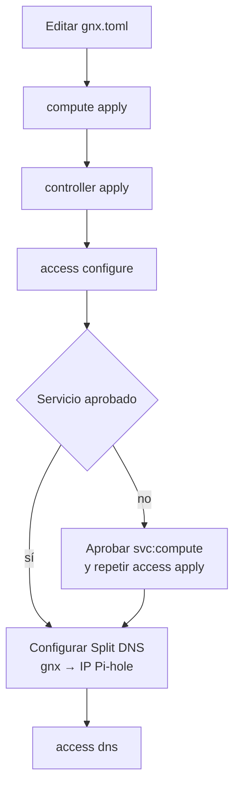

# Operar GNX

## Orden seguro



- `compute status`, `controller status` y `access dns` son los gates de salud.
- `READY` significa que el gate terminó; cualquier fallo conserva `FAILED <ETIQUETA>`.
- La clave de enrolamiento entra sólo por prompt oculto, nunca por archivo de
  configuración, argumentos, logs o Git.
- `controller.autonomous_ca = true` genera la raíz dentro de
  `/var/lib/gnx/controller`. No la instala en Windows ni en otro cliente.
- `packaging/windows/trust-ca.ps1` es la única acción que confía esa raíz en
  Windows; requiere administrador y debe invocarse de forma deliberada.
- El nombre canónico con TLS administrado es `compute.<tailnet>.ts.net`.
  `compute.gnx` depende de Pi-hole y, para HTTPS, del CA autónomo.
- El CA es una capacidad experimental: antes de declararlo PKI de producción
  faltan revocación, ceremonia/backup de raíz y pruebas de restauración.

## Gate de release

```text
cargo test --locked
cargo clippy --locked --all-targets -- -D warnings
packaging/windows/build.ps1 -Validate
```

`build.ps1 -Validate` ejecuta: test/clippy/build nativo → contenedor
rust (test/clippy/build Linux) → copia artefactos → SHA-256 →
`validate.ps1` (contract smoke). Salida `READY <dist>` o `FAILED <ETIQUETA>`.

## Criterios de éxito

| Binario | Comando de validación | Esperado |
|---|---|---|
| `gnx.exe` | `--config missing.toml access dns` | exit 2, `FAILED CONFIG_READ` |
| `gnx` (WSL) | `--config /missing.toml access dns` | exit 2, `FAILED CONFIG_READ` |
| Cualquiera | `access configure MARKER` | exit 2, `FAILED ARGUMENTS` |
| Cualquiera | `--help` / `--version` | exit 0 |

## Orden de instalación (host nuevo)

1. `packaging/windows/install-host.ps1` (Windows) o
   `packaging/linux/install.sh <bundle>` (Linux).
2. Copiar `gnx.toml` → `gnx.toml` y editar FQDN.
3. En orden: `gnx compute apply`, `gnx controller apply`, `gnx access configure`.
4. Aprobar `svc:compute` en Tailscale si el reporte lo solicita.
5. Configurar Split DNS `gnx → IP Pi-hole` en DNS del tailnet.
6. `gnx access dns` — último gate de validación end-to-end.

## Diagnóstico (componer gates existentes)

```powershell
gnx compute status     # nodo de cómputo (identity + uptime)
gnx controller status  # proxy Caddy + CA expiration (30d)
gnx access dns         # Split DNS + HTTPS Tailscale Service
```

Un gate en rojo indica el paso a re-aplicar; los `apply` son idempotentes
(`install()` con marcador `# Managed by GNX`, `ca.sh` idempotente).

## Rollback

- **Por archivo**: `install()` rechaza reescribir archivos no marcados
  (`FILE_OWNERSHIP`). Limpieza = `systemctl disable --now gnx-*.{service,container}`
  + borrar `/var/lib/gnx/` (estado del producto, regenerable).
- **Por cambio de config**: revertir `gnx.toml` → re-aplicar.
- **Por CA comprometido**: borrar `/var/lib/gnx/controller/pki/` →
  `gnx controller apply` regenera raíz y server cert.
- **Por Tailnet**: remover nodo en Tailscale admin; el Quadlet `gnx-access`
  conserva estado local hasta `access apply`.
