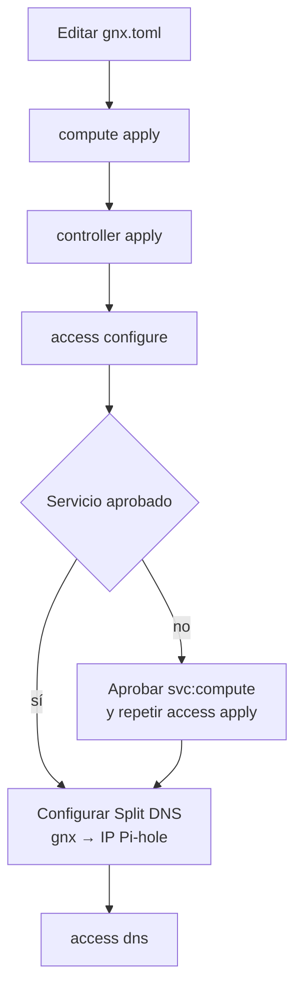

# Operar GNX

## Orden seguro



- `compute status`, `controller status` y `access dns` son los gates de salud.
- `READY` significa que el gate terminó; cualquier fallo conserva `FAILED <ETIQUETA>`.
- La clave de enrolamiento entra sólo por prompt oculto, nunca por archivo de
  configuración, argumentos, logs o Git.
- `controller.autonomous_ca = true` genera la raíz dentro de
  `/var/lib/gnx/controller`. No la instala en Windows ni en otro cliente.
- `packaging/windows/trust-ca.ps1` es la única acción que confía esa raíz en
  Windows; requiere administrador y debe invocarse de forma deliberada.
- El nombre canónico con TLS administrado es `compute.<tailnet>.ts.net`.
  `compute.gnx` depende de Pi-hole y, para HTTPS, del CA autónomo.
- El CA es una capacidad experimental: antes de declararlo PKI de producción
  faltan revocación, ceremonia/backup de raíz y pruebas de restauración.

## Gate de release

```text
cargo test --locked
cargo clippy --locked --all-targets -- -D warnings
packaging/windows/build.ps1
packaging/validate.ps1 -DistPath dist
```

El build es válido sólo si genera `gnx.exe`, `gnx`, sus SHA-256 y pasa el
contract smoke de `validate.ps1` (`WINDOWS_CONTRACT`, `LINUX_CONTRACT`,
`ARGUMENTS_CONTRACT`).
