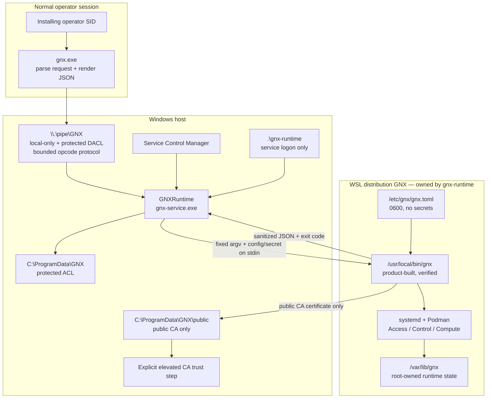
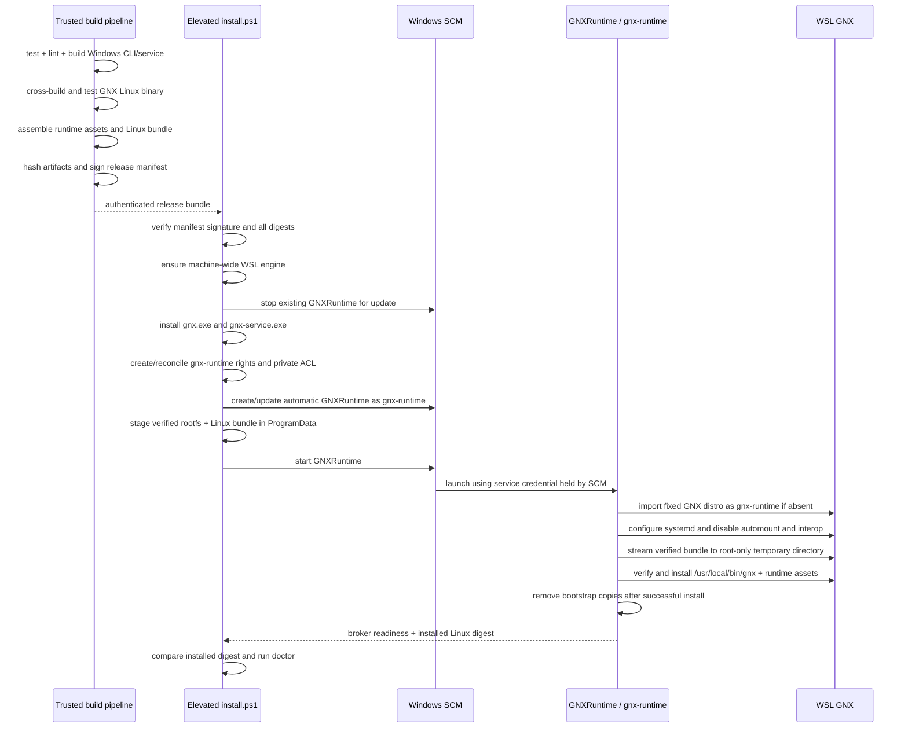
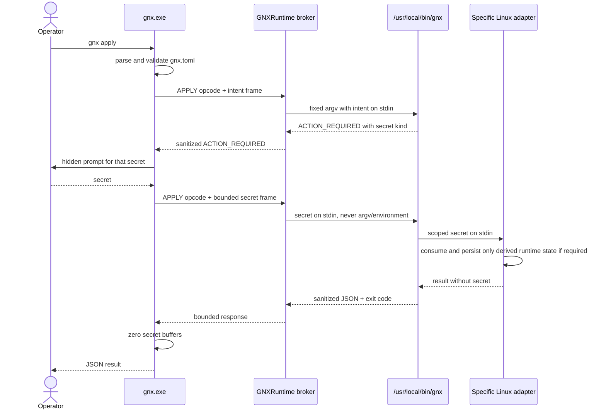

# Windows installation and isolated Linux runtime — GNX 0.3.1

This document makes the Windows boundary precise. It is normative for the new
PoC and refines BR-W01 through BR-W10.

## Context recovered from Git history

Commit `062332d` introduced the useful boundary: `GNXRuntime`, the dedicated
`.\gnx-runtime` account, a local named-pipe broker and a WSL distribution owned by
that account. Commit `7e26018` completed the clean-clone release path that built a
GNX Linux binary and packaged it for streaming into WSL.

The new PoC retains those boundaries, not the old command list, provider choices
or runtime implementation. The allowlist is now exactly `plan`, `apply`, `status`
and `doctor`; the Linux application core defined by the 0.3.1 architecture remains
the only orchestrator.

## Installed trust boundaries

The pipe DACL permits SYSTEM, Administrators and the exact installing operator
SID. Remote pipe clients are rejected. The operator SID can request allowlisted
operations but does not gain filesystem access to the WSL disk or runtime state.
SYSTEM and local Administrators remain trusted principals.

The service-account password is generated with a cryptographically secure random
source during installation or rotation, passed only to SCM while registering the
service, and zeroized from process memory afterward. It is never written into GNX
configuration, state, logs or evidence.

## Retained boundary and 0.3.1 hardening

| Historical boundary retained | 0.3.1 requirement |
| --- | --- |
| Dedicated `gnx-runtime` account and `GNXRuntime` service | Same identity boundary, with explicit rights/ACL acceptance checks |
| Local protected pipe with bounded frames | Four opcodes only: `PLAN`, `APPLY`, `STATUS`, `DOCTOR` |
| Linux bundle streamed into the isolated distro | Authenticated manifest, inner binary digest and last-valid rollback |
| Fixed WSL distro with interop disabled | Fixed `GNX` ownership plus executable post-install verification |
| Secret payload separate from configuration | Two-phase `ACTION_REQUIRED`, zeroization and negative-leak tests |

## Release build and installation

The release must authenticate the manifest, for example through a signed
installer or a detached signature rooted in a key already trusted by the
installer. Hash files shipped beside unsigned artifacts are insufficient to
establish producer authenticity.

The build-time WSL distribution is only a compiler environment. It is never
copied into product configuration. The installed distribution is always the
fixed `GNX` runtime owned by `.\gnx-runtime`.

## Sensitive request flow

The first request carries no secret. Linux decides whether one is required, so
Windows does not collect credentials unnecessarily. Secret buffers are bounded
and zeroized after use. Enrollment material is not written to Windows. If a
Linux adapter requires a temporary file because an upstream program lacks stdin
support, it must create it on a root-only in-memory filesystem, pass the filename
through fixed internal argv, and remove it with failure-safe cleanup.

## Fixed broker contract

The broker protocol contains a version marker, one opcode, bounded intent and
secret lengths, and a bounded response. The only operation mapping is:

| Opcode | Linux action | Mutation |
| --- | --- | --- |
| `PLAN` | `gnx plan` | No |
| `APPLY` | `gnx apply` | Yes, reconciled |
| `STATUS` | `gnx status` | No |
| `DOCTOR` | `gnx doctor` | No |

There is no `exec`, shell string, argv passthrough, Windows path, WSL distribution
selector or provider selector. The service invokes the absolute product path and
the fixed `/etc/gnx/gnx.toml` path.

## Installation invariants

Installation or update reports `READY` only when all of these hold:

1. The release signature and every required digest are valid.
2. `.\gnx-runtime` has service-logon permission and the three deny-logon rights.
3. `GNXRuntime` is automatic, runs under `.\gnx-runtime` and has bounded restart
   actions.
4. The ProgramData ACL and pipe DACL match their exact principals.
5. WSL `GNX` belongs to `.\gnx-runtime`; systemd is enabled while automount and
   Windows interop are disabled.
6. `/usr/local/bin/gnx` is root-owned, not group/world-writable, and matches the
   authenticated release digest.
7. Bootstrap copies are absent after successful installation.
8. Broker ping, `gnx doctor` and Windows/Linux schema parity pass.

An update preserves the last valid Linux runtime until the candidate has passed
digest, installation and health checks. A failed candidate returns `FAILED` and
must not replace the last valid executable or configuration.
